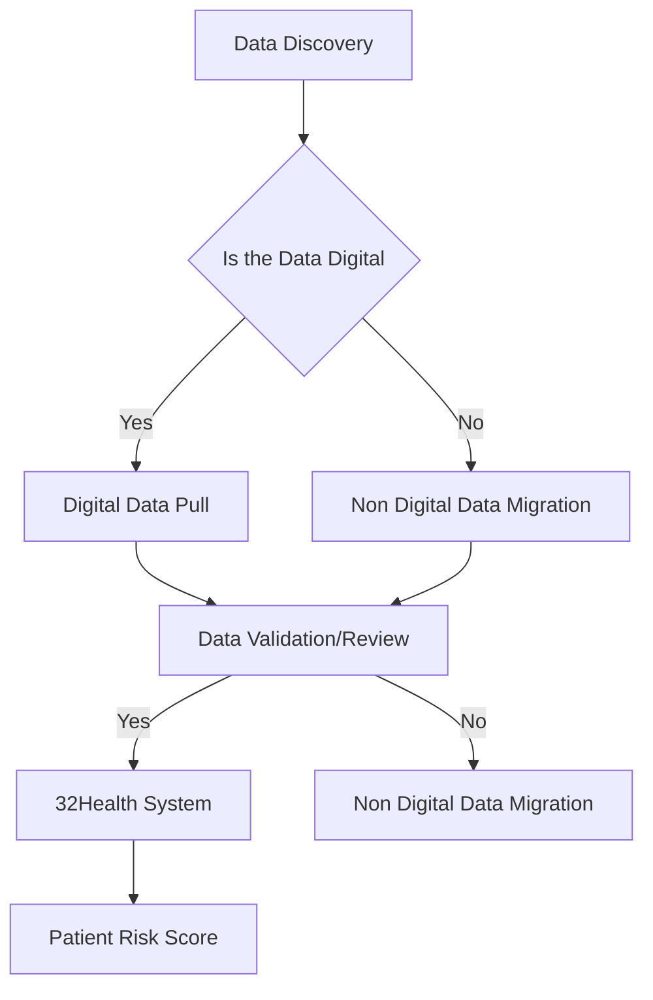
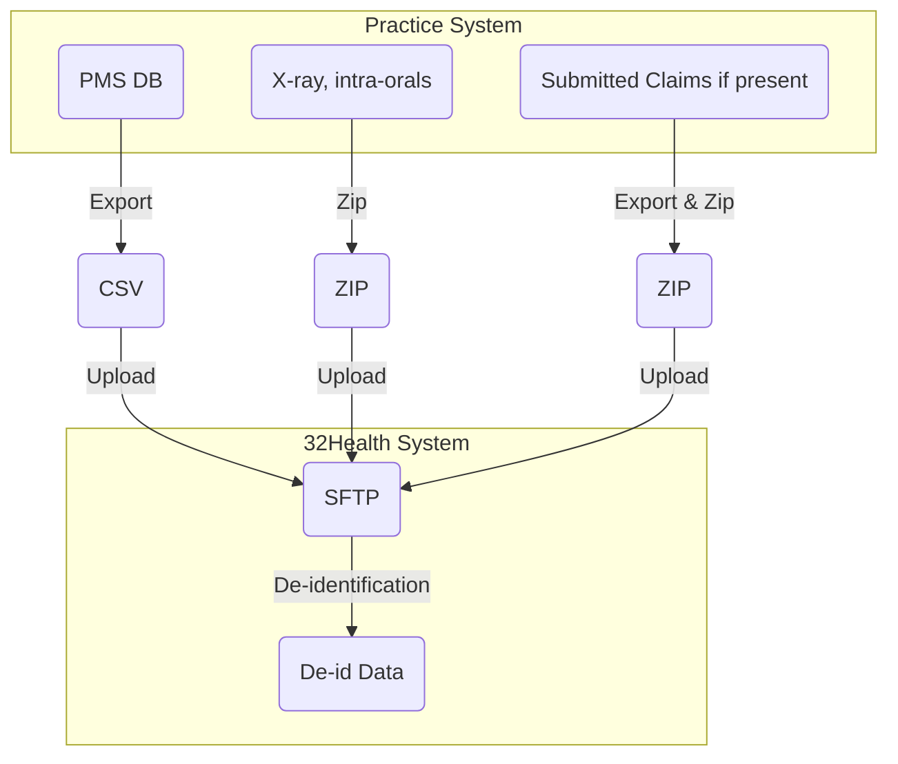
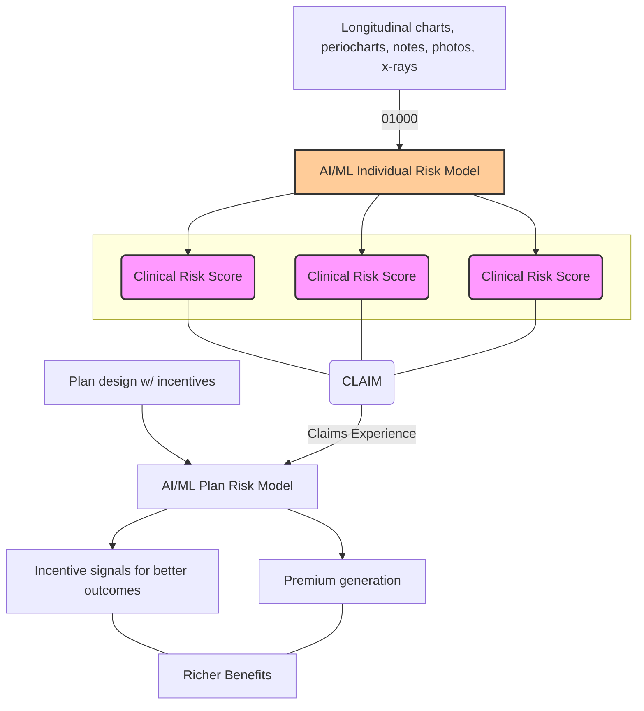

> **Original:** [View Original PDF](https://drive.google.com/file/d/1qJOVTFZ19NgtGVJKsPC8sfRcvlEgOTys/view?usp=drivesdk)

# COLLABORATIVE PROJECT AGREEMENT

This COLLABORATIVE PROJECT AGREEMENT (hereinafter referred to as “Agreement”), is entered into by and between The McGuire Institute, a not-for-profit company, having its principal place of business at 277 Muse Drive, Spring Branch, TX 78070 ("iMc") and 32Health, having its principal place of business at 21 Rangeley Rd., Brookline, MA 02465 ("Partner"). iMc and 32Health are, collectively, the "Parties," or individually as a "Party."

WHEREAS, the Partner desires to conduct a joint partnership to improve oral care (the "Project") by building proprietary deep learning AI models which is incorporated herewith as Appendix A (the “Protocol”); and

WHEREAS, the Project is of mutual interest and benefit to iMc and the Partner, and will further iMc's objectives in a manner consistent with its status as a non-profit, tax-exempt institution.

NOW THEREFORE, in consideration of the foregoing premises and the mutual covenants contained herein, the parties hereto agree as follows:

## 1. PERFORMANCE PERIOD

The Project shall commence upon the later of (a) the effective date of this Agreement, and b) 5/30/23 and will continue until later of 18 months or completion of the Project in accordance with the Protocol in Appendix A (including any amendments thereto) and Project Plan in Appendix B, unless this Agreement is terminated earlier pursuant to Article 10 hereof.

## 2. SCOPE OF WORK

A. Project Principal: Dr. Michael McGuire

B. Conduct of the Project: iMc and the Project Principal shall perform the Project in compliance with (a) the Protocol (as amended from time to time), (b) all applicable local, state and federal laws and iMc's own ethical standards and policies. Any party who becomes aware of the need for a deviation from the Protocol will immediately inform the other party to this Agreement of the facts necessitating the deviation as soon as such facts become known.

C. HIPAA: The Partner shall establish a process of de-identifying data in conformance with HIPAA and privacy compliance in handling healthcare data. All data provided to the Partner shall be stored in a private and secure fashion. The Partner shall operate the service in a manner that provides reasonable information security for data, using commercially reasonable data backup, security, and recovery protections.

D. Amendment of the Protocol: Any amendment to the Protocol shall be mutually agreed and in writing. Following any such amendment to the Protocol, either party may propose a related amendment to this Agreement (including the Budget, as defined below). The parties shall negotiate in good faith with respect to any such proposed amendment. If the parties are unable to agree upon such an amendment to this Agreement, either party may terminate this Agreement pursuant to Article 10 hereof.

## 3. LICENSING & COSTS

A. Product & Licensing Model - Revenue Share
1. Both the Partner and iMc agree to work jointly on developing, deploying and selling a new product that will be further defined after the Phase I of the Project (Proof of Concept).
2. The overall business model, go to market strategy, monetization strategy associated with the product shall all be defined after Phase I of the Project.
3. The proposed product will encompass selling a dentist/practice “DentistGPT”, an AI based co-pilot software/application for dentists that will provide analytics, insights and outcomes on their existing patients including the risk assessment scores for the practice/dentists' patients using historical multi modal data from the patients.
4. The proposed business model can also include selling the product to third party vendors who will consume the risk profile of consumers such as Dentsply Sirona and other competitors.
5. All revenues from selling the product shall be split TBD between the Partner and iMc. The level for the split will be determined after Phase I based on the effort, expertise and resources/cost needed by each party.
6. Each party shall borne all the costs incurred on their end associated with the Project.
7. Both the Partner and iMc agree that the rights and obligations associated with this agreement are solely for the purpose of the Project/Product, and that any other business opportunities outside of the Project or the existing businesses of the Partner and iMc shall not be subject to the revenue share or other obligations set forth in this agreement.

## 4. PERFORMANCE OF OBLIGATIONS

A. Partner Obligations & Rights:
(a) Partner shall be responsible for developing and deploying the product;
(b) Partner shall develop a program to de-identify patient records and information;
(c) Partner shall ensure that the de-identification program complies with all relevant provisions of HIPAA, including the HIPAA Privacy Rule and the Standards for Privacy of Individually Identifiable Health Information (45 CFR Part 164);
(d) Partner shall provide all support personnel, including iMc and participating sites, with training information regarding proper use and operation of the de-identification program, within the constraints of normal business resources and capabilities;
(e) Partner shall establish and maintain processes and procedures to regularly assess and monitor the effectiveness of the de-identification program. These processes shall include periodic reviews and audits to ensure ongoing compliance with HIPAA requirements and the accuracy of the de-identification results;
(f) Partner shall promptly update the de-identification program to comply with any changes in HIPAA regulations or other applicable privacy laws that may affect the de-identification requirements;
(g) Partner holds the rights to any processes or research outcomes, such as the algorithm, data fusion techniques, and all IP created through the process; and
(h) Partner shall work with iMc's clinical partners (list of sites as defined in Appendix C, the list can be amended as more future clinical partners come on board) to acquire data composed of, at a minimum: clinical treatment data, imaging data ( x-rays, periodontal charting, photographs, clinical notes, chart notes), claim submissions data and any other available data describing patients' features such as lifestyle, demographics, medical comorbidities, behavioral data from multiple general and specialized treatment locations.

B. iMc Obligations & Rights:
(a) iMc shall conduct the Project in accordance with the terms and conditions of this Agreement, the Project Protocol, and applicable federal, state, and local laws;
(b) iMc shall deploy the de-identification program to its affiliate sites and provide necessary support, as needed to complete the objectives of the Project Protocol.
(c) iMc shall be responsible for selling and marketing the product in the provider space;
(d) iMc shall be responsible for all agreements between iMc and the affiliates/sites that are required for the Partner to access all patient records and data associated with the patients in order to complete the Project; and
(e) iMc shall be responsible to get all sufficient approvals for obtaining patient records from its affiliates/sites

C. Shared Obligations & Rights
(a) The Parties will be joint custodians of the raw and de-identified data sets and will be responsible for the observance of all conditions for use and for establishment and maintenance of security arrangements as specified in this Agreement to prevent unauthorized use;
(b) The Parties will treat all individually identifiable health information in accordance with the applicable informed consent and all Applicable Laws governing the confidentiality and privacy of individually identifiable health information, including without limitation, the Health Insurance Portability and Accountability Act of 1996 ("HIPAA”) as amended, and any regulation and official guidelines promulgated thereunder;
(c) The application will be an advisory tool and any usage in clinical settings would require regulatory approval that needs to be discussed further post Phase I of the Project;
(d) Both parties shall not share the data or outcomes with third parties of any kind without the written approval of the other; and
(e) Access to any data created by the Partner shall be granted to iMc only and access to iMc affiliates must be through iMc. No direct access by affiliates shall be granted unless specific arrangements are made.

## 5. CONFIDENTIAL INFORMATION

A. All data and information generated, collected, developed, discovered or otherwise saved in the performance of this Agreement is Confidential Information and must not be disclosed to any person except as mutually agreed upon by the Parties, or as required by law. In connection with this Agreement, each party (as the "Disclosing Party") may disclose or make available other Confidential Information to the other party (as the "Recipient”). Along with the foregoing, "Confidential Information" means information in any form (written, oral or tangible form) or medium delivered hereunder for the performance of the Project that the Disclosing Party considers confidential or proprietary, including information consisting of or relating to the Disclosing Party's products, materials, outcomes, models, processes, insights, documents, technology, trade secrets, know-how, business operations, plans, strategies, customers, pricing, and information with respect to which the Disclosing Party has contractual or other confidentiality obligations, in each case whether or not marked, designated, or otherwise identified as "confidential".
(a) Limitations on Disclosure & Use. The Recipient of Confidential Information shall use such information solely as authorized hereunder. Recipient shall hold Confidential Information in strict confidence and shall not disclose any Confidential Information to any Person, provided, that Confidential Information may be disclosed to those representatives of Recipient who (i) have a need to know the Confidential Information in connection with the Recipient's obligations hereunder, (ii) have been informed by Recipient of the confidential nature of the Confidential Information and of the confidentiality undertakings of Recipient contained herein and (iii) are bound in writing by obligations of confidentiality no less stringent than those contained herein. Recipient shall use commercially reasonable efforts to hold the Disclosing Party's Confidential Information in a secure location so as to ensure that unauthorized persons do not gain access to any Confidential Information. Recipient shall promptly notify the Disclosing Party of any unauthorized release of, access to or use of Confidential Information of the Disclosing Party. Such notice shall not remedy any breach of this Agreement resulting from such unauthorized release, access or use.
(b) Excluded Information. This Agreement imposes no obligation upon Recipient with respect to Confidential Information that Recipient can demonstrate through written documentation:
1. was in Recipient's possession before receipt from the Disclosing Party;
2. is or becomes available to the public through no fault, act or omission of Recipient;
3. is furnished to Recipient by a Third Party who is under no obligation of confidentiality and has the right to make such disclosure without any restriction; or
4. is independently discovered or developed by Recipient without access to or use of the Disclosing Party's Confidential Information as evidenced by written records.
(c) Required Releases. In the event that Recipient is required by judicial or administrative process to disclose Confidential Information, Recipient shall promptly notify the Disclosing Party and allow the Disclosing Party a reasonable time to oppose such process or to seek limitations on the portion of the Confidential Information that is required to be disclosed. For clarity, such disclosure pursuant to this Section 4 shall not cause the information so disclosed to lose its confidential nature and in all other instances and circumstances such information shall remain Confidential Information.

B. Affiliate/Sites Confidentiality Information: iMC shall be responsible for maintaining confidentiality as defined in 4.A among their affiliates/sites.

## 6. PROPRIETARY RIGHTS

A. Data.
For the purpose of this Agreement, “Data” is defined as all data, results, models, outcomes, insights, conclusions and observations arising from this Project, elements of which may be duplicated within the Partner Deliverables. “Original Source Documents” is defined as the original medical records, hospital records, clinical and patient charts, laboratory notes, pharmacy dispensing records, recorded data from automated instruments, microfiches, photographic negatives, microfilm or magnetic media, X-rays, clinical notes, claims data submitted and other diagnostic images, and other records generated and maintained by the pharmacy, laboratories and medico-technical departments of iMc; and “Partner-Deliverables” is defined as the outcomes, models and insights/presentations and any other report required prepared as part of this Project.

B. Partner Inventions: Title and interest in and to any invention or discovery conceived or first reduced to practice which is related to the Project, the Protocol or the Partner's Confidential Information during the performance of this Agreement (the “Partner Inventions") shall be assigned to Partner.

C. The parties will retain title to any patent or other intellectual property rights in inventions made solely by their respective employees in the course of the Project (the “Other Inventions”). For the purposes of this Agreement, inventorship shall be as determined in accordance with U.S. patent law.

D. Other Proprietary Rights: Neither the Partner nor iMc grants any license or transfers to the other, by operation of this Agreement, any patent right, copyright right, or other proprietary right of any party, except as explicitly set forth in this Agreement.

## 7. DATA BREACH

The Partner agrees that it will monitor and test its security measures from time to time, and further agrees to adjust its security measures from time to time in light of relevant circumstances or the results of any relevant testing or monitoring. If the Partner suspects or becomes aware of any unauthorized access to any Confidential Information or Original Source Data by any unauthorized person or third party or becomes aware of any other security breach relating to any Data held or stored by the Partner under this Agreement, the Partner shall immediately notify iMc in writing and shall fully cooperate with iMc at Partner's expense to prevent or stop such Data Breach. In the event of such Data Breach, the Partner shall fully and immediately comply with applicable laws and shall take the appropriate steps to remedy such Data Breach.

## 8. USE OF NAME

No party to this Agreement shall use the name, symbol or marks of any other party, or the name of any staff member, employee or student of any other party, in any advertising, promotional or sales literature or in any form of publicity without the prior written approval of the party or individual whose name is to be used, except as may be required by law or this Agreement.

## 9. INDEMNIFICATION AND INSURANCE

A. Indemnification: Both Parties shall defend, indemnify and hold harmless each other and its affiliated clinics, and each of their trustees, directors, officers, employees, physicians and agents, including the Project Principal, (each, an “Indemnified Party”) from any and all liabilities, claims, actions, suits, demands or prosecutions that may be brought or instituted and all consequent damages, liabilities, costs and expenses (collectively “Liabilities”) arising out of or connected with the performance of the Project. The aforesaid indemnity shall not apply to the negligent actions, intentional misconduct, or material breach of a material obligation hereunder of any Indemnified Party to the extent that such Liability is directly attributable to such action, misconduct or breach.

B. Indemnification Procedures: In the event any such claim is made, or action initiated, both parties shall promptly notify each other in writing of such claim, provided, however, that the failure to provide such notice shall not relieve the other of any of its indemnification obligations hereunder except to the extent that the Party is prejudiced by such failure. Both parties shall provide a diligent defense against and/or settlement of any claims brought, or actions filed for the loss which is the subject of the foregoing indemnity, whether such claims or actions are rightfully or wrongfully brought or filed. Both parties shall have the right to settle claims, at their own sole expense and each's sole discretion, provided that each party shall not agree to any settlement which requires an admission of fault by an Indemnified Party without the consent of each other, whose consent will not be unreasonably withheld or delayed.

UNDER NO CIRCUMSTANCES WILL EITHER PARTY BE LIABLE TO THE OTHER FOR ANY INDIRECT, SPECIAL, CONSEQUENTIAL, PUNITIVE, INCIDENTAL OR OTHER DAMAGES (INCLUDING LOST REVENUE, PROFITS, USE, DATA OR OTHER ECONOMIC LOSS OR DAMAGE) HOWEVER CAUSED AND REGARDLESS OF THEORY OF LIABILITY (WHETHER FOR BREACH OR IN TORT, INCLUDING NEGLIGENCE) ARISING FROM, RELATED TO, OR CONNECTED WITH THIS AGREEMENT, EVEN IF NOTICE WAS GIVEN OF THE POSSIBILITY OF SUCH DAMAGE AND EVEN IF SUCH DAMAGES WERE REASONABLY FORESEEABLE.

C. Insurance: Partner and iMc shall each maintain, for the term of this Agreement and following termination to cover claims arising from the conduct of the Project, a policy or program of insurance and/or self-insurance covering:
(a) comprehensive general liability, including products liability, broad form contractual, and if applicable, professional liability in a minimum amount of three million dollars ($3,000,000.00) per claim and five million dollars ($5,000,000) in the aggregate; and
(b) errors and omissions liability insurance coverage of not less than one million dollars ($1,000,000) per claim and three million dollars ($3,000,000) in the aggregate; and
(c) cyber/privacy and security liability insurance of not less than three million dollars ($3,000,000) per claim and three million dollars ($3,000,000) annual aggregate.
(d) The coverage shall bear an endorsement precluding cancellation or reduction of coverage. Upon request, the Parties will furnish each other with certificates of insurance evidencing such insurance. The foregoing insurance requirements shall not in any way limit a party's liability with respect to its indemnification or other obligations under this Agreement.

## 10. TERMINATION OF AGREEMENT

A. Termination for Cause. In the event that either party hereto shall commit any breach or default in any of the terms or conditions of this Agreement, and also shall fail to remedy such default or breach within thirty (30) days after receipt of written notice thereof from the other party hereto, the party giving notice may, at its option and in addition to any other remedies which it may have at law or in equity, terminate this Agreement by sending notice of termination in writing to the other party, and such termination shall be effective as of the date of receipt of such notice.

B. Rights Following Termination. Termination of this Agreement by either party for any reason shall not affect the rights and obligations of the parties accrued prior to the effective date of termination of this Agreement.

C. Survival of Obligations. All provisions in this Agreement containing representations, warranties, payment obligations, releases, defense obligations and indemnities, and all provisions relating to construction and interpretation of this Agreement, intellectual property, insurance, disclaimer of certain remedies and damages, limitations of liability, dispute resolution and governing law, and all causes of action which arose prior to expiration or termination, shall survive by their respective terms, until they are no longer operative or are otherwise limited by an applicable statute of limitations.

## 11. AMENDMENTS

This Agreement may only be amended by the mutual written consent of authorized representatives of both the Partner and the Institution.

## 12. ENTIRE AGREEMENT

This Agreement, together all attachments and exhibits, constitutes the entire understanding of the parties with respect to the subject matter hereof.

## 13. HEADINGS

The descriptive headings contained in this Agreement are included for convenience and reference only and shall not be held to expand, modify or aid in the interpretation, construction or meaning of this Agreement.

## 14. INCONSISTENCY

In the event of any inconsistency between this Agreement and the Protocol or the terms of any other attachment or exhibit, the terms of this Agreement shall govern.

## 15. SEVERABILITY

If any provision of this Agreement is determined to be invalid or unenforceable, in whole or in part, for any reason, the remaining provisions shall continue in full force and effect.

## 16. ASSIGNMENT

Neither party shall have the right to assign, delegate or transfer at any time to any party, in whole or in part, any or all of the rights, duties and interests herein granted without first obtaining the written consent of the other party to such assignment.

## 17. WAIVER

No waiver of any term, provision or condition of this Agreement, whether by conduct or otherwise, in any one or more instances, shall be deemed to be or construed as a further or continuing waiver of the same term, provision or condition, or of any other term, provision or condition of this Agreement.

## 18. FORCE MAJEURE

Neither party shall be liable for any failure to perform as required by this Agreement to the extent such failure to perform is due to circumstances reasonably beyond such party's control, including, without limitation, labor disturbances or labor disputes of any kind, accident, failure to obtain any government approval required for full performance, civil disorders or commotions, acts of aggression or terrorism, acts of God, energy or other conversation measures imposed by law or regulation, explosions, failure of utilities, mechanical breakdowns, material shortages, disease, or other such occurrences.

## 19. RELATIONSHIP OF THE PARTIES

The Partner and the iMc are independent contractors and neither party shall hold itself out to third parties as purporting to act as, or on behalf of, the other party hereto. This Agreement shall not be construed to constitute a partnership or joint venture between the Partner and the iMc or to make either party the agent or employee of the other.

## 20. NOTICES

All notices required to be provided in writing hereunder shall be sent to the party in question at its address set forth in the opening paragraph of this Agreement, by hand delivery or international delivery service, return receipt requested. In the event of any controversy, claim or dispute between the parties hereto, arising out of or relating to this Agreement or the breach thereof, the prevailing party shall be entitled to recover from the other party reasonable expenses, attorney's fees, and costs. This Section 19 is not intended to govern the day-to-day business communications necessary between the parties in performing their obligations under the terms of this Agreement.

## 21. GOVERNING LAW AND JURISDICTION

This Agreement and all claims or causes of action arising hereunder shall be governed by and construed in accordance with the laws of the State of Texas, excluding its conflicts of laws provisions, and in the event of a dispute arising under or in connection with this Agreement, the parties hereby submit to exclusive jurisdiction in the federal or state courts located in Harris County, Texas, and agree that venue is proper and convenient in such forum.

## 22. COUNTERPARTS

This Agreement may be executed in any number of counterparts, each of which shall be an original and all of which together shall be one document binding on all the parties.

IN WITNESS WHEREOF, the parties hereto have caused their duly authorized representatives to execute this Agreement as of the date first written above.

**32Health**
By: Mihir Shah
Name: Mihir Shah
Title: VP Business Development
Date: 30MAY23

**The McGuire Institute**
By: Rick Heard, DDS, MS
Name: Rick Heard, DDS, MS
Title: Executive Director
Date: 30MAY23

---

## APPENDIX A
## PROJECT PROTOCOL

**Objective**
Create a joint partnership between 32Health Inc and iMC to improve oral care by building risk profiles based on predictive risk models using deep learning models on multi-Modal data. The mutual partnership entails working together to achieve the goals outlined below.

**Goals**
**iMC Goals**
1. Improve the efficiency of dental care delivery and make it more personalized, accurate, and timely using multi-modal data and machine learning technologies
2. Provide anonymized patient data for developing clinical risk models to augment clinical decision support and potentially clinical outcomes
3. To use developed data to create intelligence about performance information, about commercially available products, treatment procedures and insights to support clinical decision products. Such intelligence may be monetized with third parties per the revenue model share that will be finalized post Phase I of the Project
4. To provide leadership in oral care through scientific communication based on evidence and insights from AI-derived data models.
5. Create possible risk and prognosis calculators and clinical decision support products.

**32Health Goals**
1. Create and build a database of data sources for digital oral health that include multiple modalities, such as electronic dental records from clinical treatments, radiology images, clinical notes, photographs, intraoral images, and other associated information. While historically, these data were used in silos, new machine learning (ML) and deep learning (DL) technologies enable the integration of these data sources to produce multi-modal insights.
2. Using multi-modal insights on longitudinal data, create clinical risk models, cost models, and appropriate intervention models that may lead to better patient outcomes and optimized costs.
3. Use risk models to predict the cost of more effective dental care at individual and population levels.
4. Co-develop products with iMC that augment dental manufacturers sales and marketing efforts by using our AI risk system to promote the use of potential products in the marketplace.

**Use cases for multi-modal data sources for oral care co developed with iMc**
1. Improved individual periodontal and caries risk assessments
   Compute caries and periodontal disease risks and their progressions from multiple sources of data to compute risk scores that are repeatable, reproducible, and replicable to formulate care recommendations.
2. Improve the prescription of disease severity assessment
   Using multi-modal data from clinical practice to derive insights into oral care to enable more precise clinical decision-making. Each modality has its own special case, fusing modalities (e.g., image data, periodontal charting data with clinical data) to affect patient outcomes and theoretically enable better oral and surgical treatments.
3. Enhance clinical care recommendations
   Multi-modal data fusion is used to detect disease and risk classification and make automated care recommendations about the oral disease.

**Data collection, processing, and modeling process**
The partner shall work with iMC's clinical partners to acquire data composed of, at a minimum: clinical treatment data, imaging data (x-rays, periodontal charting, photographs, clinical notes, chart notes), and any other available data describing patients' features such as social determinants of health, lifestyle, demographics, medical comorbidities, behavioral data from multiple general and specialized treatment locations. The overall process of acquiring data and generating outcomes from each site is shown in Figure 1. The data-contributing locations shall establish a regular cadence for data refresh regularly, at least once in three months.

32Health shall implement multiple layers of data processing, aggregation, and prediction modeling. 32Health shall implement data quality protocols for feature extraction of clinically relevant data factors from unstructured data. This shall include implementing a framework for data processing for data filtering, removal of duplicate and inconsistent data, and handling missing data. After pre-processing, deep learning models are applied to predict disease presence, progression, and other outcomes of interest. The schematic business and technical process are laid out in Figure 3 below.

**Figure 1- Overall Process & Definitions**

**Diagram: Data Flow for Patient Risk Score Generation**

**Definitions**
*   **Data Discovery:** During this phase, data is analyzed to understand what type of data (e.g. images, claims etc) is available, what portion of the data is digital, non-digital, where they reside (on-site/off-site) and what custom software development needs to be accomplished to pull the data.
*   **Digital Data Pull:** The data is pulled from the sources identified in Data Discovery to perform de-identification and the data is stored for the 32Health System.. Figure 2 describes in further detail on how the data pull is performed.
*   **Data Validation/Review:** Validation of all the data and final review of the data to ensure the data is in correct format and readable by 32Health System.
*   **Non Digital Migration** - All the data that is non-digital will be migrated into a digital version of the data.
*   **32Health System:** Reads and analyzes all the data collected, builds the AI model and computes the Risk Score for each Patient.
*   **Patient Risk Score:** Database that contains all the patient's risk scores that was computed by the AI model on 32Health System. Figure 3 describes in further detail on how the risk scores are calculated.
*   **PMS DB** - Practice Management Database system of individual sites/affiliates (could have multiple sites if they are owned by the same affiliate) that has data associated with the patients.

**Figure 2 - Data Pull Process from PMS Sites**

**Diagram: Data Pull Process**

Note: The 32Health de-identification program (Anonymization Program) that is developed by 32Health will be run under PHP's scope (environment).

**Figure 3 - Technical Process for generating outcomes**

**Diagram: Technical Process for Outcomes**

---

## APPENDIX B
## PROJECT PLAN

The following below is a draft Project Plan and is subject to change from review with iMC and the Partner. The timelines, duration and the resources needed are all draft and need to be finalized after review. Project Plan will be revised post Phase I of the project.

| WBS NUMBER | TASK TITLE                                       | TASK OWNER       | 32HEALTH RESOURCES NEEDED | MI RESOURCES NEEDED | START DATE | DUE DATE   | DURATION (DAYS) | PCT OF TASK COMPLETE |
|:-----------|:-------------------------------------------------|:-----------------|:--------------------------|:--------------------|:-----------|:-----------|:----------------|:---------------------|
| **1**      | **Contract**                                     |                  |                           |                     |            |            |                 |                      |
| 1.1        | MOU - Review                                     | 32Health & MI    | 32Health Exec Team        | McGuire Exec Team   | 1/17/23    | 1/30/23    | 13              | 100%                 |
| 1.2        | MOU - Agreement                                  | 32Health & MI    | 32Health Exec Team        | McGuire Exec Team   | 1/30/23    | 1/30/23    | 0               | 100%                 |
| 1.3        | Contract Draft                                   | 32Health         | 32Health Exec Team        |                     | 2/1/23     | 2/15/23    | 14              | 60%                  |
| 1.4        | Contract Review                                  | 32Health & MI    | 32Health Exec Team        | McGuire Exec Team   | 2/15/23    | 3/15/23    | 30              | 0%                   |
| 1.4.1      | Legal Review                                     | 32Health & MI    | 32Health Legal            | McGuire Legal       | 3/15/23    | 4/30/23    | 45              |                      |
| 1.5        | Signed Contract                                  | 32Health & MI    | 32Health Exec Team        | McGuire Exec Team   | 4/30/23    | 4/30/23    | 0               | 0%                   |
| **2**      | **Phase I - Perio Health Professionals**         |                  |                           |                     |            |            |                 |                      |
| 2.1        | Data Discovery                                   | 32Health & MI    |                           |                     | 5/1/23     | 5/19/23    | 18              | 0%                   |
| 2.1.1      | Database Copy - System Location & Size           | MI               |                           | IT                  | 5/1/23     | 5/2/23     | 1               | 0%                   |
| 2.1.2      | Images - System Location & Size                  | MI               |                           | IT                  | 5/2/23     | 5/3/23     | 1               | 0%                   |
| 2.1.3      | Claims Data - System Location & Size             | MI               |                           | IT                  | 5/3/23     | 5/4/23     | 1               | 0%                   |
| 2.1.4      | Understand constraints                           | MI               | Data Engineer             | IT                  | 5/4/23     | 5/5/23     | 1               | 0%                   |
| 2.1.5      | Custom Software Development to pull data         | 32Health         | Data Engineer             |                     | 5/5/23     | 5/19/23    | 14              | 0%                   |
| 2.2        | Data Pull - Digital                              | 32Health         | Data Engineer             |                     | 5/19/23    | 6/15/23    | 26              | 0%                   |
| 2.2.1      | Tmp Staging Storage - Pre De-Identification      | 32Health         | Data Engineer             |                     | 5/22/23    | 5/23/23    | 1               | 0%                   |
| 2.2.2      | De-Identification & Final Storage at 32Health System | 32Health         | Data Engineer             |                     | 5/23/23    | 5/30/23    | 7               | 0%                   |
| 2.2.3      | Data Review & Validation                         | 32Health         | Data Engineer & Data Scientist |                     | 5/30/23    | 6/5/23     | 5               | 0%                   |
| 2.3        | Build AI Model VO Based on Tabular Data          | 32Health         | Data Scientist            |                     | 6/5/23     | 8/4/23     | 59              | 0%                   |
| 2.4        | AI Model Review                                  | 32Health         | 32Health Exec Team        |                     | 8/6/23     | 8/15/23    | 9               | 0%                   |
| 2.5        | Clinical Review of AI Model                      | 32Health & MI    | Data Scientist            | MI Clinicians       | 8/15/23    | 8/30/23    | 15              | 0%                   |
| 2.6        | Clinical Risks Assessment Review                 | 32Health & MI    | Data Scientist            | MI Clinicians       | 8/30/23    | 9/15/23    | 15              | 0%                   |
| 2.7        | Demo & Present Findings                          | 32Health & MI    | 32Health Exec Team        | McGuire Exec Team   | 9/18/23    | 9/18/23    | 0               | 0%                   |
| 2.8        | Data Pull - Non Digital                          | 32Health         | Data Engineer             |                     | TBD        | TBD        | 0               |                      |
| 2.9        | Build AI Model V1 - Chart notes & Images         | 32Health         | Data Scientist            |                     | 9/19/23    | 1/19/24    | 120             | 0%                   |
| 2.10       | Clinical Review of AI Model                      | 32Health & MI    | Data Scientist            | MI Clinicians       | 1/19/24    | 2/2/24     | 13              | 0%                   |
| 2.11       | Periodontal & Caries Risk Assessment Review      | 32Health & MI    | Data Scientist            | MI Clinicians       | 2/2/24     | 2/15/24    | 13              | 0%                   |
| 2.12       | Diseases Severity Assessment Review              | 32Health & MI    | Data Scientist            | MI Clinicians       | 2/15/24    | 2/27/24    | 12              | 0%                   |
| 2.13       | Clinical Care Recommendation Review              | 32Health & MI    | Data Scientist            | MI Clinicians       | 2/27/24    | 3/10/24    | 13              | 0%                   |
| 2.14       | Demo & Present Findings                          | 32Health & MI    | 32Health Exec Team        | McGuire Exec Team   | 3/11/24    | 3/11/24    | 0               | 0%                   |

| WBS NUMBER | TASK TITLE                                       | TASK OWNER       | 32HEALTH RESOURCES NEEDED | MI RESOURCES NEEDED | START DATE | DUE DATE   | DURATION (DAYS) | PCT OF TASK COMPLETE |
|:-----------|:-------------------------------------------------|:-----------------|:--------------------------|:--------------------|:-----------|:-----------|:----------------|:---------------------|
| **3**      | **Phase II - All other PMS/Sites**               |                  |                           |                     |            |            |                 |                      |
| 3.1        | Data Discovery - Rest of the PMS Sites           | 32Health & MI    |                           |                     | 6/5/23     | 9/4/23     | 89              | 0%                   |
| 3.1.1      | Database Copy - System Location & Size           | MI               |                           | IT                  | 6/5/23     | 6/7/23     | 2               | 0%                   |
| 3.1.2      | Images - System Location & Size                  | MI               |                           | IT                  | 6/7/23     | 6/9/23     | 2               | 0%                   |
| 3.1.3      | Claims Data - System Location & Size             | MI               |                           | IT                  | 6/9/23     | 6/12/23    | 3               | 0%                   |
| 3.1.4      | Understand constraints                           | MI               | Data Engineer             | IT                  | 6/12/23    | 6/14/23    | 2               | 0%                   |
| 3.1.5      | Custom Software Development to pull data         | 32Health         | Data Engineer             |                     | 6/14/23    | 6/26/23    | 12              | 0%                   |
| 3.2        | Data Pull - Rest of the PMS Sites                | 32Health         | Data Engineer             |                     | 6/26/23    | 10/26/23   | 120             | 0%                   |
| 3.2.1      | Tmp Staging Storage - Pre De-Identification      | 32Health         | Data Engineer             |                     | 7/11/23    | 9/11/23    | 60              | 0%                   |
| 3.2.2      | De-Identification & Final Storage at 32Health System | 32Health         | Data Engineer             |                     | 9/11/23    | 10/13/23   | 32              | 0%                   |
| 3.2.3      | Data Review & Validation                         | 32Health         | Data Engineer & Data Scientist |                     | 9/26/23    | 10/26/23   | 30              | 0%                   |
| 3.3        | Build AI Model V2                                | 32Health         | Data Scientist            |                     | 10/26/23   | 3/25/24    | 149             | 0%                   |
| 3.4        | Clinical Review of AI Model                      | 32Health & MI    | Data Scientist            | MI Clinicians       | 3/25/24    | 4/8/24     | 13              | 0%                   |
| 3.5        | Periodontal & Caries Risk Assessment Review      | 32Health & MI    | Data Scientist            | MI Clinicians       | 4/8/24     | 4/21/24    | 13              | 0%                   |
| 3.6        | Diseases Severity Assessment Review              | 32Health & MI    | Data Scientist            | MI Clinicians       | 4/21/24    | 5/3/24     | 12              | 0%                   |
| 3.7        | Clinical Care Recommendation Review              | 32Health & MI    | Data Scientist            | MI Clinicians       | 5/3/24     | 5/15/24    | 12              | 0%                   |
| 3.8        | Demo & Present Findings                          | 32Health & MI    | 32Health Exec Team        | McGuire Exec Team   | 5/15/24    | 5/15/24    | 0               | 0%                   |
| 3.9        | Data Refresh from all PMS Sites                  | 32Health & MI    | Data Engineer             |                     | 5/15/24    | 7/14/24    | 59              | 0%                   |
| 3.10       | Build AI Model V3                                | 32Health         | Data Scientist            |                     | 7/14/24    | 10/27/24   | 103             | 0%                   |
| 3.11       | Demo & Present Findings                          | 32Health & MI    | 32Health Exec Team        | McGuire Exec Team   | 10/30/24   | 10/30/24   | 0               | 0%                   |

---

## APPENDIX C
## LIST OF SITES/PMS

| Site                                     | Practice Management Software | Version of Software | Is data backed up locally or on the Cloud? | How do you access your backups?                                             | Do you have the ability to access the backups as a file?                 | Number of patients in your practice that are fully digital | Number of patients in your practice that are not digitized |
|:-----------------------------------------|:-----------------------------|:--------------------|:-------------------------------------------|:----------------------------------------------------------------------------|:-----------------------------------------------------------------------|:-----------------------------------------------------------|:-----------------------------------------------------------|
| Perio Health Professionals               | Dentrix                      | 22.5.3.2581         | Cloud                                      | through our IT                                                              | Not sure                                                               | 10,000                                                     | 40,000-50,000                                              |
| Regenerative Solutions                   | DSN                          | 2                   | Both                                       | Carbonite and windows Explorer                                              | Yes                                                                    | only digital radiographs and treament letters              | 2600                                                       |
| Gulf Coast Periodontics                  | Eaglesoft                    | 21.00.18            | Locally                                    | external hard drive (must have Eaglesoft to use it)                         | Yes                                                                    | 16,011                                                     | 0                                                          |
| Oral Health Specialists                  | DSN                          | 20.0.1.15           | Both                                       | MOUNT                                                                       | Yes                                                                    | 8588                                                       | 0                                                          |
| Misch Implant Dentistry                  | Dentrix                      | G7.6                | Locally                                    | local IT company                                                            | Yes                                                                    | actual numbers not available, recently started transferring files from paper to digital |                                                            |
| Boston Periodontics and Dental Implants  | Dentrix                      | 17.3.385.0          | Cloud                                      | through IT                                                                  | not sure                                                               | >5000                                                      | 0                                                          |
| Peninsula Periodontal Associates         | DSN                          | 20                  | Locally                                    | external drive                                                              | Yes                                                                    | 18,588                                                     | 0                                                          |
| Periodontics and Dental Implant Surgery  | Dentrix                      | G7.3                | Both                                       | IT personnel                                                                | Yes                                                                    |                                                            | 0                                                          |
| Shoreline Periodontics and Dental Implants |                              |                     |                                            | Site has chosen not to participate.                                         |                                                                        |                                                            |                                                            |
| Dr. Diego Velasquez-Plata                |                              |                     |                                            |                                                                             |                                                                        |                                                            |                                                            
| McClain and Schallhorn Periodontics and Periodontal Medicine Surgical Specialists, LLC | SoftDent                     | 19.0.1              | both                                       | Access to the back is managed by IT                                         | complete backup can be a single file or granular to a single file.     | only photos and radiographs                                | 16,000                                                     |
| Metro West Orthodontics & Periodontics   | DSN Perio Exec               | V.20                | both                                       | via web GUI                                                                 | yes                                                                    | 3832                                                       | 0                                                          |
| Oral & Facial Surgery of Pittsburgh P.C. | Eaglesoft                    | 21.2                | both                                       | locally on a machine, Medix, our IT group can access it as well.            | yes                                                                    | active-3082 inactive-4554                                  | 0                                                          |
| Seattle Periodontics and Implant Dentistry | DSN                          | 20.0.1.15           | managed services with offsite servers with cloud backup. The office is a virtual environment. | via managed service company                                                 | yes                                                                    | >5000                                                      | 0                                                          |
| Perio & Implant Associates of Middle TN  | Open Dental                  | 22.1.43.0           | both local and Cloud                       | Access locally via backup appliance or in the cloud                         | backup can be accessed as a file or individual files can be accessed.  | 7027                                                       | 0                                                          |
| Colorado Gum Care                        | Dentrix                      | 17.4.148.0          | both local and Cloud                       | Could access with IT's help                                                 | Could access with IT's help                                            | 16,541                                                     | 0                                                          |
| WisNova Institute of Dental Specialists  | OMS Vision                   | 18.1.0              | there is a local copy that is then replicated to the cloud | backups are accessed either locally or remotely with a secure connection to the BDR appliance | yes                                                                    | 35,007                                                     | 0                                                          |

---

## 32Health iMC Project Agreement 05.30.23

### Final Audit Report
**Created:** 2023-05-30
**By:** Kathy Donkin (k.donkin@themcguireinstitute.org)
**Status:** Signed
**Transaction ID:** CBJCHBCAABAAv333AlchiM6V7PffEvxq7Gwx7nmjyPWh
**Date:** 2023-05-31

### "32Health iMC Project Agreement 05.30.23" History
*   **Document created by Kathy Donkin (k.donkin@themcguireinstitute.org)**
    2023-05-30 11:41:50 PM GMT- IP address: 68.53.129.243
*   **Document emailed to Rick Heard (r.heard@themcguireinstitute.org) for signature**
    2023-05-30 11:43:22 PM GMT
*   **Email viewed by Rick Heard (r.heard@themcguireinstitute.org)**
    2023-05-31 0:03:18 AM GMT- IP address: 74.192.121.173
*   **Document e-signed by Rick Heard (r.heard@themcguireinstitute.org)**
    Signature Date: 2023-05-31 - 0:04:02 AM GMT - Time Source: server- IP address: 74.192.121.173
*   **Document emailed to mihir.shah@32health.care for signature**
    2023-05-31 0:04:03 AM GMT
*   **Email viewed by mihir.shah@32health.care**
    2023-05-31 0:33:41 AM GMT- IP address: 99.78.74.50
*   **Signer mihir.shah@32health.care entered name at signing as Mihir Shah**
    2023-05-31 0:35:07 AM GMT- IP address: 99.78.74.50
*   **Document e-signed by Mihir Shah (mihir.shah@32health.care)**
    Signature Date: 2023-05-31 - 0:35:09 AM GMT - Time Source: server- IP address: 99.78.74.50
*   **Agreement completed.**
    2023-05-31 0:35:09 AM GMT

*(Adobe Acrobat Sign logo implies this is generated by Adobe Acrobat Sign)*