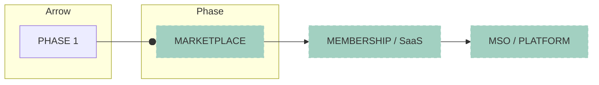
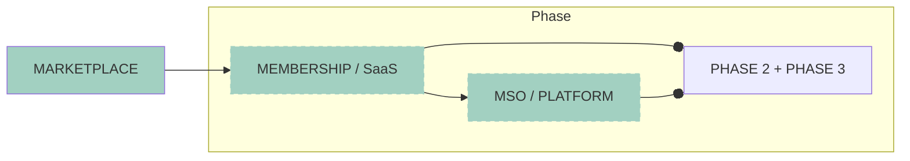
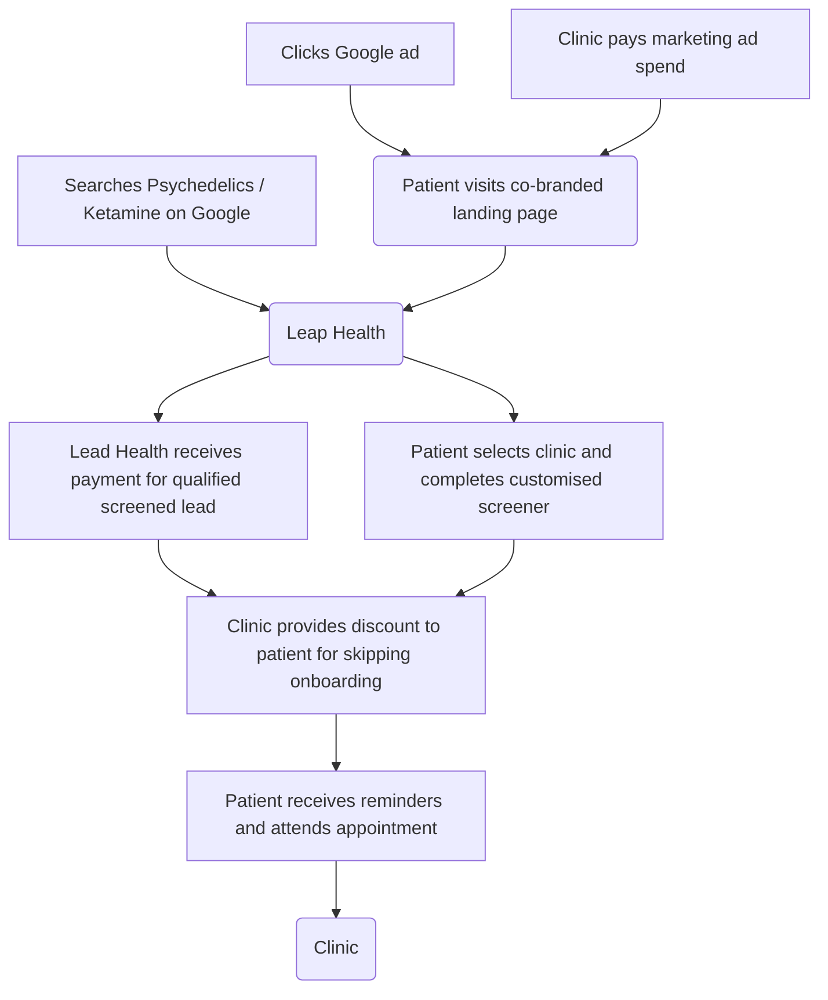

> **Original:** [View Original PDF](https://drive.google.com/file/d/1CWpD56iZWNkgvVDDJ6NyLlieXes8r-_F/view)

## Slide 1: Big Leap Health

# Big Leap Health
HEALING STARTS HERE

## Slide 2: America is experiencing a mental health crisis – and looking for alternatives to medications

# America is experiencing a mental health crisis –
# and looking for alternatives to medications

*   **31%**
    of Americans showed
    symptoms of anxiety
    and/or depressive
    disorder in 2021
*   **1 in 2**
    Americans sought out or
    wanted to seek mental
    health services either for
    themselves or for a loved
    one in 2021
*   **83%**
    of Americans with anxiety,
    depression, and/or PTSD
    are open to Rx medication
    alternatives in 2022

**Source:** https://mhanational.org/issues/state-mental-health-america;
https://www.statista.com/chart/21878/impact-of-coronavirus-pandemic-on-mental-health/
https://deliccorp.com/wp-content/uploads/Delic-Corp-Deck-MASTER-12.7.pdf

## Slide 3: Interest in a new kind of treatment option is rising

# Interest in a new kind of
# treatment option is rising

**The New York Times**
**MDMA Therapy for PTSD Inches Closer to U.S. Approval**
Results of a new study may offer regulators enough evidence to allow the psychedelic,
also known as Ecstasy, to be considered for use as a...
4 weeks ago

**UCLA Health**
**After years of depression, gentle electromagnetic stimulation**
**of the brain may provide relief**
Transcranial Magnetic Stimulation, TMS, uses electromagnets placed on the head to
send out targeted magnetic waves to stimulate and "reset"...
Mar 14, 2023

**Medical News Today**
**Depression: 4-week ketamine injections prove effective**
A four-week course of ketamine injections may be effective against treatment-resistant
depression, a double-blind trial shows.
Jul 20, 2023

### r/TherapeuticKetamine

**Subscribers**

**Chart: Subscribers of r/TherapeuticKetamine, r/Cancer, r/Asthma over time (2014-2022)**

| Year | TherapeuticKetamine Subscribers | Cancer Subscribers | Asthma Subscribers |
| :--- | :------------------------------ | :----------------- | :----------------- |
| 2014 | ~1K                               | ~1K                | ~1K                |
| 2016 | ~2K                               | ~2K                | ~2K                |
| 2018 | ~5K                               | ~5K                | ~5K                |
| 2020 | ~15K                              | ~15K               | ~10K               |
| 2022 | ~30K                              | ~25K               | ~20K               |

Reddit channels such as r/TherapeuticKetamine have seen rapid subscriber growth - doubling in
2023 YTD, and growing 2.5x faster than r/Cancer

### Google Trend for Ketamine Assisted Psychotherapy

**Interest over time**

**Chart: Google Search Interest for "Ketamine Assisted Psychotherapy" (Oct 21 '20 - Apr 16 '23)**

| Date      | Interest (0-100) |
| :-------- | :--------------- |
| Oct 21 '20 | ~10              |
| Apr 19 '20 | ~5               |
| Oct 17 '21 | ~50              |
| Apr 16 '23 | ~70 (peak)       |

*Visual observation of fluctuating line graph, peaks around 50-70 in late 2021 and early 2023.*

Google search volume for ketamine-assisted psychotherapy and associated keywords has grown
steadily over the past 2 years, coinciding with increased recognition of KAP for treatment of mental
illness

## Slide 4: The Interventional Psychiatry Market is growing to $15B/yr by 2030

# The Interventional
# Psychiatry Market
# is growing to
# $15B/yr by 2030

Since 2018, clinics offering ketamine
therapy and/or TMS have increased
from **300 to 2,000+**

40%+ further TAM expansion from
potential approval of MDMA & Psilocybin

### U.S. Interventional Psychiatry Market
2022-2030 (USD Billion)

**Chart: Bar chart showing U.S. Interventional Psychiatry Market by modality (KETAMINE, TMS, MDMA, PSILOCYBIN) from 2020-2030 in USD Billion**

| Year | Total Market (USD Billion) | KETAMINE (USD Billion) | TMS (USD Billion) | MDMA (USD Billion) | PSILOCYBIN (USD Billion) |
| :--- | :------------------------- | :--------------------- | :---------------- | :----------------- | :----------------------- |
| 2020 | ~2.5                       | ~1.8                   | ~0.7              | 0                  | 0                        |
| 2021 | ~3.0                       | ~2.0                   | ~0.9              | 0                  | 0                        |
| 2022 | ~3.5                       | ~2.2                   | ~1.1              | ~0.2               | 0                        |
| 2023 | ~4.0                       | ~2.5                   | ~1.2              | ~0.3               | 0                        |
| 2024 | ~5.0                       | ~3.0                   | ~1.5              | ~0.4               | ~0.1                     |
| 2025 | ~6.0                       | ~3.5                   | ~1.8              | ~0.5               | ~0.2                     |
| 2026 | ~7.5                       | ~4.5                   | ~2.0              | ~0.7               | ~0.3                     |
| 2027 | ~9.0                       | ~5.5                   | ~2.5              | ~0.8               | ~0.4                     |
| 2028 | ~10.5                      | ~6.0                   | ~2.8              | ~1.0               | ~0.7                     |
| 2029 | ~12.5                      | ~7.0                   | ~3.2              | ~1.3               | ~1.0                     |
| 2030 | ~15.0                      | ~8.0                   | ~3.8              | ~1.7               | ~1.5                     |

**Source:** https://www.askp.org/directory/; https://www.clinicaltmssociety.org/find-a-clinic

## Slide 5: Interventional psychiatry treatments are well reimbursed

# Interventional psychiatry treatments are well
# reimbursed

*   **$6,500+**
    Reimbursement to
    providers for first month of
    **Spravato treatment**
*   **$8,200+**
    Reimbursement to
    providers for course of
    **TMS treatment**
*   **$7,500+**
    Expected reimbursement
    to providers for course of
    **MDMA treatment**

And Spravato is on track to hit $1B in sales in 2024 with 83% YoY growth reported in Q3 ‘23

**Source:** https://www.aafp.org/pubs/afp/issues/2020/0315/p339.html
https://www.floridatmsclinic.com/tms-learning-hub/tms-cost
https://psych.global/report/
https://www.investor.jnj.com/news/news-details/2023/Johnson--Johnson-Reports-Q3-2023-Results/default.aspx

## Slide 6: Yet clinics still struggle to find & retain qualified patients

# Yet clinics still struggle to find & retain qualified patients

*   **Awareness**
    *   75,000+ daily Google searches for
        “ketamine therapy” in the US
    *   More than 2,000+ US clinics but no
        structured directory for patients
    *   Unaware of ketamine as a relevant,
        legal, and safe treatment modality
*   **Trust and safety**
    *   FDA-approved but stigma around
        safety
    *   No trusted expert in the
        space for recommendations
    *   Complex onboarding processes
*   **Cost**
    *   Typical ketamine infusion package is
        $4,000+ if cash pay
    *   Unclear CPT/DRG codes makes it
        difficult to estimate cost
    *   Complex credentialing process with
        rapidly evolving payer
        reimbursement

## Slide 7: We will become the end-to-end MSO for providers to find new patients and manage their clinic operations while providing a premium patient experience

# We will become the end-to-end MSO for providers to find
# new patients and manage their clinic operations while
# providing a premium patient experience

Our platform also helps patients discover the right clinic for them, works to lower their costs and makes it easy for
them to sign-up for treatment, driving screened, qualified leads for clinics

## Slide 8: Our initial product enables patients to find the right clinic for them at the lowest possible price

# Our initial product enables patients to find the right
# clinic for them at the lowest possible price

*   Clinic directory with 2,000+ clinics, prioritized
    & structured with relevant information
*   Guidance on insurance reimbursement and
    cash pay options by clinic
*   Clinic-specific screener that qualifies leads

**Mockup of Big Leap Health Web & Mobile Interface**

**Web Interface (MacBook Pro):**
**Header:** Big Leap Health | Directory | Treatments | Conditions | News | Discounts
**Main Title:** Find the treatment that's right for you.
**Subtitle:** Find the treatment that's right for you.
**Search Bar:** What are you looking for? | Location | Search (button)
**Section:** Ketamine-assisted Therapy
**Clinic Cards (examples):**
1.  **Neurotherapeutix**
    *   ⭐ 4.94
    *   The leading clinic for functional Imaging-
        guided transcranial magnetic stimulation
    *   44 miles from your location
2.  **ReYou Ketamine**
    *   ⭐ 4.88
    *   ReYou Ketamine Treatments is led by Dr.
        Solomon Morgenstern, a leading clinic in LES.
    *   123 miles from your location
3.  **Philadelphia Integrative**
    *   ⭐ 4.80
    *   People suffering from the debilitating effects
        of chronic mood disorders can find relief at
        Philadelphia Integrative Psychiatry.
    *   54 miles from your location
4.  **Daytryp Health**
    *   ⭐ 4.52
    *   The Daytryp team understands how difficult
        treatment-resistant depression, can be.
    *   4154 miles from your location
5.  **Numinus Phoenix**
    *   ⭐ 4.20
    *   Our center is a beacon of compassionate
        care, crafted to resonate with the distinct
        spirit of this community.
    *   524 miles from your location

**Mobile Interface (iPhone):**
**Header:** 9:41 | BL NexusMedicinePDX
**Title:** What brings you to
Nexus Medicine today?
**Checklist (checkboxes):**
*   I'm experiencing anxiety
*   I'm experiencing depression
*   I'm experiencing sleep distrubance
*   I'm experiencing chronic pain
*   I'm experiencing mood swing
*   Other
**Button:** NEXT

## Slide 9: While making it easy for providers to track the business performance of our partnership

# While making it easy for providers to track the
# business performance of our partnership

*   Initial focus on Lead Management &
    Revenue Cycle Management
*   Opportunity to expand into additional
    areas:
    *   Financial Performance
    *   Outbound sales tracking
    *   Marketing automation
    *   Supply chain management

**Mockup of Big Leap Dashboard for Clinic: NexusPDX**

**Header:** Big Leap | Clinic: NexusPDX | ↓ Download
**Navigation:** Home | Channel breakdown | Lead list | Funnel analysis | Support | Help | Settings
**Filters:** Timeframe: All-time | People: All | Topic: All
**Performance Metrics:**

| Metric            | Value        | Change | Cost per (if applicable) | CVR (if applicable) |
| :---------------- | :----------- | :----- | :----------------------- | :------------------ |
| Cost              | $1,434/day   | ▼XX%   | -                        | -                   |
| Impressions       | 5.2M         | ▼XX%   | -                        | -                   |
| Website Leads     | 856          | ▼XX%   | $25.43                   | 10.62%              |
| Leads             | 642          | ▼XX%   | $70.81                   | 40.55%              |
| Qualified Leads   | 268          | ▼XX%   | $140.43                  | 18.55%              |
| Customers         | 112          | ▲XX%   | $256.54                  | -                   |

**Chart Section:** Market Comparison by Day
**Sub-title:** Select two metrics below to trend over time
**Metrics displayed on chart:** Metric One: Website Leads (blue line), Metric One: Cost (orange line, seems to be a different scale or not fully visible)
**X-axis:** SEP 1, SEP 6, SEP 11, SEP 16, SEP 21, SEP 26
**User Info (bottom left):** Lea Stuart | leastuart@nexusPDX.com

## Slide 10: Our existing clinic partners have allocated ~$250K/yr in marketing spend through Big Leap

# Our existing clinic partners have allocated
# ~$250K/yr in marketing spend through Big Leap

| PARTNER                            | DESCRIPTION                                             | SIZE                                  | STATUS                       |
| :--------------------------------- | :------------------------------------------------------ | :------------------------------------ | :--------------------------- |
| Nexus Medicine PDX                 | 1-location clinic in OR                                 | 3 providers                           | LIVE                         |
| Manhattan Restorative Health Services | 5-location clinic in NY and NJ                          | 18 providers                          | Contract Signed & Onboarding |
| (Unnamed)                          | 2-location clinic in NY                                 | 10 providers                          | Late-stage LOI discussions   |
| (Unnamed)                          | 1-location clinic in NY                                 | 12 providers                          | Late-stage LOI discussions   |
| (Unnamed)                          | VC-backed startup with 2 in-person clinic locations in CA and NY | 10 providers within in-person locations, 30 providers total | Mid-stage LOI discussions    |
| (Unnamed)                          | 1-location clinic in NY                                 | 3 providers                           | In ongoing discussion        |
| (Unnamed)                          | 1-location clinic in KY                                 | 3 providers                           | Initial Conversation         |

We already have signed contracts with several clinics & are in active discussions with several additional

## Slide 11: The marketplace is a distribution wedge to owning more of the clinic & patient workflows over time

# The marketplace is a distribution wedge to owning
# more of the clinic & patient workflows over time

Providers using our SaaS software will automate the onboarding and intake of their patients, enabling us to have
full visibility into the patient journey and provide more value to providers & patients over time

## Slide 12: What Grow did for telehealth therapy, we will do for interventional psychiatry

# What Grow did for telehealth therapy,
# we will do for interventional psychiatry

**Y-axis:** Relevance to Interventional Mental Health
**X-axis:** Relevance to Marketplace / MSO

**Quadrant: High Interventional Mental Health, Low Marketplace/MSO**
*   TARA MIND
*   PSYCLE
*   wavepaths
*   KETAMINE MEDIA
*   Mindbloom
*   osmind
*   journey clinical

**Quadrant: High Interventional Mental Health, High Marketplace/MSO**
*   Big Leap Health (highlighted)
*   Healing Maps

**Quadrant: Low Interventional Mental Health, Low Marketplace/MSO**
*   (empty)

**Quadrant: Low Interventional Mental Health, High Marketplace/MSO**
*   Z Zocdoc
*   duet
*   PATH
*   klinic
*   Nourish
*   grow therapy
*   care.
*   Moxie

## Slide 13: Founders have deep domain expertise in marketplaces, digital health & clinic operations

# Founders have deep domain expertise in
# marketplaces, digital health & clinic operations

**Yakov Kagan**
Founder & CEO
*   **Logos:** Uber, codecademy, Bread, Clearing
*   Led growth teams at Bread,
    Codecademy and Clearing.
*   Early employee at Uber. Advisor
    to Pathize Health, ResortPass &
    Salvo Health.

**Nick Ficano**
Co-Founder & CTO
*   **Logos:** Twitter (stylized), SimpleHealth, Rakuten
*   Former Twitter engineer with 15+
    years of experience including 4
    years in healthcare and as a
    previous founder.

**Alex Bargar**
Co-Founder & COO
*   **Logos:** Juno, HORIZON, SimpleHealth, ZS
*   2X founding team member of
    telehealth & in-person clinics leading
    clinical & business operations for 7+
    years. Previous strategy work at
    BCBS & ZS Associates.

## Slide 14: We are raising $1.5M to complete the MVP and collect revenue from our design partners

# We are raising $1.5M to complete the MVP and
# collect revenue from our design partners

We will use the funds to:

01. Add additional partner clinic clients to monetize
    platform
02. Build the initial marketplace & vertical SaaS that is
    utilized by prospective patients and providers
03. Begin MSO credentialing process & build initial
    membership capabilities

## Slide 15: APPENDIX

# APPENDIX

## Slide 16: We leverage clinic marketing dollars to drive marketplace growth and charge per patient

# We leverage clinic marketing dollars to drive
# marketplace growth and charge per patient

## Slide 17: Launch of MSO & IPA Enables Take Rate Capture

# Launch of MSO & IPA Enables Take Rate Capture

**Credentialing & RCM**
*   Contracting/negotiation services
    where we leverage clinic volume to
    obtain better rates & expanded
    coverage
*   Credentialing with best-in-class tools
    to accelerate & expand insurance
    reimbursement for clinics
*   Billing and coding support to
    maximize billings
*   Full cycle claim management for
    optimization of claims paid

**Analytics & Reporting**
*   Financial and operational
    dashboards for real-time visibility
    into business performance
*   Quality tracking to support clinic
    competitiveness and group
    contracting effectiveness
*   Benchmarking to ensure best
    practices are implemented
    effectively

**Technology**
*   Preferred vendor relationships with
    platforms like EHR, contact center, help
    desk, and other tools necessary to
    operate with excellence
*   Big Leap Health platform to optimize
    patient onboarding & marketing, and to
    improve patient experience

## Slide 18: Over time, we can become the operating system for patients and providers providing interventional psychiatry

# Over time, we can become the operating system for patients
# and providers providing interventional psychiatry

**Concentric Circles Model of Market Opportunity**

*   **Outer Circle:** MSO Buildout & Branded Model (~$3B+)
    *   20% take rate of $14B 2030 US Interventional Psychiatry market
    *   Full MSO where providers get access to preferential leasing, equipment
        financing, clinical trials, insurance credentialing and tooling

*   **Middle Circle:** Expansion into Patient Experience & Practice Management (~$500M-1B)
    *   Charging $199/mo per provider and $199/mo per clinic for membership:
        *   (A) Membership with discounted ketamine, improved payer
            reimbursement rates & ongoing clinical training
        *   (B) Practice management software for self-serve booking, personalized
            patient-facing experience & revenue cycle management reporting

*   **Inner Circle:** Initial US Market Marketplace Opportunity (~$110M)
    *   2,000 US clinics today, with $12K/mo marketing budgets, and charging
        $100 per qualified lead is a **$60M/yr opportunity**
    *   Additional **$50M/yr opportunity** selling onboarding/forms SaaS
        software for clinics to use with their potential patients

## Slide 19: Why now?

# Why now?

A recent critical mass of clinical
evidence, consumer interest and
regulatory tailwinds, including potential
legalization of psilocybin & MDMA have
created an inflection point in the size
and pace of growth in the market

**Timeline of Key Events:**

*   **2024:**
    *   **August 2024 – Expected MDMA Approval**
        Expected FDA approval for usage of MDMA for treatment for
        PTSD (**$16B+ market in 2022**)
    *   **Jan 2024 – MAPS Raises $100M Series A**
        MAPS raises oversubscribed $100M Series A to support
        commercialization of MDMA
*   **2023:**
    *   **May 2023 – Ketamine Effective on Depression**
        **400+ patient study** by Harvard-Mass Gen Brigham finds
        Ketamine effective in treating depression
*   **2020:**
    *   **August 2020 – Indication Expansion**
        Drug indication expansion to include major depressive
        disorder and acute suicidal ideation or behavior
    *   **March 2020 – Ketamine Telehealth Approval**
        DEA partially lifts restrictions on prescribing ketamine
        through telehealth
*   **2019:**
    *   **March 2019 – FDA Esketamine Approval**
        FDA approval of esketamine, a nasal formulation of ketamine,
        for the treatment of resistant depression

## Slide 20: Year 1 Milestones

# Year 1 Milestones

|                       | Q2 2024                                                                                                         | Q3 2024                                                                                                     | Q4 2024                                                                                                         |
| :-------------------- | :-------------------------------------------------------------------------------------------------------------- | :---------------------------------------------------------------------------------------------------------- | :-------------------------------------------------------------------------------------------------------------- |
| **Signed Clinics**    | 2-4 design partners                                                                                             | 8-12 marketplace partners, 2 MSO clinic partners                                                            | 12+ marketplace partners, 4-6 MSO clinic partners                                                               |
| **User Goal**         | 50 Qualified Leads per Month, $150K ARR, 1,000/monthly organic visitors                                         | 150 Qualified Leads Per Month, $300K ARR, 3,000/monthly organic visitors                                    | 350 Qualified Leads Per Month, $1M ARR, 6,000/monthly organic visitors                                          |
| **Product Goal**      | Launched MVP platform, 100+ Pieces of organic content written and/or recorded                                   | Enhanced Marketplace Capabilities, Initial build-out of financial reporting, Launch of initial membership options | Launched initial insurance billing product, MSO launched with initial partner, Marketplace optimizations          |
| **Priorities**        | Execute clinic partnerships, Define Brand, Aggregate & structure directory of clinics, Design & Launch MVP, Build initial organic marketing functions (SEO content & video) | Launch membership & initial vertical SaaS, MSO credentialing kicked off, Launch financial reporting dashboard, Continue building organic content | Launch RCM capabilities, Build repeatable sales motion, Optimize provider credentialing process               |
| **Hires**             | CEO, CTO, COO, Design Lead, Contractors / agencies for content creation                                         | Marketing Lead, Software Engineer                                                                           | Customer Support Lead                                                                                           |

## Slide 21: Investment Recap

# Investment Recap

**Fast Growing Market**
*   $14B 2030 US Interventional
    psychiatry market w/10.6% CAGR
*   1,000+ new U.S. Ketamine/TMS clinics
    opened in last 5 years
*   Potential legalization of MDMA for
    PTSD in 2024 (**$16B+ market**)
*   US psychiatry market is $27B and
    growing to $35B+ by 2030
*   56% of Americans wanted to or did
    seek mental health care either for
    themselves or a loved one in 2021
*   1 in 5 Americans experienced a mental
    illness in 2021

**Disruptive GTM Strategy**
*   Utilizing clinic marketing budgets
    to kickstart growth enables faster
    scale without costly D2C efforts
*   Aggregating demand through
    marketplace model enables more
    scale than standalone clinic
    marketing
*   Unique positioning focused on
    building legitimacy and trust with
    everyday patients

**Clear Distribution Opportunity**
*   Initial distribution wedge focused on
    solving #1 pain point for providers (driving
    demand)
*   Enable turnkey credentialing & billing
    strategy to drive more demand and
    revenue for clinics
*   Long term opportunity to provide
    end-to-end platform for patients &
    providers seeking interventional
    psychiatry and psychedelic-assisted
    therapy