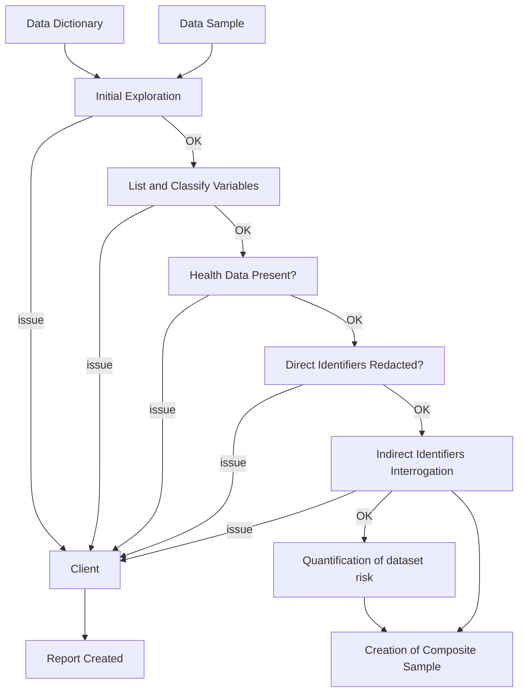

> **Original:** [View Original PDF](https://drive.google.com/file/d/1rEceOuWkbbd3bV9U2TEJ6NmFfEKW_8BHN9mbN8m0FuE/view)

## Slide 1: Integral

**Integral**
Automating healthcare data compliance
Leverage your data more quickly than ever before

## Slide 2: Meet the Integral Team

### Shubh Sinha
Founder & CEO

As a Product Manager at LiveRamp Health, Shubh collaborated with the top pharmaceutical and insurance companies to leverage de-identified healthcare data for analysis and marketing. He also led 30+ HIPAA compliance reviews on behalf of those clients.
/LiveRamp

### John Kuhn
Founder & CTO

John has built large scale data processing systems for 10,000+ users and companies at Salesforce and a number of startups. He has an in-depth understanding of algorithms for securely processing large data systems.
salesforce

## Slide 3: $40B Pharma Analytics Market

**Integral sits at the center**

Diagram of interconnected data sources and entities within the Pharma Analytics Market:

**Central Node: Multi sources (Integral sits at the center)**

**Connected Entities:**

*   **Patients**
    *   Lab/Biomarkers
    *   Genomics
    *   Clinical trials
    *   Pharmacy
    *   Social media
    *   Claims
    *   EMR
    *   Imaging
    *   PRO (Patient-Reported Outcomes)
    *   Prescriptions
    *   Mortality
    *   Registries
    *   Chart Review
    *   Checklist
*   **Physicians**
    *   Research experience
    *   Reference data
*   **Institutions/Health Systems**
    *   Trial registries
    *   Wholesalers
    *   Sales
*   **Countries**
*   **Sales/Consumption**
*   **Devices**
*   **Research experience**
*   **Claims**
*   **Reference data**

## Slide 4: The world today

*   Expert certifications can take **12+ weeks** to complete but are necessary for downstream analysis
*   Expert certifications require **40+ human hours** across companies
*   Expert certifications lack **transparency and flexibility** because they are so manual

**Process Flow Diagram:**

## Slide 5: Integral Solution

Streamlined expert certifications through easy-to-use, secure, automated software.

Integral directly integrates with your data system, continuously monitors for data changes, alerts you of non-compliant data, and remediates that data to get you HIPAA compliant in hours.

**Screenshot: Integral User Interface - SDOH Data Analysis**

Automatically detects data uploads and runs HIPAA analysis in real time

| Column Name                     | Severity | Unique Values | Nulls | Cardinality | Last Processed |
| :------------------------------ | :------- | :------------ | :---- | :---------- | :------------- |
| zip_code                        | MEDIUM   | 101           | 0     | 0.00        | Oct 12         |
| education_level                 | MEDIUM   | 7             | 0     | 0.00        | Oct 12         |
| occupation                      | MEDIUM   | 30            | 0     | 0.00        | Oct 12         |
| income                          | LOW      | 67786         | 0     | 0.68        | Oct 12         |
| patient_id                      | LOW      | 100000        | 0     | 1.00        | Oct 12         |
| household_id                    | LOW      | 100000        | 0     | 1.00        | Oct 12         |
| access_to_internet              | LOW      | 2             | 0     | 0.00        | Oct 12         |
| community_resources_food_bank | LOW      | 2             | 0     | 0.00        | Oct 12         |
| cultural_beliefs                | LOW      | 20            | 0     | 0.00        | Oct 12         |
| employment_status               | LOW      | 2             | 0     | 0.00        | Oct 12         |
| food_security                   | LOW      | 2             | 0     | 0.00        | Oct 12         |
| health_literacy                 | LOW      | 6             | 0     | 0.00        | Oct 12         |
| home_environment                | LOW      | 17            | 0     | 0.00        | Oct 12         |
| housing_type                    | LOW      | 20            | 0     | 0.00        | Oct 12         |
| insurance_coverage              | LOW      | 20            | 0     | 0.00        | Oct 12         |

## Slide 6: Traction

*   **6 customers**
    *   Eli Lilly
*   **3 partners**
    *   LiveRamp ($RAMP)
    *   PurpleLab (Series B)
    *   Skyflow (Series B)
*   **Metrics**
    *   20B+ records
    *   100,000+ columns analyzed
    *   Average processing time - < 1 day
    *   On-prem install - <1 day