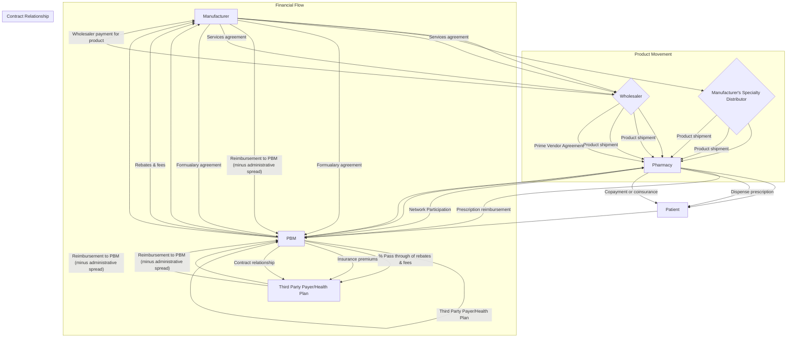
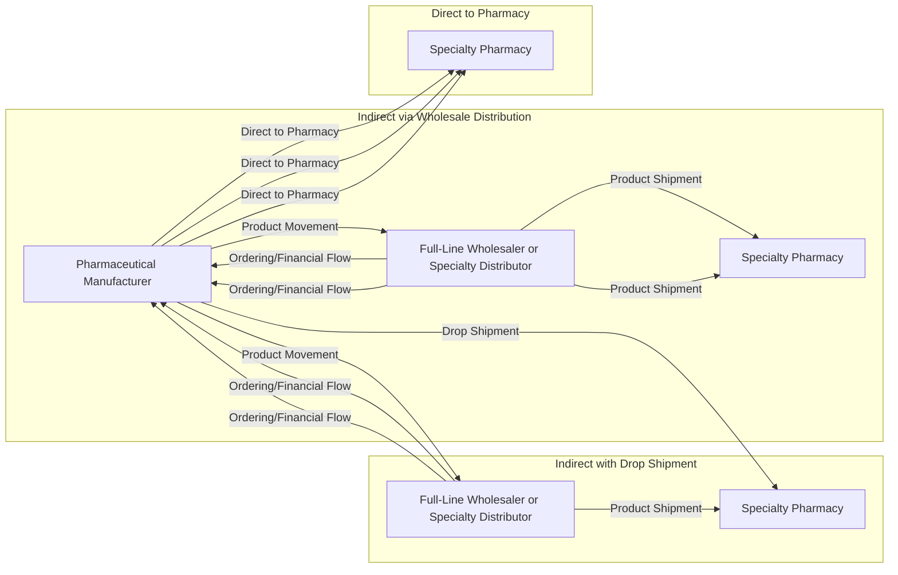
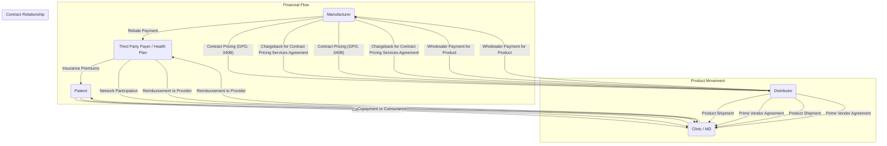

> **Original:** [View Original PDF](https://drive.google.com/file/d/1Oq1zIwoza4s4MOoVv1OMOc7poZUdvfaT/view)

# The 2022-23 Economic Report on Pharmaceutical Wholesalers and Specialty Distributors

**Adam J. Fein, Ph.D.**
Drug Channels Institute

October 2022

Corporate License

---

## The 2022–23 Economic Report on Pharmaceutical Wholesalers and Specialty Distributors
Corporate License

COPYRIGHT
Copyright © 2022 by Pembroke Consulting, Inc., d/b/a Drug Channels Institute. All rights reserved.
This report is protected by copyright law and may not be copied or otherwise reproduced, repackaged,
further transmitted, transferred, disseminated, redistributed, or resold, in whole or in part, in any form or
manner or by any means whatsoever, by any person without prior written consent. This report may be cited
in commercial documents with full and appropriate attribution. This report is for informational purposes
only and is provided “as is” without any express or implied warranty. The analyses in this report are based
solely on information and data that are in the public domain, and do not contain any material nonpublic
information. This report does not contain any information that has been obtained in violation of a fiduciary
duty, a contractual duty of confidentiality, or similar duty. All conclusions, findings, opinions, and
recommendations are based on our own experienced and professional judgment and interpretations given
the information available. While all information is believed to be reliable at the time of writing, the
information provided here is for reference use only and does not constitute the rendering of legal, financial,
commercial, or other professional advice by Pembroke Consulting, Inc., Drug Channels Institute, or the
author. Any reliance upon the information is at your own risk, and Pembroke Consulting, Inc., and the
author shall not be responsible for any liability arising from or related to the use or accuracy of the
information in any way. Pembroke Consulting, Inc., and Drug Channels Institute do not make investment
recommendations in this report or otherwise. Nothing in this report should be interpreted as an opinion by
Pembroke Consulting, Inc., Drug Channels Institute, or the author on the investment prospects of specific
companies.

Drug Channels® is a registered trademark of Pembroke Consulting, Inc.

---

## The 2022–23 Economic Report on Pharmaceutical Wholesalers and Specialty Distributors
Corporate License

LICENSE TERMS
This report is protected by copyright law. Unauthorized reproduction or distribution of this report
or any portion of it may result in severe civil and criminal penalties and will be prosecuted to the
maximum extent of the law. This report may be cited in commercial documents with full and
appropriate attribution. Nothing in the license is intended to reduce, limit, or restrict any rights
arising from fair use under copyright law or other applicable laws.

If you would like to quote from or otherwise cite the report, here is a suggested citation:
Fein, Adam J., The 2022-23 Economic Report on Pharmaceutical Wholesalers and Specialty
Distributors, Drug Channels Institute, 2022.

This copy of The 2022-23 Economic Report on Pharmaceutical Wholesalers and Specialty
Distributors has been purchased with the following license terms:

☐ Single User License: This license allows for use of this report by one (1) individual person. This
person may use the report on any computer, and may print out the report, but may not share
the report with any other person or persons. Unless a Department/Team or Corporate License is
purchased, a Single User License must be purchased for every person who wishes to use the
report within the same organization or enterprise. Buyers who infringe upon these license terms
are liable for a Department/Team or Corporate License fee.

☐ Department/Team License: This license allows for use of this report by 2 to 10 employees
within the same organization or enterprise as the purchaser identified in the upper left corner of
this page. Each of these employees may use the report on any computer, and may print out the
report, but may not share the report with any other person or persons unless a Corporate License
is purchased. Buyers who infringe upon these license terms are liable for a Corporate License fee.

☑ Corporate License: This license allows for use of the report by an unlimited number of
employees within the same organization or enterprise worldwide as the purchaser identified in
the upper left corner of this page. Each of the employees within this organization or enterprise
may use the report on any computer, and may print out the report, but may not share the report
with any other person or persons outside the enterprise or organization.

☐ Corporate License + Exhibits: This license has the same terms as the Corporate License and
includes a PowerPoint file with images of all exhibits in the report. These exhibits can be used
under the same terms and conditions as the report can be used.

The complete End User License Agreement is available at: https://drugch.nl/2022-23EULA

Please contact us at admin@drugchannels.net if you would like to upgrade the license
at any time after purchase. You will pay only the difference in license fee.

---

## The 2022–23 Economic Report on Pharmaceutical Wholesalers and Specialty Distributors
Corporate License

ABOUT THE AUTHOR
Adam J. Fein, Ph.D., is the CEO of Drug Channels Institute (DCI), a leading
source of industry research about pharmaceutical economics and the drug
distribution system. DCI is a subsidiary of Pembroke Consulting, Inc.

Dr. Fein is one of the country’s foremost experts on the pharmaceutical
industry. He has published hundreds of academic and industry articles. Dr.
Fein has contributed to, and is regularly quoted in, such national
publications as The Wall Street Journal, The New York Times, The
Washington Post, Forbes, and many others.

His popular and influential Drug Channels website is the go-to source for definitive and
comprehensive industry analysis, delivered with a witty edge. Drug Channels is the only place
where you’ll find a serious discussion of PBMs, drug pricing, and pharmacy economics, all
explained with humor and a healthy dose of pop culture.

Dr. Fein earned his doctoral degree from the Wharton School of Business at the University of
Pennsylvania and his undergraduate degree from Brandeis University. He lives in Philadelphia
with his wife and business partner, Paula.

Contact information
Adam J. Fein, Ph.D.
Drug Channels Institute
1515 Market Street, Suite 1660
Philadelphia, PA 19102
Phone: 215-523-5700
Website: www.DrugChannelsInstitute.com
Email: afein@drugchannels.net

Visit Dr. Fein’s Drug Channels blog for the latest industry updates!
www.DrugChannels.net

---

## The 2022–23 Economic Report on Pharmaceutical Wholesalers and Specialty Distributors
Corporate License

ABOUT DRUG CHANNELS INSTITUTE
Drug Channels Institute (DCI) is a leading source of
industry research about pharmaceutical economics and
the drug distribution system.

DCI hosts live video webinars during which Dr. Fein discusses trends and policies that affect the
pharmaceutical industry and its channels. Click here to learn about our upcoming and previous
video webinars.

DCI also combines Dr. Fein’s expertise and cutting-edge analysis—such as this 2022-23 Economic
Report on Pharmaceutical Wholesalers and Specialty Distributors—into interactive e-learning
modules that offer your team a thorough grounding in crucial industry topics. Click here to view
a list of our e-learning modules. These online learning tools explain highly complex economic and
business data and concepts so you can:

*   Make better decisions to achieve your business goals
*   Improve relationships with key accounts
*   Understand your customers, channels, and the economics of the U.S. pharmaceutical
    industry

To learn more about how Drug Channels Institute can help your business, please contact:
Paula Fein, M.S.Ed.
V.P., Business Development
Drug Channels Institute
1515 Market Street, Suite 1660
Philadelphia, PA 19102
Phone: 215-523-5700
Website: www.drugchannelsinstitute.com
Email: paula@drugchannels.net

---

## The 2022–23 Economic Report on Pharmaceutical Wholesalers and Specialty Distributors
Corporate License

INTRODUCTION AND GUIDE TO THE 2022-23 REPORT
By late 2022, the pharmaceutical channel—and much of our society—had recovered from the
unprecedented volatility triggered by the COVID-19 pandemic. U.S. distribution and dispensing
channels for prescription drugs have remained highly resilient throughout the pandemic.

Pharmacy and healthcare provider markets have now reached or exceeded pre-pandemic levels.
The largest pharmaceutical wholesalers have strengthened their industry position and economic
fundamentals, although they continue to confront a diverse set of commercial, political, and legal
challenges. They are among the many issues we consider in the 2022-23 edition of this report:

*   Growth in wholesalers’ U.S. drug distribution revenues has accelerated, as pharmacy and
    provider markets have recovered from the disruptions of the COVID-19 pandemic. We
    project that U.S. drug distribution revenues for the Big Three public wholesalers—
    AmerisourceBergen, Cardinal Health, and McKesson—will reach $616 billion in 2022.
*   Pharmacies and pharmacists have stepped up as key providers of COVID-19 vaccines.
    During the first eight months of 2022, pharmacists at retail pharmacies administered
    more than 60% of all COVID-19 vaccines. Wholesalers played a crucial role in distributing
    both COVID-19 vaccines and antiviral therapeutics to pharmacies and providers.
*   The market for provider-administered biosimilars reached new highs in 2022. Adoption
    rates continue to rise, prices have declined further, and plans are relaxing medical benefit
    formulary limits. Consequently, biosimilars have become an important source of profits for
    wholesalers and specialty distributors.
*   The stock prices of the publicly traded wholesalers have rebounded compared to the overall
    market. This reversed a multiyear trend that began in 2015. The wholesalers’ valuation
    discount to the market was much smaller compared to the discount measured one year ago.
*   The Inflation Reduction Act, which was signed into law by President Joe Biden in August
    2022, will change numerous aspects of prescription drug pricing in the Medicare program.
    The law seems poised to trigger changes in pharmacy and provider markets that will
    negatively impact wholesalers, despite significant uncertainty about the law’s
    implementation.
*   The U.S. economy’s overall inflation rate reached levels not seen for more than 40 years.
    However, list prices for brand-name drugs—which directly impact wholesalers’ revenues
    and profits—continue to grow at single-digit rates. Wholesalers have successfully adapted
    their business economics and channel relationships to the era of slower growth in list
    prices.

---

## The 2022–23 Economic Report on Pharmaceutical Wholesalers and Specialty Distributors
Corporate License

*   The pharmacy market, which accounts for the majority of wholesalers’ revenues, remains
    intensely competitive and highly consolidated. The retail pharmacy shakeout is
    accelerating, as smaller competitors sell to larger companies and larger chains reduce
    store count. This activity further concentrates wholesalers’ revenues and encourages
    wholesalers to invest more in stabilizing the business of their smaller and more profitable
    pharmacy customers.
*   Specialty drugs remain the key driver of prescription revenues for the pharmacy and PBM
    industries. Specialty drugs account for nearly 40% of outpatient prescription revenues—
    and an even greater share of payers’ net prescription costs. In the coming years, both
    biological and traditional specialty drugs will face increasing competition from biosimilar
    and generic versions of these products. The 2023 launch of the Humira biosimilars will be
    a market-changing event for pharmacy benefit management and specialty pharmacy.
*   Generic market pricing has returned to a deflationary cycle during 2021 and 2022, after
    the COVID-19 pandemic added inflation pressures for oral solid generics during 2020.
    However, low generic prices are limiting pharmacies’ revenues and gross profits from
    these prescriptions.
*   Wholesalers are expanding their businesses that provide services to pharmaceutical
    manufacturers. Since the previous edition of this report, AmerisourceBergen and
    McKesson made significant acquisitions that bring new services and capabilities.
*   The largest wholesalers have finalized a comprehensive, $20 billion settlement of their
    financial and other obligations related to opioids. This agreement has removed
    considerable uncertainty about wholesalers’ future financial liabilities.
*   Wholesalers are pursuing divergent strategies for geographic expansion. McKesson has
    nearly completed its exit from the European market, while AmerisourceBergen
    completed its acquisition of Walgreen Boots Alliance’s European distribution businesses.
    Cardinal Health no longer operates any international drug distribution business, having
    divested its China businesses in 2018.
*   Federal and state government efforts to import drugs originally intended for the Canadian
    market remain stalled. None of the major wholesalers are participating in these state
    proposals. In 2022, Florida sued the FDA over delays related to the state’s proposed
    importation program, while Colorado prepared to submit its importation proposal.
*   New cell and gene therapies continue to launch. Wholesalers do not generally provide
    traditional warehousing and physical distribution services for these therapies. However,
    they are offering services that address some of the logistical and commercial challenges
    for these therapies.

---

## The 2022–23 Economic Report on Pharmaceutical Wholesalers and Specialty Distributors
Corporate License

Understanding an Evolving Channel
This 2022-23 Economic Report on Pharmaceutical Wholesalers and Specialty Distributors—our
13th edition—remains the most comprehensive, fact-based tool for understanding and analyzing
the large and growing U.S. pharmaceutical distribution industry.

This definitive, nonpartisan resource thoroughly updates our annual exploration of the industry’s
interactions with—and services for—other participants in our healthcare system. The report
synthesizes a wealth of statistical data, research studies, financial information, and my own
unique business consulting experience. It will aid pharmaceutical manufacturers, wholesalers,
pharmacists, pharmacy owners, hospital executives, pharmacy buyers, benefit managers,
managed care executives, policy analysts, investors, consultants, and many others.

Our 2022-23 edition contains the most current financial and industry data. We include detailed
information about the strategies, market positions, and executive compensation of the three
largest companies: AmerisourceBergen, Cardinal Health, and McKesson. The report updates our
annual analysis of each wholesaler’s business segments and underlying business profitability,
based upon our proprietary economic models. The information allows you to assess differences
among the public wholesalers’ business organizations, strategies, and financial performance.
Where appropriate, financial data have been restated based on updated disclosures.

What’s New in the 2022-23 Report
The 2022-23 Economic Report on Pharmaceutical Wholesalers and Specialty Distributors retains
the overall structure of previous editions, and the chapters correspond to those of previous
editions. However, certain material has been reorganized to reflect the latest industry
developments. We have also added new sections and offer expanded analyses of various topics.
The notable new material in this 2022-23 edition includes the following:

*   **Section 3.4.1.** contains new data on hospital acquisitions and consolidation activity
*   **Section 6.1.6.** examines how the Inflation Reduction Act could ultimately impact
    pharmaceutical wholesalers’ customers and business outlook.
*   We have updated our financial analyses based on the new reporting segments introduced
    by AmerisourceBergen (**Section 7.2.2.**) and McKesson (**Section 8.2.2.**).

Material that addresses COVID-19 and its impact on wholesalers has been integrated into our
analyses throughout the report. We also update sections that were introduced in recent editions:

*   **Section 4.2.5.** analyzes how marketplace dynamics of provider-administered biosimilars
    affect wholesalers’ gross margins. (**Section 4.4.** contains our updated estimates of these
    profits.)
*   **Section 6.1.5.** updates key aspects of the wholesalers’ national opioid settlement.

---

## The 2022–23 Economic Report on Pharmaceutical Wholesalers and Specialty Distributors
Corporate License

*   **Section 6.1.4.** examines the distribution of COVID-19 vaccines and therapeutics.
*   **Section 6.6.2.** highlights the effects of COVID-19 on the pharmacy industry and the
    derivative impact on wholesalers.
*   **Section 6.3.2.** traces how COVID-19 has impacted the buy-and-bill and inpatient drug
    market, and the derivative impact on wholesalers.
*   **Section 7.4.3.** reviews AmerisourceBergen’s entry into the European distribution market.
    (We consider McKesson’s exit from Europe in **Section 9.4.3.**)

Structure of the 2022-23 Report
The 2022-23 Economic Report on Pharmaceutical Wholesalers and Specialty Distributors analyzes
the industry in a preface and three primary sections, comprising nine total chapters.

**PREFACE: INDUSTRY TRENDS AND KEY REPORT THEMES** provides an integrated overview of the
major themes that recur throughout our analysis. Each theme includes links to relevant chapters
and sections within the report.

**SECTION I: WHOLESALER AND CUSTOMER INDUSTRY ANALYSIS**

*   **Chapter 1: Industry Overview** (page 9) defines the industry, describes business
    differences between full-line wholesaling and specialty distribution, summarizes
    wholesalers’ obligations under the Drug Supply Chain Security Act (DSCSA), explains
    wholesalers’ channel roles, analyzes the products that wholesalers sell, and reviews
    insurance coverage of these products. This chapter also identifies the major full-line
    wholesalers and specialty distributors, and it provides the latest data on their market
    share and revenues.
*   **Chapter 2: Channel Role for Retail, Mail, and Specialty Pharmacies** (page 35) analyzes
    the pharmacy market—the customer group that accounts for the majority of wholesalers’
    revenues. It covers wholesalers’ services for smaller pharmacies, wholesalers’
    participation in the pharmacy—PBM relationship via Pharmacy Services Administrative
    Organizations (PSAOs), and wholesalers’ interactions with pharmacy buying groups.
    The chapter also analyzes how wholesalers work with larger pharmacies. We include our
    proprietary analysis of the large generic sourcing consortia between wholesalers and the
    largest pharmacies. Section 2.4. (page 62) analyzes wholesalers’ role in the distribution of
    patient-administered drugs that specialty pharmacies dispense. We also consider
    wholesaler-owned specialty pharmacies.
*   **Chapter 3: Channel Role for Physician Office/Clinics and Hospitals** (page 72) examines
    channels for provider-administered medications, explains the buy-and-bill system for

---

## The 2022–23 Economic Report on Pharmaceutical Wholesalers and Specialty Distributors
Corporate License

drugs administered in outpatient settings, and describes the role and functions that
wholesalers perform for hospitals, including hospitals that participate in the 340B Drug
Pricing Program. This chapter also provides an in-depth consideration of group purchasing
organizations (GPOs) for both hospitals and physician practices. It includes material
regarding pharmacy dispensing within buy-and-bill channels.

**SECTION II: BUSINESS ECONOMICS AND INDUSTRY TRENDS**

*   **Chapter 4: Wholesaler Profitability** (page 120) delves into the industry’s income
    statement economics to explain the underlying sources of drug distribution profits. We
    deconstruct buy-side and sell-side gross margin components, distinguish between sell side profits from specialty and traditional drugs, and explain distribution service
    agreements (DSAs) with manufacturers. We analyze overall gross margins and operating
    profits, as well as wholesalers’ gross profits from brand-name, biosimilar, and generic
    drugs. This chapter explains how brand-name drug price inflation affects wholesalers’
    profits and examines wholesalers’ operating expenses, operating profits, and employee
    compensation.
*   **Chapter 5: Financial Stability and Cash Management** (page 153) provides a detailed
    analysis of the key metrics that illustrate wholesalers’ overall financial health. These
    include capital structures, debt (leverage), balance sheet assets, the cash conversion
    cycle, wholesalers’ capital deployment and uses of cash, return on invested capital, and
    stock market valuation and performance. Chapter 5 also explains executive compensation
    at the Big Three wholesalers.
*   **Chapter 6: Forces of Change for Drug Distribution** (page 173) updates our analysis of the
    key industry trends that will impact the market structure and economics of the
    pharmaceutical wholesaling and specialty distribution industries. It presents the outlook
    for the U.S. prescription market, wholesalers’ projected revenues, and brand-name and
    generic pricing. In addition, we update our analyses of ongoing trends related to vertical
    integration activities by hospitals and cell and gene therapies. This chapter also reviews
    the status of, and outlook for, pharmacy-dispensed and provider-administered
    biosimilars. Chapter 6 also contains material related to COVID-19, the national opioid
    settlement, and the Inflation Reduction Act of 2022.

**SECTION III: BIG THREE WHOLESALER COMPANY PROFILES**

In this section, we analyze the latest financial data and strategies of the largest public
companies. Each chapter provides parallel examinations of the Big Three public wholesalers.
We scrutinize each company’s business history, acquisitions and divestitures, business mix,
profitability, largest customers, and company-specific business trends.

o **Chapter 7: AmerisourceBergen Corporation** (page 223)

---

## The 2022–23 Economic Report on Pharmaceutical Wholesalers and Specialty Distributors
Corporate License

o **Chapter 8: Cardinal Health** (Page 244)
o **Chapter 9: McKesson Corporation** (page 257)

How to Use the 2022-23 Report
The chapters are self-contained and do not need to be read in order. We include extensive
internal references to help you navigate the entire document and customize it to your specific
needs. After clicking a link, use the following shortcuts to return to your previous location in the
document:

*   Windows: ALT+Left Arrow
*   Mac: Command+Left Arrow

We offer nearly 600 endnotes, most of which have hyperlinks to original source materials. The
report also includes a list of the Acronyms and Abbreviations (page 275) used within it. To search
the entire PDF document for every occurrence of a word or phrase, use the following keyboard
shortcuts:

*   Windows: Shift+CTRL+F
*   Mac: Shift+Command+F

As always, I welcome your feedback. Please contact me if you have any questions or comments
about The 2022-23 Economic Report on Pharmaceutical Wholesalers and Specialty Distributors.

Adam J. Fein
October 2022

P.S. Click here for post-publication errata.

---

## The 2022–23 Economic Report on Pharmaceutical Wholesalers and Specialty Distributors
Corporate License

CONTENTS
PREFACE: INDUSTRY TRENDS AND KEY REPORT THEMES ....................................................................................1
SECTION I: WHOLESALER AND CUSTOMER INDUSTRY ANALYSIS.........................................................................8
Chapter 1: Industry Overview...............................................................................................................................9
1.1. Wholesale Industry Fundamentals............................................................................................................9
1.1.1. Defining Drug Wholesale Distribution................................................................................................9
1.1.2. Full-Line Wholesalers........................................................................................................................11
1.1.3. Specialty Distributors........................................................................................................................13
1.1.4. Regulation and Supply Chain Security ..............................................................................................15
1.2. The Products That Wholesalers Sell.........................................................................................................19
1.2.1. Brand vs. Generic Drugs ...................................................................................................................19
1.2.2. Route of Administration and Benefit Coverage................................................................................20
1.2.3. Traditional vs. Specialty Drugs..........................................................................................................21
1.3. Overview of Wholesalers’ Channel Roles................................................................................................22
1.3.1. Physical Distribution.........................................................................................................................22
1.3.2. Financial Intermediation...................................................................................................................24
1.3.3. Services for Pharmacies, Providers, and Manufacturers..................................................................25
1.3.4. Impact on Pharmacy and Provider Reimbursement ........................................................................26
1.4. Industry Participants................................................................................................................................27
1.4.1. Big Three Wholesalers: Revenue and Growth Trends......................................................................27
1.4.2. Specialty Product Distribution Market Share ...................................................................................30
1.4.3. Other Wholesale Market Participants..............................................................................................32
Chapter 2: Channel Role for Retail, Mail, and Specialty Pharmacies..................................................................35
2.1. The Pharmacy Market..............................................................................................................................35
2.1.1. Outpatient Dispensing Formats........................................................................................................36
2.1.2. Pharmacy Market Size and Structure ...............................................................................................38
2.2. Independent Pharmacies.........................................................................................................................39
2.2.1. Industry Position and Wholesaler Market Shares............................................................................40
2.2.2. Wholesaler Services for Independent Pharmacies...........................................................................44
2.2.3. Franchise Programs and Marketing Groups.....................................................................................45
2.2.4. PSAOs and the Wholesalers’ Role in the Pharmacy-PBM Relationship............................................47
2.2.5. Pharmacy Group Purchasing Organizations and Wholesaler Relationships ....................................53

---

## The 2022–23 Economic Report on Pharmaceutical Wholesalers and Specialty Distributors
Corporate License

2.2.6. Wholesaler Generic Source Programs for Smaller Pharmacies........................................................55
2.3. Retail Chains and Mail Pharmacies..........................................................................................................57
2.3.1. Wholesale Suppliers to Largest U.S. Pharmacies .............................................................................57
2.3.2. Physical Distribution Relationships Between Wholesalers and Retail Chains..................................58
2.3.3. Generic Sourcing Relationships Between Wholesalers and Large Pharmacies................................59
2.4. Specialty Pharmacies...............................................................................................................................62
2.4.1. Specialty Pharmacy Market Participants..........................................................................................62
2.4.2. Wholesalers’ Specialty Pharmacies..................................................................................................65
2.4.3. Wholesalers’ Role in Manufacturer-Defined Limited Specialty Networks.......................................66
2.4.4. Implications for Wholesalers............................................................................................................69
Chapter 3: Channel Role for Physician Offices/Clinics and Hospitals.................................................................72
3.1. The Provider-Administered Drug Market ................................................................................................72
3.1.1. Outpatient Drug Spending, Sites of Care, and Market Size..............................................................72
3.1.2. The Buy-and-Bill System...................................................................................................................76
3.1.3. Group Purchasing Organizations (GPOs)..........................................................................................77
3.1.4. Contract Management and Chargebacks.........................................................................................78
3.1.5. White Bagging and Specialty Pharmacies’ Role in Buy-and-Bill Channels........................................80
3.2. Provider Reimbursement in the Buy-and-Bill System..............................................................................87
3.2.1. Medicare Part B and Average Sales Price (ASP) ...............................................................................87
3.2.2. Commercial Health Plans..................................................................................................................92
3.2.3. Patient Cost Sharing .........................................................................................................................97
3.3. Physician Offices......................................................................................................................................98
3.3.1. Pharmaceutical Purchasing and Distributors’ Services ....................................................................98
3.3.2. GPOs for Physician Practices ..........................................................................................................101
3.3.3. Specialty Drug Dispensing by Physician Practices ..........................................................................103
3.4. Hospitals ................................................................................................................................................105
3.4.1. Pharmaceutical Purchasing and Wholesalers’ Services..................................................................105
3.4.2. Hospital GPOs.................................................................................................................................110
3.4.3. Specialty Pharmacies at Hospitals and Health Systems .................................................................112
3.4.4. Wholesalers and the 340B Drug Pricing Program ..........................................................................115
SECTION II: BUSINESS ECONOMICS AND INDUSTRY TRENDS ...........................................................................119
Chapter 4: Wholesaler Profitability ..................................................................................................................120

---

## The 2022–23 Economic Report on Pharmaceutical Wholesalers and Specialty Distributors
Corporate License

4.1. Sources of Wholesaler Gross Profits and Gross Margin ........................................................................121
4.2. Components of Buy-Side Gross Margin.................................................................................................121
4.2.1. Distribution Service Agreements....................................................................................................123
4.2.2. Payment Discounts.........................................................................................................................124
4.2.3. Specialty Distribution Service Agreements ....................................................................................125
4.2.4. Generic Sourcing Formularies ........................................................................................................127
4.2.5. Provider-Administered Biosimilars.................................................................................................128
4.2.6. Wholesaler Compensation and Bona Fide Service Fees.................................................................130
4.3. Sell-Side Gross Margins and Cost-Minus Discounts...............................................................................131
4.4. Gross Margins........................................................................................................................................133
4.4.1. Overall Gross Margins ....................................................................................................................133
4.4.2. Estimates of Buy-Side and Sell-Side Gross Margins........................................................................134
4.5. Gross Profits of Brand-Name, Biosimilar, and Generic Drugs................................................................136
4.5.1. Lifecycle Profits for Traditional Generic Drugs...............................................................................138
4.5.2. Lifecycle Profits for Provider-Administered Generic Drugs............................................................142
4.5.3. Private Label Generic Drugs ...........................................................................................................143
4.6. The Profit Impact of Brand-Name Drug Price Inflation..........................................................................144
4.6.1. Brand-Name Drug Inflation and Wholesaler Fees..........................................................................144
4.6.2. Inventory Appreciation and Revaluation........................................................................................148
4.7. Operating Expenses and Operating Profit .............................................................................................149
Chapter 5: Financial Stability and Cash Management......................................................................................153
5.1. Debt, Coverage, and Liquidity Ratios.....................................................................................................153
5.2. Balance Sheet Assets.............................................................................................................................156
5.3. Cash Conversion Cycle ...........................................................................................................................156
5.3.1. Inventory Levels and Days Sales in Inventory (DSI)........................................................................159
5.3.2. Accounts Receivable and Days Sales Outstanding (DSO) ...............................................................161
5.3.3. Accounts Payable and Days Payable Outstanding (DPO) ...............................................................164
5.4. Capital Deployment and Uses of Cash...................................................................................................165
5.5. Return on Invested Capital ....................................................................................................................166
5.6. Stock Market Performance....................................................................................................................167
5.7. Executive Compensation .......................................................................................................................169
Chapter 6: Forces of Change for Drug Distribution ..........................................................................................173

---

## The 2022–23 Economic Report on Pharmaceutical Wholesalers and Specialty Distributors
Corporate License

6.1. Industry Outlook ....................................................................................................................................174
6.1.1. The Outlook for U.S. Wholesaler Revenues ...................................................................................174
6.1.2. The Outlook for Brand-Name Drug Prices......................................................................................176
6.1.3. The Outlook for Generic Drug Prices..............................................................................................179
6.1.4. Distribution of COVID-19 Vaccines and Therapeutics....................................................................182
6.1.5. Impact of the National Opioid Settlement .....................................................................................184
6.1.6. Wholesale Industry Implications of the Inflation Reduction Act....................................................185
6.2. Future Trends for Pharmacy Dispensing Channels................................................................................190
6.2.1. Pharmacy Market Evolution and Wholesaler Impact.....................................................................190
6.2.2. Impact of COVID-19 on Pharmacy Channels..................................................................................193
6.2.3. Importation From Canada ..............................................................................................................195
6.3. Future Trends for Buy-and-Bill Channels...............................................................................................199
6.3.1. Consolidation and Vertical Integration of Hospitals and Physician Practices ................................199
6.3.2. Impact of COVID-19 on Provider-Administered Channels..............................................................205
6.3.3. Channels for Cell and Gene Therapies............................................................................................208
6.4. The Impact of Biosimilars on Wholesalers.............................................................................................212
6.4.1. 2022 Update on the Biosimilar Market..........................................................................................212
6.4.2. Biosimilars Under the Pharmacy Benefit........................................................................................214
6.4.3. Biosimilars Under the Medical Benefit...........................................................................................216
SECTION III: BIG THREE WHOLESALER COMPANY PROFILES ............................................................................222
Chapter 7: AmerisourceBergen Corporation....................................................................................................223
7.1. Business Overview.................................................................................................................................223
7.1.1. Company Information ....................................................................................................................223
7.1.2. Company History ............................................................................................................................223
7.1.3. Acquisitions and Divestitures.........................................................................................................224
7.1.4. Business Segments .........................................................................................................................226
7.2. Profitability ............................................................................................................................................229
7.2.1. Overall Pharmaceutical Distribution ..............................................................................................229
7.2.2. Profitability by Business Sub-Segment...........................................................................................230
7.3. Customers..............................................................................................................................................231
7.3.1. The 10 Largest Customers..............................................................................................................231
7.3.2. Walgreens Boots Alliance...............................................................................................................233

---

## The 2022–23 Economic Report on Pharmaceutical Wholesalers and Specialty Distributors
Corporate License

7.3.3. Express Scripts................................................................................................................................236
7.4. Growth Trends.......................................................................................................................................238
7.4.1. U.S. Distribution Growth Trends ....................................................................................................238
7.4.2. MWI Animal Health ........................................................................................................................240
7.4.3. Alliance Healthcare.........................................................................................................................241
Chapter 8: Cardinal Health................................................................................................................................244
8.1. Business Overview.................................................................................................................................244
8.1.1. Company Information ....................................................................................................................244
8.1.2. Company History ............................................................................................................................244
8.1.3. Acquisitions and Divestitures.........................................................................................................245
8.1.4. Business Segments .........................................................................................................................246
8.2. Profitability ............................................................................................................................................248
8.2.1. Overall Pharmaceutical Distribution ..............................................................................................248
8.2.2. Profitability by Business Sub-Segment...........................................................................................249
8.3. Customers..............................................................................................................................................250
8.3.1. The 10 Largest Customers..............................................................................................................250
8.3.2. CVS Health ......................................................................................................................................251
8.3.3. OptumRx.........................................................................................................................................253
8.4. Growth Trends.......................................................................................................................................255
8.4.1. U.S. Distribution Growth Trends ....................................................................................................255
8.4.2. Specialty Solutions..........................................................................................................................255
Chapter 9: McKesson Corporation....................................................................................................................257
9.1. Business Overview.................................................................................................................................257
9.1.1. Company Information ....................................................................................................................257
9.1.2. Company History ............................................................................................................................257
9.1.3. Acquisitions and Divestitures.........................................................................................................259
9.1.4. Business Segments .........................................................................................................................260
9.2. Profitability ............................................................................................................................................262
9.2.1. Distribution Businesses ..................................................................................................................262
9.2.2. Profitability by Business Sub-Segment...........................................................................................263
9.3. Customers..............................................................................................................................................264
9.3.1. The Top 10 Customers....................................................................................................................264

---

## The 2022–23 Economic Report on Pharmaceutical Wholesalers and Specialty Distributors
Corporate License

9.3.2. CVS Health ......................................................................................................................................266
9.3.3. Rite Aid ...........................................................................................................................................268
9.4. Growth Trends.......................................................................................................................................269
9.4.1. U.S. Drug Distribution Growth Trends............................................................................................269
9.4.2. McKesson’s Specialty Businesses ...................................................................................................270
9.4.3. McKesson Europe ...........................................................................................................................271
9.4.4. McKesson Canada...........................................................................................................................272
Acronyms and Abbreviations............................................................................................................................275
Endnotes...........................................................................................................................................................276

---

## The 2022–23 Economic Report on Pharmaceutical Wholesalers and Specialty Distributors
Corporate License

LIST OF EXHIBITS
Exhibit 1: Full-Line Wholesale Revenues, by Type of Customer, 2020 ...............................................................11
Exhibit 2: Full-Line Wholesalers, Inventory Levels vs. Product Sales, by Product Type, 2020............................12
Exhibit 3: Full-Line Wholesalers, Inventory Levels and Product Sales, by Product Type, 2011 vs. 2020............12
Exhibit 4: Specialty Distributor Revenues, by Customer Type, 2020..................................................................13
Exhibit 5: Specialty Distributor Sales, by Therapeutic Area, 2020......................................................................14
Exhibit 6: Average Number of Manufacturers with Distribution Agreements for Specialty Distributors, 2015 to 
2020 ....................................................................................................................................................................14
Exhibit 7: Distribution Center Operational Metrics, Full-Line Wholesalers vs. Specialty Distributors, 2020 .....15
Exhibit 8: Timeline of DSCSA Requirements for Wholesale Distributors, 2013 to 2023.....................................16
Exhibit 9: Unbranded and Branded Generics, Share of U.S. Prescriptions, 2003 to 2021..................................19
Exhibit 10: Allowance for Doubtful Accounts at Big Three Wholesalers, by Company, 2021/2022 ..................25
Exhibit 11: U.S. Drug Distribution and Related Revenues at Big Three Wholesalers, Calendar Year 2021 ........28
Exhibit 12: Big Three Wholesalers, Market Share for U.S. Drug Distribution and Related Revenues, 2012 vs. 
2021 ....................................................................................................................................................................28
Exhibit 13: U.S. Drug Distribution and Related Revenues, Big Three Wholesalers, 2018 to 2022E ...................29
Exhibit 14: Change in Quarterly U.S. Drug Distribution and Related Revenues, Big Three Wholesalers, 2018 to 
2022 ....................................................................................................................................................................30
Exhibit 15: Specialty Product Distribution Revenues, by Division and Parent Company, 2021..........................31
Exhibit 16: The U.S. Pharmacy Distribution and Reimbursement System for Patient-Administered, Outpatient 
Brand-Name Drugs..............................................................................................................................................36
Exhibit 17: Total U.S. Pharmacy Industry Revenues, Prescriptions, and Locations, by Dispensing Format, 2021
............................................................................................................................................................................38
Exhibit 18: Independent Pharmacy Purchasing Source, by Product Type, 2020 ................................................40
Exhibit 19: Number of Independent Pharmacy Locations, 2001 to 2021...........................................................41
Exhibit 20: Independent Pharmacies as a Percentage of Full-Line Wholesaler Revenues, 2014 to 2022E ........41
Exhibit 21: Independent Pharmacies, Average Per-Prescription Gross Profits and Margins, 2016 to 2020 ......43
Exhibit 22: U.S. Pharmacy Franchise and Marketing Programs, 2022................................................................46
Exhibit 23: U.S. Pharmacy Franchise Locations, by Company, 2015 to 2022 .....................................................46
Exhibit 24: Customer Satisfaction with Pharmacies, by Dispensing Format and Company, 2022 .....................47
Exhibit 25: Largest Pharmacy Services Administrative Organizations, by Membership and Ownership, 2022 .50
Exhibit 26: Pharmacy Buying Groups and Primary/Preferred Wholesaler Relationships, by Number of 
Pharmacies, 2022................................................................................................................................................54
Exhibit 27: Wholesaler Generic Source Programs, Number of SKUs and Manufacturers, 2011 to 2020...........56
Exhibit 28: Largest U.S. Pharmacies and Their Primary Wholesale Suppliers, 2022...........................................57

---

## The 2022–23 Economic Report on Pharmaceutical Wholesalers and Specialty Distributors
Corporate License

Exhibit 29: Alignment Between the Big Three Wholesalers and the Top Five Pharmacy Companies, 2022......58
Exhibit 30: Full-Line Wholesaler Sales to Retail Chain Warehouses, 2007 to 2020............................................58
Exhibit 31: Share of U.S. Generic Purchasing Volume, by Organization, 2022...................................................60
Exhibit 32: Pharmacy Locations with Specialty Pharmacy Accreditation, By Corporate Ownership, 2021........63
Exhibit 33: Specialty Drug Prescription Revenues, by Dispensing Format, 2021................................................64
Exhibit 34: Prescription Revenues and Market Share from Specialty Pharmaceuticals, by Company, 2021 .....64
Exhibit 35: Alternative Channels to Specialty Pharmacies in Limited Dispensing Networks..............................67
Exhibit 36: Medical Benefit Spending on Outpatient Provider-Administered Drugs, by Drug Category and 
Payer, 2019 .........................................................................................................................................................73
Exhibit 37: Spending for Outpatient Medical Benefit Drugs, by Site of Care and Payer, 2020 ..........................73
Exhibit 38: Medicare Part B Spending for Outpatient Provider-Administered Drugs, by Site of Care and Drug, 
2019 ....................................................................................................................................................................74
Exhibit 39: Commercial Medical Benefit Spending for Outpatient Provider-Administered Drugs, by Site of Care 
and Drug, 2019....................................................................................................................................................75
Exhibit 40: Total Drug Purchases by Hospitals and Clinics, 2017 to 2021 ..........................................................75
Exhibit 41: Buy-and-Bill System for Distribution and Reimbursement of Provider-Administered Outpatient 
Drugs...................................................................................................................................................................76
Exhibit 42: Primary Roles of Third-Party Payer, Distributor, and Provider in Buy-and-Bill System....................77
Exhibit 43: Chargebacks as a Percentage of Net Sales, Full-Line Wholesalers, 2009 to 2020 ............................80
Exhibit 44: White Bagging Approach for Distribution and Reimbursement of Provider-Administered 
Outpatient Drugs................................................................................................................................................82
Exhibit 45: UnitedHealthcare, Requirements for White Bagging, by Specialty Pharmacy and Therapeutic Class, 
2022 ....................................................................................................................................................................83
Exhibit 46: Drug Sourcing for Infused Oncology Therapies, by Practice Type and Source, 2019 to 2022..........83
Exhibit 47: Distribution of Medicare Part B Add-on Payments, 2019.................................................................89
Exhibit 48: Reimbursement Method for Provider-Administered Drugs Paid Under the Commercial Medical 
Benefit, by Site of Care .......................................................................................................................................92
Exhibit 49: Reimbursement Rate and Administration Cost for Provider-Administered Drugs Paid Under the 
Commercial Medical Benefit, by Site of Care, 2021 ...........................................................................................93
Exhibit 50: Monthly Cost of Provider-Administered Specialty Drugs for Privately Insured Individuals, by Site of 
Care, 2018...........................................................................................................................................................94
Exhibit 51: Share of Commercial Plan Sponsors Receiving Rebates, Pharmacy vs. Medical Benefits, 2021 ......96
Exhibit 52: Site-of-Care Management Programs, Commercial Health Plans, 2017 to 2020...............................96
Exhibit 53: Patient Cost Sharing for Provider-Administered Drugs, 2021 ..........................................................97
Exhibit 54: Physician Employment, by Practice Ownership, 2012 vs. 2020........................................................99
Exhibit 55: Most Important Service Offered by Community Practice GPOs.....................................................101
Exhibit 56: Specialty Physician Practice GPOs and Ownership, 2022 ...............................................................101
Exhibit 57: U.S. Hospitals, by Type and Ownership, 2020 ................................................................................106

---

## The 2022–23 Economic Report on Pharmaceutical Wholesalers and Specialty Distributors
Corporate License

Exhibit 58: Share of Community Hospitals, by Health System Affiliation, 2000 to 2020..................................106
Exhibit 59: Hospital Mergers & Acquisitions, Total Transacted Revenue, 2011 to 2022 .................................107
Exhibit 60: Ten Largest Integrated Delivery Networks, by Number and Type of Facilities, 2021.....................107
Exhibit 61: Hospital Costs, by Type of Expense, 2018.......................................................................................108
Exhibit 62: Prescription Drug Costs as a Percentage of Hospital Expenses, 2006 to 2021...............................108
Exhibit 63: Number of Inpatient Pharmacists and Pharmacy Technicians per 100 Occupied Hospital Beds, 
2002 to 2021.....................................................................................................................................................109
Exhibit 64: Number and Share of Pharmacists Employed by Hospitals, 2011 to 2021.....................................109
Exhibit 65: Largest Group Purchasing Organizations, by Membership and Total Purchasing Volume, 2022...110
Exhibit 66: Hospitals with a Specialty Pharmacy, by Number of Staffed Beds, 2015 vs. 2019.........................113
Exhibit 67: 340B Drug Pricing Program, Purchases by Covered Entities, 2015 to 2021 ...................................116
Exhibit 68: Key Elements on a Wholesaler’s Income Statement......................................................................120
Exhibit 69: Sources of a Wholesaler’s Gross Margin from Brand-Name Drugs................................................121
Exhibit 70: U.S. Drug Distribution Gross Margin, Big Three Wholesalers, 2018 to 2022..................................133
Exhibit 71: U.S. Drug Distribution Gross Profits, Big Three Wholesalers, Total and Annual Change, 2018 to 
2022 ..................................................................................................................................................................134
Exhibit 72: Estimated Buy-Side and Sell-Side Contributions to Wholesalers’ Gross Margin, 2022 ..................135
Exhibit 73: Estimated Drug Distribution Gross Margin, by Drug and Customer Type, 2022 ............................137
Exhibit 74: Big Three Wholesalers, Revenues and Gross Profits, by Type of Drug, 2022 .................................137
Exhibit 75: Median Wholesaler Sell-Side Discount for Generic Drugs Sold to Retail Pharmacies, by Number of 
Manufacturers, 2022 ........................................................................................................................................139
Exhibit 76: Path of Wholesaler Gross Profits, Brand vs. Multi-Source Generic Drug, 2021 .............................141
Exhibit 77: Nonbiological Specialty Drugs, Pharmacy Acquisition Cost per Unit for Brand-Name vs. Generic 
Version, 2022....................................................................................................................................................142
Exhibit 78: Brand-Name Drugs, Change in Average List and Net Prices, 2014 to 2021....................................145
Exhibit 79: Illustrative Value of a Wholesaler’s Buy-Side Fees with Alternative Brand-Name Pharmaceutical 
Price Inflation Scenarios ...................................................................................................................................146
Exhibit 80: Price Indices for Warehousing & Storage and Truck Transportation, 2017 to 2022 ......................147
Exhibit 81: Illustrative Effect of Inventory Revaluation on a Wholesaler’s Gross Profit...................................148
Exhibit 82: Full-Line Wholesalers, Operating Expenses, by Category, 2020.....................................................150
Exhibit 83: Median Annual Total Employee Compensation, by Company, 2021 .............................................150
Exhibit 84: Big Three Wholesalers, Drug Distribution Operating Profit as a Percentage of Revenues, 2018 to 
2022 ..................................................................................................................................................................151
Exhibit 85: Big Three Wholesalers, Distribution Operating Profits as a Percentage of Gross Profits, 2021.....152
Exhibit 86: Big Three Wholesalers, Total Debt Including Interest Payments, 2022..........................................154
Exhibit 87: Big Three Wholesalers, Debt-to-EBITDA Ratio, FY2020 to FY2022.................................................155
Exhibit 88: Big Three Wholesalers, Liquidity Ratios, FY2022 ............................................................................155

---

## The 2022–23 Economic Report on Pharmaceutical Wholesalers and Specialty Distributors
Corporate License

Exhibit 89: Big Three Wholesalers, Composition of Current Assets, 2022 .......................................................156
Exhibit 90: Illustrative Wholesaler Cash Conversion Cycle for Brand-Name Drugs Sold to a Pharmacy..........157
Exhibit 91: Big Three Wholesalers, Cash Conversion Cycle, 2022 ....................................................................158
Exhibit 92: Big Three Wholesalers, Cash Conversion Cycle, 2013 to 2022 .......................................................159
Exhibit 93: Big Three Wholesalers, Days Sales in Inventory, 2018 to 2022 ......................................................160
Exhibit 94: Wholesalers’ Days Sales in Inventory, by Therapeutic Category, 2020 to 2022.............................161
Exhibit 95: Big Three Wholesalers, Days Sales Outstanding, 2018 to 2022......................................................162
Exhibit 96: Percentage of Wholesalers’ Trade Accounts Receivable and DSO for Largest Customers, 2022...162
Exhibit 97: Big Three Wholesalers, Days Payable Outstanding, 2018 to 2022 .................................................164
Exhibit 98: Big Three Wholesalers, Capital Deployment, FY2018 to FY2022....................................................165
Exhibit 99: Big Three Wholesalers, Dividends and Share Repurchases as a Percentage of Operating Cash Flow, 
FY2020 to FY2022 .............................................................................................................................................166
Exhibit 100: Big Three Wholesalers, Return on Invested Capital, 2016 to 2022 ..............................................167
Exhibit 101: Forward Price-to-Earnings Ratio, Big Three Wholesalers vs. S&P 500, 2014 to 2022 ..................167
Exhibit 102: One- and Five-Year Stock Price Performance, Big Three Wholesalers vs. Manufacturers and 
Overall Market..................................................................................................................................................168
Exhibit 103: Components of CEO Compensation, Big Three Wholesalers, 2021/22 ........................................169
Exhibit 104: Financial Metrics Used for Annual Cash Incentive Compensation, Big Three Wholesalers, 2021/22
..........................................................................................................................................................................170
Exhibit 105: Financial Metrics Used for Long-Term Incentive Compensation, Big Three Wholesalers, 2021/22
..........................................................................................................................................................................171
Exhibit 106: U.S. Drug Distribution and Related Revenues, Big Three Wholesalers, 2016 to 2026 .................174
Exhibit 107: Total Manufacturer Net Brand Revenues Lost to Generic Launches, by Product Type, 2017 to 
2026 ..................................................................................................................................................................175
Exhibit 108: Pharmacy Industry Prescription Revenues, Traditional vs. Specialty Drugs, 2016 to 2026..........175
Exhibit 109: Average Year-Over-Year Change in Pricing of Mature Generic Drugs, Oral vs. Injectable, 2015 to 
2022 ..................................................................................................................................................................180
Exhibit 110: Generic Drug Approvals, FDA, 2014 to 2022 ................................................................................181
Exhibit 111: Year-over-Year Change in Monthly Number of 30-Day Equivalent Prescriptions Dispensed, 
January 2020 to December 2021......................................................................................................................194
Exhibit 112: Community Oncology Practices, by Type of Exit, 2010 to 2021 ...................................................199
Exhibit 113: Number of U.S. Physicians Employed by Hospitals/Health Systems, 2019 to 2022 .....................200
Exhibit 114: Medicare Part B Spending on Provider-Administered Outpatient Drugs, by Location of Service, 
2008 to 2020.....................................................................................................................................................201
Exhibit 115: Share of Medicare Part B Spending on Provider-Administered Outpatient Drugs, by Location of 
Service, 2008 to 2020 .......................................................................................................................................201
Exhibit 116: Share of Specialty Distributor Revenues, by Customer Type, 2011 to 2020 ................................202
Exhibit 117: Hospitals as a Percentage of Full-Line Wholesaler Revenues, 2015 to 2021 ...............................202

---

## The 2022–23 Economic Report on Pharmaceutical Wholesalers and Specialty Distributors
Corporate License

Exhibit 118: Quarterly Health Services Utilization as Percentage of Pre-Pandemic Baseline, 2020 to 2021...206
Exhibit 119: Change in Quarterly Drug Purchases by Hospitals, 2019 to 2022 ................................................206
Exhibit 120: Growth in Total Home Infusion Commercial Claims for Provider-Administered Drugs, 2020:Q1 To 
2021:Q4 ............................................................................................................................................................207
Exhibit 121: Pricing and Payments for CAR-T Therapies, Commercial Health Plans, 2021 ..............................209
Exhibit 122: Number of U.S. Biosimilar Approvals, 2015 to 2022 ....................................................................213
Exhibit 123: FDA-Approved Biosimilars, Provider-Administered Drugs, 2015 to 2022 ....................................217
Exhibit 124: Market Share of Provider-Administered Biosimilars, 2022 ..........................................................218
Exhibit 125: Share of Health Plans Preferring Biosimilars Over Reference Products, 2020 .............................221
Exhibit 126: AmerisourceBergen, Pharmaceutical Distribution Segment, Profitability Metrics, 2018 to 2022229
Exhibit 127: AmerisourceBergen, Estimated Revenues and Operating Profit, by Segment, FY2022E .............230
Exhibit 128: AmerisourceBergen, Top 10 U.S. Drug Distribution Customers, FY2022 .....................................231
Exhibit 129: AmerisourceBergen, Revenues from Walgreens Boots Alliance, 2018 to 2022...........................234
Exhibit 130: AmerisourceBergen, Days Sales Outstanding from Walgreens and Express Scripts vs. All Other 
Customers, 2018 to 2022..................................................................................................................................235
Exhibit 131: AmerisourceBergen, Revenues from Express Scripts, 2018 to 2022............................................237
Exhibit 132: Express Scripts, Pharmacy Dispensing Revenues vs. Pharmaceutical Purchases Through 
AmerisourceBergen, 2016 to 2022...................................................................................................................238
Exhibit 133: AmerisourceBergen, U.S. Pharmaceutical Distribution, Revenues and Growth, 2018:Q1 to 
2022:Q2 ............................................................................................................................................................239
Exhibit 134: MWI Animal Health, Revenues and Growth, 2018 to 2022..........................................................240
Exhibit 135: Animal Health Products Distribution Market Share, by Company and Segment, 2015 vs. 2020 .241
Exhibit 136: Cardinal Health, Profitability Metrics, 2018 to 2022 ....................................................................248
Exhibit 137: Cardinal Health, Estimated Revenues and Operating Profit, by Segment, FY2022 ......................249
Exhibit 138: Cardinal Health, Top 10 U.S. Drug Distribution Customers, FY2022.............................................250
Exhibit 139: Cardinal Health, Revenues from CVS Health, 2010 to 2022 .........................................................252
Exhibit 140: Cardinal Health, Days Sales Outstanding from CVS Health and OptumRx vs. All Other Customers, 
2018 to 2022.....................................................................................................................................................253
Exhibit 141: Cardinal Health, Revenues from OptumRx, 2018 to 2022............................................................254
Exhibit 142: Cardinal Health, U.S. Pharmaceutical Distribution, Revenues and Growth, 2018:Q1 to 2022:Q2
..........................................................................................................................................................................255
Exhibit 143: McKesson, Distribution Businesses, Gross and Segment Operating Profitability Metrics, 2018 to 
2022 ..................................................................................................................................................................262
Exhibit 144: McKesson, Estimated Revenues and Operating Profit, by Segment, FY2022...............................263
Exhibit 145: McKesson, Top 10 U.S. Drug Distribution Customers, FY2022.....................................................264
Exhibit 146: McKesson, Revenues from CVS Health, 2011 to 2022..................................................................266
Exhibit 147: McKesson, Days Sales Outstanding, CVS Health vs. All Other Customers, 2018 to 2022.............268
Exhibit 148: McKesson, Revenues from Rite Aid, 2018 to 2022.......................................................................269

---

## The 2022–23 Economic Report on Pharmaceutical Wholesalers and Specialty Distributors
Corporate License

Exhibit 149: McKesson, U.S. Pharmaceutical Distribution, Revenues and Growth, 2018:Q2 to 2022:Q2 .......269
Exhibit 150: McKesson Canada, Revenues and Growth, 2018 to 2022 ............................................................273

---

## The 2022–23 Economic Report on Pharmaceutical Wholesalers and Specialty Distributors
Corporate License

PREFACE: INDUSTRY TRENDS AND KEY REPORT THEMES
As you read this report, note the following major themes that recur throughout our analysis. They
are directly affecting the strategies and actions of the industry’s participants. This list does not
summarize every aspect of the entire report.

1.  U.S. drug distribution revenues at the largest wholesalers have accelerated, as pharmacy
    and provider markets have recovered from the disruptions of the COVID-19 pandemic.
    We estimate that in calendar year 2021, U.S. revenues from the drug distribution divisions of
    the Big Three wholesalers reached $558 billion, an 8.5% increase over the 2020 figure. (See
    Exhibit 11, on page 28.) Due to the distribution of COVID-19 therapies, growth for calendar
    year 2021 was higher than the figure we had projected in last year’s edition of this report. We
    project that combined drug distribution revenues at the Big Three wholesalers—
    AmerisourceBergen, Cardinal Health, and McKesson—will reach $616 billion in 2022, a 10%
    increase from the 2021 figure. (See Exhibit 13, on page 29.)

    As we discuss in Section 6.1.4. (page 182), multiple vaccines and therapeutics for COVID-19
    have been adopted in the United States. AmerisourceBergen and McKesson have played
    crucial roles in distributing these products, although the economics differ from those of other,
    non-pandemic products. In 2023, COVID-19 vaccines and therapeutics are expected to
    transition to commercial channels, which will make their economics more similar to those of
    other products distributed by wholesalers.

    We consider the impact of COVID-19 on pharmacy channels in Section 6.2.2. (page 193) and
    on the buy-and-bill and inpatient drug market in Section 6.3.2. (page 205). We also review
    each wholesalers’ quarterly revenue growth patterns during the pandemic. See Exhibit 133
    (page 239), Exhibit 142 (page 255), and Exhibit 149 (page 269).

    The largest wholesalers’ combined share of the drug distribution channel has grown in recent
    years, from 87% in 2012 to 95% in 2021. (See Exhibit 12, on page 28.) This share growth has
    occurred due to (1) acquisitions of smaller companies (described in the company profiles in
    Section III) and (2) large retailers’ shift to purchasing generic drugs via wholesale distribution
    (per Section 2.3.3., on page 59). However, none of the Big Three wholesalers has made a
    significant domestic distribution acquisition during the past few years.

    We project that overall wholesaler revenues will continue to increase in the coming years.
    (See Exhibit 106, on page 174.) Wholesalers will benefit from the expected growth in demand
    for prescription pharmaceuticals and the corresponding increase in drug spending. We
    project that, excluding the effects of acquisitions, drug distribution revenues at the Big Three
    wholesalers will increase by $172 billion, to $730 billion, in 2026. (See Section 6.1.1., on page
    174.)

---

## The 2022–23 Economic Report on Pharmaceutical Wholesalers and Specialty Distributors
Corporate License

2.  Gross profits from drug distribution have grown for the third consecutive year, while
    operating profits at two of the largest companies have stabilized.
    We estimate that wholesalers’ gross margin percent declined slightly in 2022. Due to revenue
    growth, however, total gross profit dollars from drug distribution at the Big Three wholesalers
    grew for the third consecutive year. (See Exhibit 71, on page 134.) Drug distribution operating
    margins have been stable or increasing at AmerisourceBergen and McKesson, but continued
    to decline at Cardinal Health. (See Exhibit 84, on page 151.) As we discuss below, generic and
    biosimilar drugs have supported wholesalers’ profitability.

    The Big Three wholesalers continue to have conservative capital structures, limited leverage,
    high levels of liquidity, excess cash flow, and solid debt ratings. Since the previous edition of
    this report, total debt levels at all three companies have declined. (See Chapter 5.)

    In contrast to our analyses in recent editions of this report, we find the stocks of publicly
    traded wholesalers have rebounded compared to the overall market. This reversed a
    multiyear trend that began in 2015. The wholesalers’ valuation discount to the market was
    much smaller in September 2022 compared with the discount measured one year ago. (See
    Section 5.6., on page 167.)

3.  Accelerating adoption of provider-administered biosimilar specialty drugs provides a
    profitability tailwind for wholesalers and specialty distributors.
    Adoption of provider-administered biosimilars continues to grow, and their prices are
    declining. (See Section 6.4.3., on page 216.) Many major biological reference products have
    now lost a majority of their unit sales to their biosimilars. (See Exhibit 124, on page 218.)

    Twenty-eight of the 39 approved biosimilars are provider-administered products covered
    primarily under a patient’s medical benefit. Wholesalers are benefiting from more extensive
    competition among provider-administered biosimilars—particularly when the wholesaler can
    influence which biosimilar version a provider utilizes. (See Section 4.2.5., on page 128.) We
    estimate that for 2022, biosimilars accounted for only about 3% of wholesalers’ revenues, but
    8% of total gross profits. We expect ongoing growth in these figures. (See Section 4.5., on
    page 136.)

    Eleven of the 39 approved biosimilars are patient-administered products covered primarily
    by a patient’s pharmacy benefit. (See Section 6.4.2., on page 214.) Patent litigation has
    prevented all but one of these biosimilars from launching in the United States. The 2023
    launch of the Humira biosimilars will be a market-changing event for pharmacy benefit
    management and specialty pharmacy. Consistent with our analyses in previous editions of
    this report, wholesalers will not experience the same profit benefits from patient administered, pharmacy-dispensed biosimilars that they gain from brand-to-generic
    conversions of traditional drugs or from provider-administered biosimilars. Many
    uncertainties remain about how channel participants will benefit from forthcoming launches.

---

## The 2022–23 Economic Report on Pharmaceutical Wholesalers and Specialty Distributors
Corporate License

4.  PBMs and insurers have expanded their dominance over specialty drug dispensing, making
    them increasingly important customers for wholesalers.
    Specialty drugs remain the key driver of prescription revenues for the pharmacy and PBM
    industries. We estimate that in 2021, mail pharmacies accounted for three-quarters of the
    $192 billion total prescription revenues from specialty drugs. (See Exhibit 33, on page 64.)
    Market share for the dispensing of specialty drugs remained highly concentrated in the
    central fill, mail pharmacies operated by large PBMs and health insurers (See Exhibit 34, on
    page 64.) This dominance is due partly to network strategies used by payers and PBMs (per
    Section 6.2.2., on page 193) and channel strategies used by manufacturers (per Section 2.4.3.,
    on page 66.)

    Consequently, the largest specialty pharmacies are among wholesalers’ largest (but least
    profitable) customers:
    *   AmerisourceBergen supplies the specialty pharmacies of Cigna’s Express Scripts and
        Walgreens Boots Alliance. (See Section 7.3.3., on page 236.)
    *   Cardinal Health supplies the Optum Specialty Pharmacy of UnitedHealth Group’s
        OptumRx business. (See Section 8.3.3., on page 253.)
    *   McKesson supplies CVS Health’s specialty and mail pharmacies. (See Section 9.3.2.,
        on page 266.)

    The challenges of competing in the specialty pharmacy market have led two of the three
    biggest wholesalers to sell their internal specialty pharmacies. (See Section 2.4.2., on page
    65.)

    Wholesalers are benefiting as healthcare providers—including physician practices (per
    Section 3.3.3., on page 103) and hospitals and health systems (Section 3.4.3., on page 112)—
    pursue specialty pharmacy dispensing. Hospitals and health systems have emerged as the
    fastest-growing participants in the specialty pharmacy market. (See Exhibit 32, on page 63.)
    They accounted for nearly one out of five accredited specialty pharmacies. Nearly 90% of large
    hospitals now have their own in-house specialty pharmacy.

5.  The shakeout of retail pharmacies continues as smaller competitors exit the market and
    larger companies reduce the number of U.S. pharmacy locations. These developments
    remain headwinds for wholesalers’ profitability.
    Changes to the pharmacy and PBM industries continue to pressure wholesalers’ profits. In
    Section 6.2.1. (page 190), we review the key forces of change that continue to alter the
    pharmacy industry and therefore affect wholesalers’ profits:
    *   Consolidation and concentration among wholesalers’ pharmacy customers
    *   Vertical integration

---

## The 2022–23 Economic Report on Pharmaceutical Wholesalers and Specialty Distributors
Corporate License

*   Narrowing specialty channels
*   Competitive pressure on retail pharmacies and the exit of smaller pharmacies
*   Disruption of the generic market
*   New entrants and potential pharmacy market disruption

Throughout this report, we discuss and identify many of the factors driving these trends.
Consistent with the analyses in previous editions of the report, the market structure for both
traditional and specialty prescriptions remains highly consolidated. (See Section 2.1.2., on
page 38.) Per the report’s company-specific chapters, wholesalers’ six largest pharmacy
customers—CVS Health, Express Scripts (Cigna), OptumRx (UnitedHealth Group), Rite Aid,
Walgreens Boots Alliance, and Walmart—account for nearly half of the Big Three wholesalers’
total brand-name U.S. drug distribution revenues. These customers have extracted deep sell side discounts and favorable payment terms from wholesalers. (See Section 4.4., on page 133,
and Section 5.3.2., on page 161.)

Wholesalers benefit from novel, interlocking relationships with the largest pharmacy
organizations. (See Section 2.3.1., page 57.) We analyze major customer relationships in the
following sections: AmerisourceBergen (Section 7.3., on page 231), Cardinal Health (Section
8.3., on page 250), and McKesson (Section 9.3., on page 264). All three wholesalers have long term contracts with their largest customers. In recent years, there have been no major shifts
in the relationships between the largest pharmacies and their wholesale suppliers.

Wholesalers continue to invest significant sums to sustain the businesses of their smaller
pharmacy customers. The 2022-23 edition updates our market data on key wholesaler
services, including:

*   Franchise programs and marketing groups, in Section 2.2.3. (page 45)
*   Payer contracting via pharmacy services administrative organizations (PSAOs), in
    Section 2.2.4. (page 47)
*   Relationships with group purchasing organizations (GPOs), in Section 2.2.5. (page 53)

6.  Wholesalers’ position in buy-and-bill channels for provider-administered drugs remains
    strong. However, the COVID-19 pandemic has further eroded the physician office market.
    Consistent with our previous analyses, hospitals and physicians continue to rely on specialty
    distributors and full-line wholesalers as their primary sources of supply for provider administered drugs. We review these end markets in Chapter 3, on page 72. Physician offices
    and hospital outpatient clinics account for almost one-quarter of full-line wholesalers’ sales
    (per Exhibit 1, on page 11) and about 80% of specialty distributors’ sales (per Exhibit 4, on
    page 13).

    Previous editions of this report have tracked the ongoing shift in drug administration from
    community physician practices to hospital outpatient facilities. This shift has occurred

---

## The 2022–23 Economic Report on Pharmaceutical Wholesalers and Specialty Distributors
Corporate License

primarily because hospital and health systems have been acquiring physician practices. (See
Section 6.3.1., on page 199.) Consequently, specialty distributors’ revenues from independent
physician offices and clinics have declined significantly, from 73% of sales in 2011 to 37% in
2020. (See Exhibit 116, on page 202.) These changes have occurred gradually, so distributors
have been able to adjust their businesses. Overall market growth has also lessened the
impact.

The COVID-19 pandemic temporarily slowed this acquisition activity. However, vertical
integration between hospitals and physician practices has begun to accelerate, suggesting
that the shift in sites of care will continue. (See Exhibit 113, on page 200.) As discussed in
Section 6.1.6. (page 185), the Inflation Reduction Act of 2022 may accelerate physician
practices’ consolidation into health systems and hospitals.

Amid this shift in sites of care, wholesalers continue to invest significant sums to sustain the
businesses of their physician practice customers. The 2022-23 edition updates our market
data on key wholesaler services, including:

*   Practice management services, in Section 3.3.1. (page 98)
*   Group purchasing organizations for physician practices, in Section 3.3.2. (page 101)
*   Support of specialty drug dispensing, via medically integrated dispensing solutions
    (per Section 3.3.3., on page 103) and expanding PSAOs to physician practices (per
    Section 2.2.4., on page 47)

Payers and PBMs continue to expand efforts to use specialty pharmacies—via white, brown,
and clear bagging—to displace buy-and-bill distribution channels for provider-administered
specialty drugs. (See Section 3.1.5., on page 80.) These developments have been generally
negative for wholesalers, because provider-administered drugs sold to hospitals and
physician offices remain more profitable than patient-administered drugs sold to specialty
pharmacies.

Cell and gene therapies (CGTs) are poised to transform treatment for many serious and
previously untreatable conditions. These products are administered by providers and are
extraordinarily expensive compared with other specialty and traditional drugs. Consistent
with the analyses in previous editions of this report, wholesalers have limited roles in the
distribution channels for these products. (See Section 6.3.3., on page 208.)

7.  The Inflation Reduction Act of 2022 seems poised to trigger multiple changes in pharmacy
    and provider markets that will negatively impact wholesalers, although wholesalers may
    benefit from certain aspects of the legislation.
    The Inflation Reduction Act of 2022 (IRA) includes numerous changes to prescription drug
    pricing in the Medicare program. A complete review of the IRA is beyond the scope of this
    2022-23 report, due partly to the fact that the IRA does not directly impact wholesalers.

---

## The 2022–23 Economic Report on Pharmaceutical Wholesalers and Specialty Distributors
Corporate License

However, some of the IRA’s provisions will ultimately impact pharmaceutical wholesalers’
customers and business outlook. In Section 6.1.6. (page 185), we review the following
potential drug channel implications of the IRA:

*   Slower increase in brand-name drug prices
*   Higher launch prices for new drugs
*   Greater prescription demand for specialty drugs among Part D beneficiaries
*   Acceleration of physician practice consolidation into health systems and hospitals
*   Altered biosimilar launch strategies
*   Managing reduced pharmacy reimbursements from Part D plans

Given the many uncertainties about the IRA’s implementation, we expect to revisit this
material in future editions of this report and on Drug Channels.

8.  Wholesalers are benefiting from relatively stable generic drug prices and have adapted to
    a world of slower growth in brand-name drug list prices.
    Generic drug prices remain crucial to explaining and understanding wholesalers’ profits. We
    estimate that in calendar year 2022, generic drugs will have contributed almost 70% of the
    Big Three wholesalers’ total gross profits, but only 12% of their drug distribution revenues.
    (See Exhibit 74, on page 137.) Wholesalers’ gross margin percentage for generic drugs remains
    higher than the margin for brand-name drugs. (See Exhibit 73, on page 137.) This reflects the
    products’ per-unit costs and wholesalers’ improved bargaining position in the channel, per
    Section 4.2.4. (page 127).

    The effects of the COVID-19 pandemic added some inflation pressures for oral solid generics
    during 2020, although these products returned to a deflationary cycle during 2021 and 2022.
    Wholesalers’ profits have benefited from these patterns, though their profits have not
    reached (and are unlikely to reach) pre-2015 levels. (See Section 6.1.3., on page 179.)

    Wholesalers have also benefited from the generic purchasing consortia they have formed
    with large pharmacies. (See Section 2.3.3., on page 59.) We estimate that in 2022, the five
    largest groups will account for more than 95% of total U.S. generic drug purchases from
    manufacturers. (See Exhibit 31, on page 60.) The scale of these combinations has shifted
    generic purchasing into the wholesale channel, increasing wholesalers’ share of generic
    channel volume. The future benefits of these groups will be smaller, as there are diminishing
    opportunities for additional rounds of contractual savings.

    Brand-name drug prices are crucial to explaining and understanding wholesalers’ revenues.
    As we demonstrate in Chapter 4, a wholesaler’s fees from distribution service agreements are
    usually computed as a percentage of a brand-name drug’s list price. As we show in Chapter 5,
    many aspects of a wholesaler’s balance sheet and cash management are also tied to brand name list prices. List prices remain important even though manufacturers and wholesalers

---

## The 2022–23 Economic Report on Pharmaceutical Wholesalers and Specialty Distributors
Corporate License

routinely negotiate agreements that recapture the value of price appreciation on wholesalers’
inventories. (See Section 4.6.2., on page 148.) Looking forward, we expect that wholesalers
will continue to finance their operations based on list prices.

Inflation in brand-name list prices has slowed significantly since 2014. (See Exhibit 78, on page
145.) For 2021, list price inflation for brand-name prescription drugs was below the overall
U.S. inflation rate. The moderation in brand-name drug inflation has influenced—and will
continue to influence—wholesalers’ revenues and profits. (See Section 6.1.2., on page 176.)
As we note in Section 6.1.6. (page 185), the Inflation Reduction Act may discourage
manufacturers from increasing list prices on both patient- and provider-administered brand name drugs, although new products may launch at higher prices.

Wholesalers have been evolving their compensation to account for moderate growth in
brand-name drug list prices and mitigate the impact of lower brand-name drug list prices and
slower list-price growth on their profits.

---

## The 2022–23 Economic Report on Pharmaceutical Wholesalers and Specialty Distributors
Corporate License

SECTION I: WHOLESALER AND CUSTOMER INDUSTRY ANALYSIS
In Section I, we examine the U.S. drug distribution industry’s structure, distinguish among the
different business models for prescription pharmaceutical distribution, and identify the largest
participants. We also examine wholesalers’ various channel roles for their major customers.

Section I contains:
*   Chapter 1: Industry Overview
*   Chapter 2: Channel Role for Retail, Mail, and Specialty Pharmacies
*   Chapter 3: Channel Role for Physician Offices/Clinics and Hospitals

---

## The 2022–23 Economic Report on Pharmaceutical Wholesalers and Specialty Distributors
Corporate License

CHAPTER 1: INDUSTRY OVERVIEW
This chapter examines the basic products and industry structure of pharmaceutical distribution.
Here we will:
*   Define pharmaceutical wholesale distribution and describe key product types
*   Delineate wholesalers’ roles and functions in U.S. drug channels
*   Identify the leading companies and primary customer types
*   Review revenue growth trends and market shares for the largest companies

1.1. Wholesale Industry Fundamentals
1.1.1. Defining Drug Wholesale Distribution
Wholesale distributors of prescription drugs are specifically defined by U.S. federal regulations.
The Drug Quality and Security Act (DQSA) was signed into law by President Barack Obama on
November 27, 2013. Title II of DQSA, the Drug Supply Chain Security Act (DSCSA), defines a
wholesale distributor to be “a person (other than a manufacturer, a manufacturer’s co-licensed
partner, a third-party logistics provider, or repackager) engaged in wholesale distribution.” ^1

The DSCSA further defines wholesale distribution as “the distribution of a drug…to a person other
than a consumer or patient.” The DSCSA’s definition excludes such activities as intracompany
transfers, third-party logistics, returns and reverse logistics, the distribution of a drug among
hospitals under common control, the distribution by the manufacturer, and other arrangements.

Wholesalers are regulated by the states that license them. Each state board of pharmacy has the
authority to license, control, and regulate any establishment or person who distributes,
manufactures, or sells drugs in that state. The DSCSA requires wholesale drug distributors to
report their licensing status to the U.S. Food and Drug Administration (FDA), which makes this
information available in a public database. Click here to access the database.

However, each state’s laws regarding wholesale distribution can differ. Some of the ways in which
these laws vary, as described by the FDA, include: ^2
*   The length of time for which records must be maintained
*   Qualifications of facility managers and designated representatives
*   Facility requirements
*   Licensure duration
*   Renewal procedures
*   Exemptions from the definition of wholesale distribution

---

## The 2022–23 Economic Report on Pharmaceutical Wholesalers and Specialty Distributors
Corporate License

*   Inspection and approval requirements by specific organizations in order to receive
    licensure

Consequently, the DSCSA requires the FDA to establish national standards for the licensing of
prescription drug wholesale distributors and third-party logistics providers. These standards will
apply to all state licensing programs as well as to a new federal licensing program that will be
operated by the FDA. Since the previous edition of this report, the FDA has proposed a rule that
will implement this component of the DSCSA. ^3 The definition of wholesale distribution in this
proposed rule parallels the definition contained in the DSCSA. ^4

The Healthcare Distribution Alliance (HDA), ^5 the association that represents healthcare
distributors, requires that any active, domestic, full-service healthcare distributor: ^6
*   Have its primary business located in the United States
*   Sell predominantly to individuals and business entities that are pharmacies or healthcare
    providers not under common direct or indirect ownership with the distributor
*   Own and maintain adequate local inventories consisting primarily of drug- and health related items purchased directly from manufacturers
*   Offer ongoing sales, customer service, and other value-added services customarily
    offered by full-service healthcare distributors
*   Offer credit to customers whose financial conditions warrant it

HDA also requires that its active distributor members comply with federal, state, and local laws
and regulations. They must also demonstrate that they have “rigorous compliance programs in
place, including best practices to ensure the safety and security of drug products.” Note that self distributing retail chains are ineligible for HDA membership, because a distributor and its
customers cannot have common ownership. As of mid-2022, HDA had 35 distributor members. ^7

HDA also has an international membership class that includes two distribution companies—
PHOENIX Pharmahandel and VITAL-NET. The distributors meet all of the above requirements but
operate outside the United States. The Big Three U.S. wholesalers have varying investments in
international markets:
*   In 2021, AmerisourceBergen completed the acquisition of Walgreens Boots Alliance’s
    Alliance Healthcare businesses. (See Section 7.4.3., on page 241.)
*   Cardinal Health divested its Chinese businesses in 2018. (See Section 8.1.3., on page 245.)
*   McKesson has been divesting its distribution businesses outside North America. (See
    Section 9.4.3., on page 271.)

---

## The 2022–23 Economic Report on Pharmaceutical Wholesalers and Specialty Distributors
Corporate License

1.1.2. Full-Line Wholesalers
Full-line wholesalers purchase, inventory, and sell a manufacturer’s complete pharmaceutical
product line unless otherwise designated. They service a diverse set of pharmacy outlets, which
include:
*   Retail outpatient outlets (such as chain drugstores, independent pharmacies, mail
    pharmacies, mass merchants with pharmacies, and supermarkets with pharmacies)
*   Institutional, non-retail healthcare facilities (such as long-term care pharmacies,
    hospitals, and physician offices)

Retail outlets account for about three-quarters of full-line wholesaler revenues. (See Exhibit 1.)
Wholesalers’ overall share of sales to retail outpatient outlets has remained fairly stable for many
years. When compared with data from previous editions of this report, full-line wholesalers’ share
of sales to hospitals has increased, while the share of sales to independent pharmacies has
decreased. We consider these shifts in Chapters 2 and 3.

**Exhibit 1: Full-Line Wholesale Revenues, by Type of Customer, 2020**

| Customer Type                     | Share of full-line wholesaler revenues |
| :-------------------------------- | :------------------------------------- |
| Retail outpatient outlets         | 75%                                    |
| Retail chains¹                    | 45%                                    |
| Hospitals & HMOs                  | 20%                                    |
| Independent pharmacies            | 12%                                    |
| Mail pharmacies                   | 12%                                    |
| Clinics and long-term care        | 5%                                     |
| Specialty pharmacies              | 4%                                     |
| All other                         | 1%                                     |

¹ Includes chain pharmacies, mass merchants, and food stores. Chain store figures include warehouse deliveries.
² Figures may not be comparable to those of previous reports due to reclassifications of mail and specialty pharmacy sales.
Source: Drug Channels Institute analysis of HDA Factbook, various years. Drug Channels Institute estimates. Sales to other wholesalers and (2)
sales from specialty distribution and specialty divisions. Totals may not sum due to rounding.

For 2020, the typical full-line wholesaler holds more than 41,000 stock keeping units (SKUs) in
inventory. About 22,600 (55%) of these SKUs were prescription drug SKUs. (See Exhibit 2, on the
next page.) Other products, such as health and personal care items and non-prescription drugs,
are sold primarily to wholesalers’ smaller retail customers. (See Exhibit 18, on page 40.) Despite
the diversity of products held in inventory, pharmaceuticals accounted for about 98% of product
distribution revenues. We discuss definitions of prescription drugs in Section 1.2.1., on page 19.
A typical full-line wholesaler purchases from between 1,000 to 1,200 different manufacturers
(suppliers). This figure has not changed in recent years.

---

## The 2022–23 Economic Report on Pharmaceutical Wholesalers and Specialty Distributors
Corporate License

**Exhibit 2: Full-Line Wholesalers, Inventory Levels vs. Product Sales, by Product Type, 2020**

| Product Type                  | Percentage of sales | Percentage of SKUs in inventory |
| :---------------------------- | :------------------ | :------------------------------ |
| Prescription drugs (brand-name) | 54%                 | 12%                             |
| Prescription drugs (specialty)¹ | 36%                 | 4%                              |
| Prescription drugs (generic)  | 8%                  | 38%                             |
| All other products²           | 2%                  | 45%                             |

SKU = Stock Keeping Unit
¹ Includes brand-name specialty drugs, generic specialty drugs, and biosimilars.
² "All Other Products" includes: Non-Prescription Drugs; Health & Personal Care; Durable Medical Equipment & Home Healthcare; and General Merchandise
Source: Drug Channels Institute analysis of HDA Factbook, Drug Channels Institute estimates. Totals may not sum due to rounding.

Exhibit 3 shows how full-line wholesalers’ sales and inventory mix have changed with the growth
in generic and specialty drugs discussed in Section 1.2. (page 19).

**Exhibit 3: Full-Line Wholesalers, Inventory Levels and Product Sales, by Product Type, 2011 vs. 2020**

| Product Type                  | 2011 (Sales) | 2020 (Sales) | 2011 (SKUs) | 2020 (SKUs) |
| :---------------------------- | :----------- | :----------- | :---------- | :---------- |
| All other products¹           | 2%           | 2%           | 55%         | 45%         |
| Prescription drugs (generic)  | 12%          | 8%           | 21%         | 38%         |
| Prescription drugs (specialty)² | 1%           | 36%          | 1%          | 4%          |
| Prescription drugs (brand-name) | 74%          | 54%          | 23%         | 12%         |

¹ "All Other Products" includes: Non-Prescription Drugs; Health & Personal Care; Durable Medical Equipment & Home Healthcare; and General Merchandise
² Includes brand-name specialty drugs, generic specialty drugs, and biosimilars.
Source: Drug Channels Institute analysis of HDA Factbook, various years. Drug Channels Institute estimates. Totals may not sum due to rounding.

These data highlight the notable changes in full-line wholesalers’ business and operational mix:
*   Traditional brand-name drugs’ share of sales has declined, from 74% in 2011 to 54% in
    2020. These drugs’ share of SKUs has also dropped, from 23% in 2011 to 12% in 2020.
*   Meanwhile, specialty drugs’ share of sales has grown, from 12% in 2011 to 36% in 2020.
    Their share of SKUs has grown, from 1% in 2011 to 4% in 2020.

---

## The 2022–23 Economic Report on Pharmaceutical Wholesalers and Specialty Distributors
Corporate License

*   Generic drugs account for a larger share of SKUs but a smaller share of sales. These
    contrasting patterns reflect price deflation for generic drugs. In Chapter 5, we explain how
    wholesalers’ balance sheets and cash flow have benefited from the shift to generic drugs.

As we discuss in Chapter 3, medical-surgical products are sold primarily to physician offices and
hospitals. However, some of these products are also distributed to retail customers. As we discuss
in the company profiles of Section III, two of the three largest wholesalers—Cardinal Health and
McKesson—operate separate business units that focus on medical product distribution. We
estimate that pharmaceuticals account for about 20% of revenues at these business units.

1.1.3. Specialty Distributors
Specialty distributors sell specialty pharmaceuticals primarily to physician-owned/operated
clinics, hospitals, and hospital-owned outpatient clinics. Independent physician offices and
outpatient clinics are privately owned, community-based centers that have office space as a direct
cost to the physician and not typically in a hospital outpatient department area. ^8 Exhibit 4
provides the most current available data on specialty distributors’ customer mix. For the first time,
hospitals and hospital-owned clinics have become specialty distributors’ largest customer group.
Meanwhile, specialty distributors’ revenues for independent physician offices and clinics have
declined significantly, from 73% of sales in 2011 to 37% in 2020. (See Exhibit 116, on page 202.)

**Exhibit 4: Specialty Distributor Revenues, by Customer Type, 2020**

| Customer Type                       | Share of specialty distributor revenues |
| :---------------------------------- | :-------------------------------------- |
| Hospitals and hospital-owned clinics | 41%                                     |
| Independent physician-owned/operated clinics | 37%                                     |
| Retail and specialty pharmacies     | 13%                                     |
| Other*                              | 9%                                      |

* Other includes home health, government organizations, long-term care, other healthcare distributors, and all other customer types.
Source: Drug Channels Institute analysis of Specialty Pharmaceutical Distribution Facts, Figures and Trends, HDA Research Foundation, 2021.

This change reflects the ongoing disruption of the buy-and-bill market, in which hospital
outpatient settings have been crowding out physician offices. Hospital acquisitions of physician
practices have also decreased distributors’ sales to physician offices and increased distributors’
sales to hospitals and hospital-owned clinics. (See Section 6.3.1., on page 199.)

---

## The 2022–23 Economic Report on Pharmaceutical Wholesalers and Specialty Distributors
Corporate License

Consistent with historical trends, oncology products accounted for about half of specialty
distributors’ sales. (See Exhibit 5.) Most drugs sold by specialty distributors require administration
or infusion by a healthcare provider, such as a physician or nurse. The sales mix reflects medical
benefit spending for provider-administered drugs. (See Exhibit 36, on page 73.) Specialty
distributors also supply self-administered drugs to specialty pharmacies.

**Exhibit 5: Specialty Distributor Sales, by Therapeutic Area, 2020**

| Therapeutic Area                                           | Percentage of specialty distributors sales |
| :--------------------------------------------------------- | :----------------------------------------- |
| Oncology (includes blood, breast, prostate, and lung cancers) | 52%                                        |
| Inflammatory (including rheumatoid arthritis, Crohn’s disease) | 12%                                        |
| Supportive care (e.g., anemia, blood modifiers)           | 7%                                         |
| Ophthalmology                                              | 6%                                         |
| Hemophilia, bleeding disorders (includes renal disease)    | 7%                                         |
| CNS (includes multiple sclerosis, Alzheimer’s)             | 4%                                         |
| Cardiovascular (includes pulmonary arterial hypertension)  | 3%                                         |
| All other areas                                            | 10%                                        |
| **Total**                                                  | **100%**                                   |

Source: Drug Channels Institute analysis of Specialty Pharmaceutical Distribution Facts, Figures and Trends, HDA Research Foundation, 2021. Total
may not sum due to rounding.

For 2020, a typical specialty distributor had agreements with more than 190 manufacturers. (See
Exhibit 6.) This figure has grown in recent years along with expansion of the specialty market. A
typical specialty distributor had agreements with only 113 manufacturers in 2015.

**Exhibit 6: Average Number of Manufacturers with Distribution Agreements for Specialty Distributors, 2015 to 2020**

| Year | Average number of manufacturers with distribution agreements |
| :--- | :----------------------------------------------------------- |
| 2015 | 113                                                          |
| 2016 | 121                                                          |
| 2017 | 140                                                          |
| 2018 | 152                                                          |
| 2019 | 176                                                          |
| 2020 | 191                                                          |

Source: Drug Channels Institute analysis of Specialty Pharmaceutical Distribution Facts, Figures and Trends, HDA Research Foundation, various years.

---

## The 2022–23 Economic Report on Pharmaceutical Wholesalers and Specialty Distributors
Corporate License

The differences in products handled and customers served lead to crucial operational distinctions
between full-line wholesaling and specialty distribution. Exhibit 7 summarizes the latest data on
key differences in the size and scope of distribution center (DC) operations:

*   The DCs of specialty distributors are physically smaller and handle fewer orders.
*   On average, customer orders to specialty distributors contain fewer products (lines) on
    each order and have a much higher dollar value per order.
*   More than half of the pharmaceutical products at a specialty distributor require cold chain
    handling, compared with a minority of products at a full-line wholesaler.

**Exhibit 7: Distribution Center Operational Metrics, Full-Line Wholesalers vs. Specialty Distributors, 2020**

| Item                                                 | Full-Line Wholesaler | Specialty Distributor |
| :--------------------------------------------------- | :------------------- | :-------------------- |
| Average square feet of warehouse space per distribution center | 170,993              | 133,750               |
| Percentage of prescription SKUs that require cold chain handling | 4%                   | 51%                   |
| Average orders per day per distribution center       | 4,234                | 4,489                 |
| Average lines per order                              | 10.5                 | 2.8                   |
| Average order value                                  | $2,906               | $22,905               |

SKU = Stock keeping unit
Source: Drug Channels Institute analysis of HDA data. Figures represent the average value.

1.1.4. Regulation and Supply Chain Security
The DSCSA (described in Section 1.1.1., on page 9) outlines steps for building an electronic,
interoperable system to identify and trace certain prescription drugs as they are distributed in the
United States. ^9 The law, passed in 2013, superseded all state and federal regulations. It also
replaced the outdated pedigree regulations of the Prescription Drug Marketing Act ^10 and most
designations of the Authorized Distributor of Record (ADR) concept. ^11 In 2022, the FDA proposed
regulations that would formally remove any existing regulations regarding wholesale distribution
that conflict with or were superseded by new requirements established under the DSCSA. ^12

The DSCSA’s passage began the 10-year process of building a single, unified, secure national
system for tracing products through the drug distribution channel. The DSCSA mandates
numerous technical standards designed to prevent counterfeit drugs from entering the U.S.
supply chain. Manufacturers, wholesalers, and pharmacies will ultimately spend billions to build
this system. ^13

By 2023, wholesalers and pharmacies (referred to as “dispensers” in the DSCSA ^14) must be fully
compliant with all requirements for an electronic, package-level traceability system. ^15 Exhibit 8

---

## The 2022–23 Economic Report on Pharmaceutical Wholesalers and Specialty Distributors
Corporate License

summarizes key deadlines during the implementation of the DSCSA. As we discuss below, the FDA
has used its enforcement discretion to adjust certain deadlines for wholesalers and dispensers.

**Exhibit 8: Timeline of DSCSA Requirements for Wholesale Distributors, 2013 to 2023**

| Year | Event | Details |
| :--- | :---- | :------ |
| 2013 | DSCSA passed | |
| 2015 | Distributors must: 1. Quarantine and investigate 2. Report to FDA 3. Obtain DSCSA licensing requirements | |
| 2017 | Distributors must start manufacturing product with serial numbers | |
| 2018 | Distributors must manufacture product using serial numbers. Manufacturers apply unique serial numbers to their packages and homogenous cases | |
| 2019 | Distributors must distribute product with serial numbers. Manufacturers apply unique serial numbers to their packages and homogenous cases | |
| 2020 | Distributors must distribute product with serial numbers. Manufacturers apply unique serial numbers to their packages and homogenous cases | |
| 2021 | Distributors must distribute product with serial numbers. Manufacturers apply unique serial numbers to their packages and homogenous cases | |
| 2022 | Distributors must distribute product with serial numbers. Manufacturers apply unique serial numbers to their packages and homogenous cases | |
| 2023 | All segments: 1. Must use serial numbers 2. Must have serial number in electronic transaction data 3. Must have electronic scanner to verify product 4. Must have electronic transaction history | |

Source: Rodgers, Dork, The Drug Supply Chain Security Act Explained, Second Edition

In general, the product tracing requirements apply to transactions in which a prescription drug
changes ownership. Important exceptions include: ^16
*   Transfer from one pharmacy to another to fulfill a specific patient need
*   Distribution as part of the sale or merger of a pharmacy
*   Distribution for emergency medical reasons or in minimal quantities to a healthcare
    practitioner for office use
*   Product returns

Here are the key DSCSA deadlines for wholesalers and pharmacies:
*   The DSCSA mandated that by January 1, 2015, wholesale distributors had to have made
    lot-level product tracking a standard component of every change of ownership (known as
    a “transaction”) of drugs and biologics (known as “products”) in the U.S. supply chain. ^17
    After that date, wholesale distributors had to start receiving lot-level transaction
    information, ^18 history, ^19 and statements ^20 for each product received.
*   As of January 1, 2015, pharmacies could do business only with trading partners that had
    been authorized under the DSCSA. Wholesalers therefore had to begin providing lot-level
    product tracking information to their pharmacy customers. Pharmacies are responsible
    for verifying that their trading partners are authorized and licensed. The FDA has
    developed a public database of wholesale distributor license information that pharmacies
    can use to help them meet this requirement. ^21 (We discuss the FDA database of wholesale
    distributor license information in Section 1.1.1., on page 9.)

    Pharmacies must also have systems to (1) quarantine suspect product, (2) perform
    investigations based on the lot-level product identifier, (3) determine whether a product

---

## The 2022–23 Economic Report on Pharmaceutical Wholesalers and Specialty Distributors
Corporate License

is legitimate, and (4) be able to notify their trading partners and the FDA of a product’s
status. Enforcement did not begin until May 1, 2015. ^22
*   By July 1, 2015, pharmacies had begun storing and maintaining traceability data for six
    years ^23 after receipt. However, a July 1, 2015, enforcement deadline for dispensers
    (pharmacies) was postponed until March 1, 2016. ^24 Pharmacies may rely on a third party
    to retain the transaction information, ^25 transaction history, ^26 and transaction statements
    on their behalf. ^27
*   In November 2018, the FDA began enforcing the requirement that manufacturers apply
    unique serial numbers to their packages and homogeneous cases. ^28 Because of a
    grandfathering provision in the law, certain non-serialized drugs that have entered the
    supply chain prior to November 27, 2018, may still be bought and sold by wholesale
    distributors, even beyond the 2019 deadline noted below. ^29
*   Beginning in November 2019, wholesale distributors were required to deal only in
    products labeled with DSCSA product identifiers encoded in 2D bar codes applied by the
    manufacturer or repackager. ^30 These identifiers must include unique serial numbers on
    each package and case. Wholesale distributors, however, are not required to make use of
    these serial numbers until November 2023.
*   Beginning in November 2020, dispensers were required to transact only those products
    that are encoded with the new DSCSA-mandated product identifier. ^31 Grandfathered
    products are excepted. ^32
*   The FDA postponed enforcement of certain DSCSA requirements until November 2023: ^33
    (1) the requirement that wholesalers verify salable returns using product identifiers, and
    (2) the requirement that a dispenser verify the product identifier, including the
    standardized numerical identifier, for a subset of suspect product.
*   By November 2023, all drugs entering the U.S. drug channel must be traceable using a
    unique product identifier. All members of the supply chain, including pharmacies and
    wholesalers, must be fully compliant with all requirements of this electronic, package level traceability system. Dispensers will be obligated to “promptly facilitate the
    gathering” of transaction information going back to the manufacturer in response to a
    tracing request.

Over the past few years, the FDA has published various draft and final guidance policy documents
to assist the industry in understanding how to meet the law’s requirements. ^34 Since the previous
edition of this report, the FDA has issued:
*   A proposed rule regarding national licensure (described in Section 1.1.1., on page 9)
*   Draft guidance on verification systems ^35

---

## The 2022–23 Economic Report on Pharmaceutical Wholesalers and Specialty Distributors
Corporate License

*   Final guidance on drug product tracing ^36

In 2019, the FDA fulfilled one of its DSCSA obligations by moving forward with a DSCSA pilot
project program. Participation in the program was voluntary and open to all pharmaceutical
distribution supply chain members and stakeholders. The results have been collected and are
being reviewed by the FDA, which will issue a public report. ^37

Industry stakeholders have also been progressing with implementation:
*   To support the DSCSA, the Healthcare Distribution Alliance (HDA) has developed an
    industry central master data repository, called Origin. Through this cloud-based service,
    a drug manufacturer can provide a unified product master data source to its distributors,
    pharmacies, and others in the supply chain. Origin has been designed for future
    compatibility with GS1’s Global Data Synchronization Standard (GDSN) requirements
    outside the U.S. In 2022, the HDA issued updated barcoding guidelines. ^38
*   In 2016, the HDA also initiated the development of a Verification Router Service (VRS)
    project. ^39 This service is intended to help wholesale distributors fulfill their DSCSA
    obligation for verification using the package serial number. ^40 Multiple vendors have
    announced VRS software offerings. ^41 Several are using blockchain technology, the
    distributed ledger technology that underlies such cryptocurrencies as Bitcoin.
*   Wholesale distributors, manufacturers, and solution providers have conducted
    investigations and pilots to test blockchain for use in meeting several DSCSA
    requirements. ^42 It is possible that blockchain could solve some of the DSCSA’s more
    difficult technical problems at a cost lower than those of traditional approaches.
*   In 2019, the Pharmaceutical Distribution Security Alliance (PDSA), an industry stakeholder
    group, launched the Partnership for DSCSA Governance (PDG). ^43 The PDG is a non-profit
    governance body that will oversee the interoperability of the systems and networks to
    support the DSCSA. ^44 This organization comprises the primary trading partners that have
    legal obligations under the DSCSA: manufacturers, wholesale distributors, dispensers,
    3PLs, and repackagers.

    In 2021, the PDG released its Foundational Blueprint for 2023 Interoperability, a
    comprehensive, consensus-based industry document that defines the baseline business
    requirements for the secure, electronic, interoperable unit-level tracing, verification and
    reporting required by the DSCSA.

Implementation of DSCSA has important implications for the feasibility of state laws, national
regulatory rules, and public policies that permit importation of prescription drugs. We consider
these issues more fully in Section 6.2.3., on page 195.

---

## The 2022–23 Economic Report on Pharmaceutical Wholesalers and Specialty Distributors
Corporate License

1.2. The Products That Wholesalers Sell
1.2.1. Brand vs. Generic Drugs
Wholesalers sell two general categories of prescription drugs:
*   Brand-name drugs accounted for less than 10% of total outpatient prescriptions
    dispensed in 2021. (See Exhibit 9.) They constitute a slightly greater share of stock keeping
    units (SKUs) in a typical drug wholesale company’s inventory. (See Exhibit 2, on page 12.)
    This is due partly to the presence of provider-administered drugs that are not included in
    the overall generic dispensing rate. An SKU is a unique identifier for each distinct product.
    The FDA has granted exclusive marketing rights to the manufacturers of these products.
    Brand-name drugs are typically “single source drugs” as defined by federal legislation. ^45

**Exhibit 9: Unbranded and Branded Generics, Share of U.S. Prescriptions, 2003 to 2021**

| Year | Unbranded Generics (share of U.S. Prescriptions) | Branded Generics (share of U.S. Prescriptions) |
| :--- | :----------------------------------------------- | :--------------------------------------------- |
| 2003 | 43%                                              | 11%                                            |
| 2004 | 46%                                              | 11%                                            |
| 2005 | 50%                                              | 10%                                            |
| 2006 | 54%                                              | 9%                                             |
| 2007 | 58%                                              | 9%                                             |
| 2008 | 63%                                              | 9%                                             |
| 2009 | 70%                                              | 8%                                             |
| 2010 | 73%                                              | 8%                                             |
| 2011 | 78%                                              | 8%                                             |
| 2012 | 80%                                              | 8%                                             |
| 2013 | 82%                                              | 8%                                             |
| 2014 | 83%                                              | 7%                                             |
| 2015 | 84%                                              | 6%                                             |
| 2016 | 85%                                              | 6%                                             |
| 2017 | 86%                                              | 5%                                             |
| 2018 | 87%                                              | 4%                                             |
| 2019 | 87%                                              | 4%                                             |
| 2020 | 87%                                              | 4%                                             |
| 2021 | 87.3%                                            | 3.4%                                           |

Note: Figures for 2017 onwards have been restated from those reported in previous editions of this report.
Source: Drug Channels Institute analysis of IQVIA data. Figures below 3000 bps are not adjusted for length of therapy, i.e., 90 day and 30-day prescriptions
are not counted as 30-day equivalent. Totals may not sum due to rounding.

*   Generic drugs accounted for nearly 91% of total outpatient prescriptions dispensed in
    2021. Unbranded generic drugs accounted for 87.3%, and branded generics accounted
    for a further 3.4%. ^46 Generic drugs are comparable to brand-name drugs in dosage form,
    strength, route of administration, quality, performance characteristics, and intended
    use. ^47 Generic drugs are usually “multiple source drugs” as defined by federal
    legislation. ^48 Note that state laws vary as to whether and how pharmacists can substitute
    brand-name drugs with equivalent generic drugs.

    The generic dispensing rate (GDR)—the percentage of prescriptions dispensed with a
    generic drug instead of a branded drug—grew by 37 percentage points, from 54% to 91%,
    between 2003 and 2021. Most of this growth came from unbranded generics, which
    constituted 43% of prescriptions in 2003 and more than 87% in 2021. Branded generics

---

## The 2022–23 Economic Report on Pharmaceutical Wholesalers and Specialty Distributors
Corporate License

have declined sharply, from 11% of all prescriptions in 2002 to less than 4% in 2021. GDR
varies by therapeutic category and for traditional vs. specialty drugs. For 2021, the GDR
was slightly higher (92%) when prescriptions were adjusted to prescription length by
converting to 30-day equivalent prescriptions.

The GDR has plateaued in recent years because fewer major brand-name products lost exclusivity
and faced generic competition. We project that GDR will continue to grow slowly. We consider
this development and upcoming generic launches in Section 6.1.3., on page 179.

1.2.2. Route of Administration and Benefit Coverage
Prescription drugs can also be characterized by their method of administration and benefit
coverage:

*   Patient-administered drugs include oral and self-injected medications. They are typically
    covered under a patient’s pharmacy benefit, which covers outpatient prescriptions
    dispensed from a licensed pharmacy. These products are dispensed primarily by retail,
    mail, and specialty pharmacies. (See Chapter 2.)

    Most employers cover patient-administered drugs under a patient’s pharmacy benefit.
    Medicare offers a voluntary outpatient prescription drug benefit under its Part D
    program. Outpatient prescription drug coverage is an optional benefit that all state
    Medicaid programs have elected to provide.

*   Provider-administered drugs include medications administered or infused by a
    healthcare-practitioner. Physician offices and hospital outpatient clinics are crucial
    channels for such provider-administered drugs as biologics, injectables, intravenous
    immunoglobulins (IVIG), and other products. In Chapter 3 (page 72), we consider
    wholesalers’ channel role for these drugs.

    For patients with commercial health insurance, provider-administered medications are
    typically covered under a patient’s medical benefit, which covers such medical services
    as inpatient care, X-rays, diagnostics, office visits, and outpatient drug infusion.

Medicare is the primary government payer for provider-administered drugs. Payment is made
through multiple programs:

*   Medicare Part A uses the inpatient prospective payment system (IPPS) to establish a
    bundled per-discharge payment for acute care inpatient hospital stays. The payment rates
    are established based on clinical conditions and treatment strategies and are codified per
    Medicare severity diagnosis related groups (MS-DRG). Drug costs are generally bundled
    into these payments. However, hospitals can receive additional payments for certain new,
    high-cost drugs under Medicare’s new technology add-on payment (NTAP) program. ^49

---

## The 2022–23 Economic Report on Pharmaceutical Wholesalers and Specialty Distributors
Corporate License

*   Medicare Part B is the primary government payer of provider-administered specialty
    drugs administered in an outpatient setting. Its Part B program covers provider administered injectable and other drugs. Part B also covers certain self-administered
    drugs, such as oral anticancer drugs and immunosuppressive drugs, drugs used in
    conjunction with durable medical equipment, and some vaccines. (We discuss the vaccine
    market in Section 6.1.4., on page 182.)

    The Part B program accounts for a significant share of spending for many high-cost
    specialty drugs. In 2020 (the most recent year available), Medicare Part B spending on
    drugs was $40.7 billion—about 5% of total annual Medicare expenditures. The top 20
    drugs paid under the ASP system accounted for 52% of all Part B drug spending. ^50
*   Medicare’s hospital outpatient prospective payment system (OPPS) includes the costs of
    inexpensive drugs in its payment for related services. For 2022, drugs with a per-day cost
    of less than or equal to $130 are included in the OPPS payment. ^51 For 2023, the Centers
    for Medicare and Medicaid Services (CMS) has proposed increasing this amount to $135
    per day. ^52 The OPPS provides separate payment for new drugs, and for existing drugs and
    biologics whose costs exceed this threshold. Separately payable drugs accounted for
    25.7% of OPPS spending in 2020 (the most recent year for which data are available). ^53 We
    describe the payment methodologies for Medicare Part B and the OPPS in Section 3.2.1.,
    on page 87.

Some products are covered under both pharmacy and medical benefits, regardless of route of
administration. The choice of benefit affects patient cost sharing amounts and the plan’s ability
to enforce its policies. We consider this subject in Section 3.1.5. (page 80) while reviewing the
growth of pharmacy alternatives to the buy-and-bill channel in the commercial market.

1.2.3. Traditional vs. Specialty Drugs
Both brand-name and generic drugs can be further characterized as either a traditional or a
specialty drug. Traditional pharmaceuticals comprise brand-name and generic nonbiological
products. They include products chemically synthesized or purified from naturally occurring
mineral or plant sources, antibiotics, and hormone products. ^54 The approval and regulation of
these products typically fall under the FDA’s Center for Drug Evaluation and Research (CDER).

Specialty pharmaceuticals (also known as specialty drugs) are brand-name or generic drugs for
patients undergoing intensive therapies for such chronic, complex illnesses as cancer, rheumatoid
arthritis, multiple sclerosis, and HIV. For 2021, we estimate that there were about 104 million
specialty prescriptions dispensed, which represented 2.5% of unadjusted prescriptions. Total U.S.
specialty drug spending is split between medical and pharmacy benefits.

---

## The 2022–23 Economic Report on Pharmaceutical Wholesalers and Specialty Distributors
Corporate License

We characterize specialty drugs as typically sharing the following characteristics:
*   They require that patients receive in-depth education about their disease, assistance with
    medication administration, frequent dosing adjustments, counseling regarding side effect
    management, support for medication adherence, monitoring by their physicians, and
    other services.
*   They are typically more expensive than traditional pharmaceuticals. Patients therefore
    need help researching and obtaining insurance coverage for specialty medications.
*   They generally treat smaller patient populations than do traditional drugs. Many specialty
    drugs have “orphan” status, which the Orphan Drug Act (ODA) grants to a drug or
    biological product that treats, diagnoses, or prevents a rare disease/disorder that affects
    fewer than 200,000 people in the U.S., or in situations where the manufacturer is not
    expected to recover the costs of developing and marketing the drug. ^55 Many newer
    specialty drugs treat very small patient populations of fewer than 10,000 patients.
*   Biological drugs—unlike traditional drugs—lack equivalent generic alternatives. Since
    many specialty drugs are biologics, generic dispensing rates (GDRs) are generally lower in
    specialty therapeutic classes compared with those in traditional therapy classes. We
    discuss biosimilars of biological drugs in Section 6.4., on page 212.

Note that there is no universal definition of specialty pharmaceuticals. Health plans, PBMs, and
other third-party payers develop their own definition of specialty drugs for internal management
purposes and to describe benefit coverage to health plan beneficiaries. For example, CMS uses an
exclusively cost-based definition of specialty drugs for the Medicare Part D program. A drug that
exceeds the CMS-specified, dollar-per-month amount may be placed on a Medicare Part D plan’s
specialty tier. There is no corresponding definition for specialty drugs for the Part B program.

These definitional differences contribute to varying published estimates of specialty drugs’ share
of spending and revenue data. However, surveys of health plans indicate that the four criteria
above appear consistently in various definitions. ^56

1.3. Overview of Wholesalers’ Channel Roles
In this section, we outline the key wholesale distribution functions that wholesalers and specialty
distributors perform. As we note throughout the report, industry participants provide additional
non-distribution services for manufacturers, payers, customers, patients, and other healthcare
industry participants.

1.3.1. Physical Distribution
Wholesalers create significant transactional and logistical channel efficiencies for both
manufacturers and pharmacies:

---

## The 2022–23 Economic Report on Pharmaceutical Wholesalers and Specialty Distributors
Corporate License

*   Wholesalers link a pharmaceutical manufacturer with the more than 100,000 points of
    retail and nonretail dispensing and administration throughout the United States. A
    manufacturer can ship bulk quantities of a product to the relatively small number of
    wholesaler warehouses instead of shipping to thousands of individual outlets. A
    wholesaler stores and then sells the products in much smaller quantities—such as a case
    or even a unit—to its customers.

    Consequently, a manufacturer is a part of a wholesaler’s supply chain because
    wholesalers purchase products from manufacturers. However, neither wholesalers of
    prescription drugs nor pharmacies are part of a manufacturer’s supply chain for the
    manufacturer’s marketed prescription drugs. Instead, wholesalers are channels by which
    a manufacturer can reach points of dispensing and administration.
*   Pharmaceutical wholesalers meet the purchasing needs of customers by providing a
    broad assortment of prescription and non-prescription products. Pharmacies and
    providers generally seek to buy relatively small quantities of many different drugs made
    by many different manufacturers.

    Retail and institutional pharmacies generally prefer to concentrate their purchases with
    a primary wholesale supplier. However, they also maintain relationships with one or more
    secondary wholesalers in case their primary wholesaler cannot fulfill a product need.
    Consequently, wholesalers are part of a pharmacy’s supply chain because pharmacies
    purchase products from wholesalers.

For 2020, nearly all (95%) of full-line wholesalers’ deliveries are made using a contract courier. ^57
Less than 1% were made using wholesaler-owned vehicles. The remaining deliveries use air and
surface common carriers such as FedEx, UPS, and the U.S. Postal Service.

A wholesaler’s logistical relationship with its pharmacy customer depends partly on whether the
pharmacy has its own warehouse facilities or relies on the wholesaler for delivery to an individual
store location.

The two primary types of delivery include:
*   Direct store delivery. Smaller pharmacies rely on pharmaceutical wholesalers for direct
    delivery of branded and generic drugs to individual locations. A wholesaler receives
    inventory in large quantities from many manufacturers, warehouses the product, picks
    smaller quantities of products from multiple manufacturers specific to a customer’s
    order, and delivers the smaller order to a customer’s location.
*   Warehouse delivery. A self-warehousing retail chain can use wholesalers for deliveries to
    a chain’s warehouse instead of directly to the store. The chain’s warehouse then
    distributes drugs to its individual stores. CVS Health, for example, acts as its own

---

## The 2022–23 Economic Report on Pharmaceutical Wholesalers and Specialty Distributors
Corporate License

wholesaler, because it has capabilities for distributing drugs to individual stores from the
retailer’s own warehouses. Some hospitals also receive deliveries to a central location and
then redistribute products to satellite pharmacy locations.

As we discuss in Section 2.3.1. (page 57), many large retail chains—such as Walgreens,
Rite Aid, and Walmart—have moved away from self-distribution and rely on wholesalers
for direct store deliveries. By contrast, some group purchasing organizations (GPOs) of
smaller, independent pharmacies operate their own warehouses. (See Section 2.2.5., on
page 53.)

In some circumstances, the manufacturer delivers the product (or uses a third-party logistics
company) to ship directly to the pharmacy or provider. Ordering and payment, however, are made
through the wholesaler. These transactions are called drop shipments. The wholesaler incurs no
physical distribution costs, since it acts only as the transactional intermediary for ordering and
payment. These shipments are relatively rare for traditional products. They can, however, be part
of a manufacturer’s specialty product channel strategies. (See Exhibit 35, on page 67.)

1.3.2. Financial Intermediation
Wholesalers play a crucial role in the financial transactions within the drug distribution system
because they assume credit risk when reselling a manufacturer’s products. Unlike a third-party
logistics company, a wholesaler:
*   Purchases and takes title (legal ownership) to a manufacturer’s product
*   Holds physical inventory in anticipation of selling the products to its customers
*   Manages accounts receivable from pharmaceutical buyers
*   Collects payment from its customers
*   Absorbs credit risk from the manufacturer

Reflecting their financial intermediation role, the largest wholesalers maintain allowances for
doubtful accounts. Cardinal Health and McKesson maintained allowances for doubtful accounts
of $273 million and $99 million for their respective 2022 fiscal years, while AmerisourceBergen
maintained an allowance of $85.1 million for its 2021 fiscal year. (See Exhibit 10, on the next page.)

As a result of this channel role, the two biggest components of wholesalers’ current assets are (1)
the product inventories purchased from manufacturers and owned by the wholesaler, and (2) the
accounts receivable that customers owe to wholesalers. (See Exhibit 89, on page 156.) As we
discuss in Chapter 5, the Big Three wholesalers have conservative capital structures, limited debt
(leverage), high levels of liquidity, strong cash flow, and solid debt ratings.

---

## The 2022–23 Economic Report on Pharmaceutical Wholesalers and Specialty Distributors
Corporate License

**Exhibit 10: Allowance for Doubtful Accounts at Big Three Wholesalers, by Company, 2021/2022**

| Company            | Allowance for Doubtful Accounts as % of Corporate Revenues | Allowance for Doubtful Accounts as % of Accounts Receivable |
| :----------------- | :--------------------------------------------------------- | :---------------------------------------------------------- |
| AmerisourceBergen  | 0.04%                                                      | 0.5%                                                        |
| Cardinal Health    | 0.15%                                                      | 2.6%                                                        |
| McKesson           | 0.04%                                                      | 0.6%                                                        |

Source: Drug Channels Institute analysis of company SEC filings. McKesson and Cardinal Health data for fiscal year 2022. AmerisourceBergen data
for fiscal year 2021.

If a manufacturer were to sell directly to a pharmacy, the manufacturer would be responsible for
collecting unpaid invoices and would incur administrative costs for credit management.
Compared with a single pharmaceutical manufacturer, wholesalers have additional leverage over
customers, because wholesalers provide a broad range of products and services to pharmacies.
In contrast, a manufacturer would be providing only its own products, thereby having potentially
less influence to ensure payment of outstanding invoices.

Since wholesalers (in their role as distribution intermediaries) do not dispense prescriptions, they
do not receive reimbursements from third-party payers. Wholesalers also do not receive payment
from (or interact with) patients, nor are they involved with the discounts and rebates paid by
manufacturers to PBMs.

1.3.3. Services for Pharmacies, Providers, and Manufacturers
Wholesalers offer various services to help pharmacies, hospitals, and physician practices provide
better patient care and lower their operating costs. These services broaden wholesalers’ channel
role beyond the traditional functions of physical and financial intermediation. Wholesalers may
also generate compensation or fees, because these services are distinct from the “value added”
services normally bundled with product distribution.

Examples of services that broaden wholesalers’ channel role include:
*   Franchise programs and marketing groups. Nearly 9,500 pharmacies participate in a
    franchise or marketing program owned and operated by one of the three largest
    pharmaceutical wholesalers. (See Section 2.2.3., on page 45.)
*   Payer contracting. Pharmaceutical wholesalers own and operate the largest pharmacy
    services administrative organizations (PSAOs). Pharmacies can participate in a
    wholesaler’s PSAO programs without being part of a wholesaler franchise or marketing
    group. (See Section 2.2.4., on page 47.)

---

## The 2022–23 Economic Report on Pharmaceutical Wholesalers and Specialty Distributors
Corporate License

*   Group purchasing for physician practices. Wholesalers own and operate multiple group
    purchasing organizations (GPOs) for physician practices. (By contrast, GPOs for
    pharmacies, hospitals, and health systems are not owned by wholesalers.) A wholesaler’s
    GPO is aligned with one of the its specialty distribution businesses. (See Section 3.3.2., on
    page 101.)
*   Specialty pharmacies. Some wholesalers own and operate specialty pharmacies that
    dispense products to patients, although two of the three largest companies have divested
    these businesses during the past few years. (See Section 2.4.2., on page 65.) No
    wholesaler operates a U.S. retail community pharmacy.
*   Services for manufacturers. Wholesalers have diversified into various businesses that
    provide services to pharmaceutical manufacturers. These include patient support
    services, ^58 prescription prior authorization tools, and technology services. We discuss
    these businesses in the company profiles in Section III.

Wholesalers also provide an efficient communication channel through which a
manufacturer could inform pharmacists and pharmacy technicians about its products and
provide fundamental product and availability information. Such information typically
includes the availability of a new product, its medication guide, the patient package insert,
warnings, the manufacturer’s copay support programs, and other factual material. A
manufacturer’s communications also typically encourage a pharmacy to purchase and
stock a new prescription drug in anticipation of meeting a patient’s demand to fill a
prescription authorized by a physician.

1.3.4. Impact on Pharmacy and Provider Reimbursement
In the United States, most people have third-party insurance that covers outpatient prescriptions.
A “third party” payment refers to a reimbursement not paid by the patient, who is the “first party”
recipient of the drug. A patient with third-party insurance is typically required to pay for a portion
of a prescription’s cost. People who are uninsured do not have a third-party payment, so the
entire cost of a prescription is paid by the patient.

Generally, wholesalers do not directly influence pharmacy reimbursement for brand-name
outpatient prescriptions. Private and government third-party payers typically link reimbursement
for brand-name prescriptions to a published price benchmark, such as Average Wholesale Price
(AWP) or Wholesale Acquisition Cost (WAC).

Wholesalers have greater impact on pharmacy reimbursement for generic drugs. For generic
prescriptions, payers typically establish a reimbursement limit, called the Maximum Allowable
Cost (MAC). ^59 States and private payers use a variety of formulas to set MAC amounts, including
market research that estimates the prices that pharmacies pay to wholesalers for generic drugs.
Wholesalers also influence Average Manufacturer Price (AMP), because they are among the

---

## The 2022–23 Economic Report on Pharmaceutical Wholesalers and Specialty Distributors
Corporate License

biggest buyers of multisource drugs that will be dispensed by retail community pharmacies. AMP
affects certain aspects of Medicaid reimbursement to retail pharmacies for outpatient drugs.

Emerging approaches to pharmacy reimbursement are based on acquisition cost data collected
directly from pharmacies. Under an acquisition cost method, wholesalers directly affect pharmacy
reimbursement, because a pharmacy’s acquisition cost equals the wholesaler’s selling price.

Note that these acquisition cost survey data do not necessarily reflect a pharmacy’s actual net
acquisition costs. This is because current surveys exclude off-invoice discounts, rebates, and price
concessions. Such amounts could include volume-based rebates from wholesalers, buying groups,
and manufacturers. These off-invoice discounts supplement a pharmacy’s negotiated invoice
discounts, which are generally small for single-source, brand-name drugs but large for multisource
drugs. For more details on pharmacy reimbursement, see Chapter 8 of our companion Economic
Report on U.S. Pharmacies and Pharmacy Benefit Managers.

Wholesalers have a greater impact on reimbursement for provider-administered drugs
distributed to physician offices and outpatient clinics. These products are often reimbursed using
a drug’s Average Sales Price (ASP), which is computed using the selling price to wholesalers. (See
Section 3.1.2., on page 76.)

1.4. Industry Participants
1.4.1. Big Three Wholesalers: Revenue and Growth Trends
Three companies account for nearly all revenues from drug distribution in the United States:
AmerisourceBergen Corporation (NYSE:ABC), Cardinal Health, Inc. (NYSE:CAH), and McKesson
Corporation (NYSE:MCK). We examine each company in detail in Chapter 7 (AmerisourceBergen),
Chapter 8 (Cardinal Health), and Chapter 9 (McKesson).

We estimate that in calendar year 2021, U.S. revenues from the drug distribution divisions of the
Big Three wholesalers reached $558 billion, an 8.5% increase over the 2020 figure. (See Exhibit
11, on the next page.) Due to the distribution of COVID-19 therapies, growth for calendar year
2021 was higher than the figure we had projected in last year’s edition of this report. Note that
these figures include sales of traditional, specialty, and generic drugs. We discuss specialty drugs
in the next subsection. As we noted in last year’s edition, demand for pharmaceuticals and
healthcare services is not strongly connected to overall economic activity.

To facilitate comparison, we present the summary financial information in Exhibit 11 (next page)
on a calendar-year basis, though each of the companies reports financial results using different
fiscal-year schedules. The fiscal year-end dates are:
*   AmerisourceBergen: September 30
*   Cardinal Health: June 30
*   McKesson: March 31

---

## The 2022–23 Economic Report on Pharmaceutical Wholesalers and Specialty Distributors
Corporate License

**Exhibit 11: U.S. Drug Distribution and Related Revenues at Big Three Wholesalers, Calendar Year 2021**

| Company (Stock Ticker)          | U.S. Drug Distribution and Related Revenues ($B) | % Change, 2021 vs. 2020 | Share of Total U.S. Market¹ |
| :------------------------------ | :----------------------------------------------- | :---------------------- | :-------------------------- |
| AmerisourceBergen Corporation (ABC) | $198.2                                           | +6.7%                   | 34%                         |
| Cardinal Health, Inc. (CAH)     | $154.5                                           | +9.9%                   | 26%                         |
| McKesson Corporation (MCK)      | $205.3                                           | +9.3%                   | 35%                         |
| **Total**                       | **$558.4**                                       | **+8.5%**               | **95%**                     |

Dollar figures in billions. Total may not sum due to rounding.
1. Revenues are presented for calendar year 2021. Note that year and segment definitions differ among the three companies. Revenue data include certain
related businesses that are not reported separately. Revenue data exclude international drug distribution. Data include AmerisourceBergen, Cardinal Health, and McKesson. Data
Source: Drug Channels Institute analysis of company filings; Drug Channels Institute estimates.

We estimate that these wholesalers’ combined share of the channel has grown in recent years,
from 87% in 2012 to 95% in 2021. (See Exhibit 12.) This share growth occurred due to acquisitions
of smaller companies (described in the company profiles in Section III) and a shift by large retailers
to purchasing generic drugs via wholesale distribution (per Section 2.3.3., on page 59).
AmerisourceBergen experienced the greatest market share growth, due to its relationships with
Walgreens Boots Alliance and Express Scripts. (See Section 7.3., on page 231.) The larger
companies were also responsible for distribution of COVID-19 therapeutics, which also increased
their share in 2021. (See Section 6.1.4., on page 182.)

**Exhibit 12: Big Three Wholesalers, Market Share for U.S. Drug Distribution and Related Revenues, 2012 vs. 2021**

| Company (Stock Ticker)          | Share of Total U.S. Market¹ 2012 | Share of Total U.S. Market¹ 2021 |
| :------------------------------ | :------------------------------- | :------------------------------- |
| AmerisourceBergen Corporation (ABC) | 24%                              | 34%                              |
| Cardinal Health, Inc. (CAH)     | 29%                              | 26%                              |
| McKesson Corporation (MCK)      | 34%                              | 35%                              |
| Other / Direct distribution     | 13%                              | 5%                               |
| **Total share**                 | **100%**                         | **100%**                         |
| **Total distribution revenues (billions)** | **$318**                         | **$586**                         |

Source: Drug Channels Institute analysis; Dollar figures in billions. Total may not sum due to rounding. Revenue shares based on calendar year. Note
1. Revenue data include certain related businesses that are not reported separately. Data include AmerisourceBergen, Cardinal Health, and McKesson. Data
reported separately. Data exclude international drug distribution. Market share is not adjusted for acquisitions or divestitures.

Exhibit 13 (next page) shows total revenues since 2018 for the Big Three wholesalers’ U.S. drug
distribution businesses. We project that the companies’ combined drug distribution revenues will
reach $616 billion in 2022, a 10% increase from the 2021 figure.

---

## The 2022–23 Economic Report on Pharmaceutical Wholesalers and Specialty Distributors
Corporate License

**Exhibit 13: U.S. Drug Distribution and Related Revenues, Big Three Wholesalers, 2018 to 2022E**

| Calendar Year | Revenues (billions) | % change from previous year |
| :------------ | :------------------ | :-------------------------- |
| 2018          | $457.8              | 7.8%                        |
| 2019          | $484.4              | 5.8%                        |
| 2020          | $514.5              | 6.2%                        |
| 2021          | $558.4              | 8.5%                        |
| 2022E         | $616.2              | 10.3%                       |

Source: Drug Channels Institute analysis of company reports. Data include AmerisourceBergen, Cardinal Health, and McKesson. Data
are presented on a calendar year basis. Note that year and segment definitions differ among the three companies. Revenue data include certain related businesses that
are not reported separately. Revenue data exclude international drug distribution.

In recent years, revenue has consistently grown at 5% to 10% per year. Factors that have been
accelerating wholesalers’ revenue growth over time include:

*   Acquisitions of smaller wholesale distribution companies prior to 2019 (described in the
    company profiles in Section III)
*   Ongoing growth in pharmaceutical spending, per Exhibit 106 (page 174)
*   Greater utilization of specialty drugs with higher list prices
*   Growth in the number of people with health insurance
*   Distribution of therapies and vaccines to treat COVID-19

Note that revenues for 2021 were about $10 billion (1.8%) higher than we had projected in the
previous edition of this report. This growth was due to the additional revenues from COVID-19
therapeutics and vaccines as well as faster-than-projected rebound in underlying demand for
provider-administered drugs as pandemic conditions eased.

These factors have been counterbalanced by factors that have been slowing revenue growth:
*   Higher generic dispensing, per Exhibit 9 (page 19)
*   Deflation in generic drug prices, per Section 6.1.3. (page 179)
*   Slower inflation in brand-name drug list prices, per Section 6.1.2. (page 176)
*   Declining use of prescription opioids ^60

As we show in the company profiles in Section III, the COVID-19 pandemic significantly altered
historical quarterly revenue growth patterns. Exhibit 14 (next page) highlights the year-over-year
changes in the Big Three wholesalers’ aggregated U.S. distribution revenues.

---

## The 2022–23 Economic Report on Pharmaceutical Wholesalers and Specialty Distributors
Corporate License

**Exhibit 14: Change in Quarterly U.S. Drug Distribution and Related Revenues, Big Three Wholesalers, 2018 to 2022**

| Quarter | % change from previous year |
| :------ | :-------------------------- |
| 2018:Q1 | 7%                          |
| 2018:Q2 | 8%                          |
| 2018:Q3 | 11%                         |
| 2018:Q4 | 5%                          |
| 2019:Q1 | 9%                          |
| 2019:Q2 | 7%                          |
| 2019:Q3 | 6%                          |
| 2019:Q4 | 4%                          |
| 2020:Q1 | 12%                         |
| 2020:Q2 | 0%                          |
| 2020:Q3 | 6%                          |
| 2020:Q4 | 8%                          |
| 2021:Q1 | 14%                         |
| 2021:Q2 | 11%                         |
| 2021:Q3 | 8%                          |
| 2021:Q4 | 12%                         |
| 2022:Q1 | 10%                         |
| 2022:Q2 | 9%                          |

Source: Drug Channels Institute analysis of company reports. Drug Channels Institute estimates. Data include AmerisourceBergen, Cardinal Health, and McKesson.
Data are presented on a calendar year basis. Note that year and segment definitions differ among the three companies. Revenue data include certain related businesses that
are not reported separately. Revenue data exclude international drug distribution.

The factors behind the trends in Exhibit 14 include:
*   Prior to the COVID-19 pandemic, year-over-year growth in quarterly revenues was 5% to
    10%. This growth reflected both the underlying demand and the impact of acquisitions of
    smaller wholesalers.
*   The COVID-19 pandemic shifted prescription demand forward into the first calendar
    quarter of 2020, which led to wholesaler sales growth of 11%. Demand in the second
    calendar quarter of 2020 was significantly depressed, growing by less than 1% compared
    with that of the previous year.
*   Demand for outpatient prescriptions and provider-administered drugs began recovering
    during the second half of 2020.
*   In the second calendar quarter of 2021, the Big Three wholesalers’ sales grew by more
    than 13%, reflecting the reduced demand during the comparable period of 2020. Growth
    in 2021 and the first half of 2022 has been 8% to 12%, due to the factors described above.

1.4.2. Specialty Product Distribution Market Share
We estimate that more than $280 billion in specialty drugs was sold via wholesale distribution
and directly by manufacturers in 2021. Specialty drugs are sold by both full-line wholesalers and
specialty distributors. Therefore, we provide an integrated look at the wholesale distribution
channels for these products. We estimate that in 2021, specialty drugs accounted for more than
one-third of full-line wholesalers’ revenues. (See Exhibit 3, on page 12.) Specialty drugs accounted
for nearly all of specialty distributors’ revenues.

---

## The 2022–23 Economic Report on Pharmaceutical Wholesalers and Specialty Distributors
Corporate License

**Exhibit 15 presents our estimates of market share by parent company and, where relevant, the
division of that company.**

**Exhibit 15: Specialty Product Distribution Revenues, by Division and Parent Company, 2021**

| Division and Parent Company                    | Share of Total Distribution Revenues |
| :--------------------------------------------- | :----------------------------------- |
| AmerisourceBergen (ABDC)                       | 19%                                  |
| Oncology Supply                                | 8%                                   |
| AmerisourceBergen specialty distribution\*     | 6%                                   |
| Besse Medical                                  | 2%                                   |
| McKesson Corp.                                 | 23%                                  |
| McKesson Specialty                             | 15%                                  |
| Cardinal Health                                | 14%                                  |
| CuraScript SD (Evernorth/Cigna)                | 2%                                   |
| Specialty Solutions                            | 6%                                   |
| All Other + direct distribution                | 5%                                   |

\*ABDC = AmerisourceBergen Distribution Company
\*Formerly known as ASD Healthcare
Source: Drug Channels Institute analysis of company reports. Division figures represent product distribution revenues only. Total
includes specialty drugs sold directly by manufacturers to pharmacies and providers.

Note that the channel participants’ market shares are slightly lower than the figures shown in
previous editions of this report. This reflects the inclusion in this year’s edition of products sold
directly by manufacturers. We estimate that direct sales by manufacturers accounted for less than
5% of specialty drug purchases. These direct sales are made primarily to specialty pharmacies, not
to providers.

Full-line wholesalers and specialty distributors sell specialty drugs to three primary types of
customer:

*   Retail, mail, and specialty pharmacies. The distribution channel’s role for patient administered specialty drugs is much more complex and diverse than it is for traditional
    drugs. As we discuss in Section 2.4. (page 62), the channel’s role depends significantly on
    manufacturer and payer strategies for these products. Consequently, most sales of
    patient-administered specialty drugs occur via central fill specialty pharmacies.
*   Physician offices and clinics. As we note in Section 1.1.3. (page 13), independent
    physician offices and outpatient clinics remain significant customers for specialty
    distributors. The biggest specialty distributors serving these customers are divisions of
    the Big Three wholesalers. These include the AmerisourceBergen’s specialty distribution
    businesses (AmerisourceBergen specialty distribution, Besse Medical, and Oncology

---

## The 2022–23 Economic Report on Pharmaceutical Wholesalers and Specialty Distributors
Corporate License

Supply), Specialty Solutions (a business unit of Cardinal Health), and McKesson Specialty
Health (a business unit of McKesson Corporation). The company-specific chapters in
Section III analyze these businesses.

Per Exhibit 15, we estimate that the specialty distribution businesses of
AmerisourceBergen and McKesson still account for a majority of specialty drug
distribution revenues from physician offices and clinics. Cardinal Health has become a
much larger participant in specialty distribution, but it still lags the two other wholesalers.
(See Section 8.4.2., on page 255.)

CuraScript Specialty Distribution (CSD) is a specialty distributor that sells primarily
provider-administered drugs to physician offices, clinics, and hospitals. CSD’s revenues
have grown substantially in recent years, from $2.2 billion in 2014 to an estimated $5.5
billion in 2022. CSD also operates the Matrix GPO. (See Exhibit 56, on page 101.) CSD is a
wholly owned subsidiary of Evernorth, the pharmacy business unit of Cigna.

Other, smaller, full-line wholesalers also operate specialty distribution businesses. For
example, Morris & Dickson operates M&D Specialty Distribution.
*   Hospitals. A growing share of provider-administered specialty drugs is administered in
    hospital outpatient departments. These sites are owned and operated by a hospital or
    health system but can be located at the hospital facility or at an off-site location.

    Hospital pharmacies typically purchase specialty pharmaceuticals from a full-line
    wholesaler under its preferred vendor contract, rather than from a specialty distributor.
    Specialty drug administration has been shifting from physician offices/clinics to hospital
    outpatient departments. (See Section 6.2.1., on page 190.) Consequently, hospitals have
    become specialty distributors’ largest customer group. (See Exhibit 4, on page 13.)

Note that manufacturers’ channel strategies can determine whether hospitals purchase from full line wholesalers or specialty distributors. In some circumstances, manufacturers allow a specialty
distributor to sell product to a hospital, which orders the product via its prime vendor (a full-line
wholesaler). These arrangements are enabled by the corporate ownership relationships between
full-line wholesalers and specialty distributors.

1.4.3. Other Wholesale Market Participants
Outside the Big Three wholesalers, smaller full-line drug wholesalers also play important industry
roles:
*   They are the primary wholesale suppliers for smaller retail and non-retail customers. The
    smaller wholesalers can compete effectively for smaller customers, because they do not
    have to compensate for lower profits earned from the largest pharmacies.

---

## The 2022–23 Economic Report on Pharmaceutical Wholesalers and Specialty Distributors
Corporate License

*   They provide a secondary supply source for the Big Three wholesalers’ customers,
    especially independent retail pharmacies and small chains.
*   They often focus on a subset of the market, such as a geographic region or a specific
    product category—for example, generic drugs or blood products.

Here are some of the largest of these wholesalers and their estimated 2021 annual revenuesfrom
drug distribution:
*   CuraScript Specialty Distribution: $5.5 billion
*   Morris & Dickson: $4.0 billion
*   Smith Drug Company (J M Smith Corporation): $2.7 billion
*   FFF Enterprises: $2.1 billion ^61
*   Anda Distribution: $1.3 billion
*   Mutual Drug: ^62 $1.2 billion

Three of these companies are fully or partially owned by other drug channel participants:
*   In 2018, Cigna acquired Express Scripts, which owned CuraScript SD. ^63 The business is part
    of Cigna’s Evernorth business segment.
*   In 2016, Premier acquired a 49% ownership stake in FFF Enterprises, Inc. ^64 Premier is one
    of the largest group purchasing organizations. (See Exhibit 65, on page 110.)
*   In 2016, Teva Pharmaceutical Industries acquired Allergan’s Anda Distribution business. ^65

Other regional and specialty wholesalers include: BioCareSD, Capital Wholesale Drug Co., Dakota
Drug, Louisiana Wholesale Drug Company, Prescription Supply, Inc., and Value Drug Company.

Larger companies have acquired many smaller wholesalers within the United States, although this
activity has slowed since the 1980s and 1990s. (See the company histories in Section III.) There
have been only three significant transactions over the past five years:

*   In 2016, JM Smith acquired Burlington Drug Company, a small, family-run wholesaler
    based in Vermont. ^66
*   In 2017, McKesson acquired BDI Pharma, a distributor of plasma and related products
    that focuses on the specialty pharmacy and homecare markets. ^67

---

## The 2022–23 Economic Report on Pharmaceutical Wholesalers and Specialty Distributors
Corporate License

*   In 2018, AmerisourceBergen acquired H.D. Smith, which had been one of the largest
    independent full-line wholesalers. ^68

Historically, it has been rare for a full-line pharmaceutical wholesaler to close rather than be
acquired. This pattern has changed in recent years. Prior to 2016, FoxMeyer Drug was the last
major bankruptcy, in 1996. McKesson acquired FoxMeyer after it had filed for bankruptcy
protection. (See Section 9.1.2., on page 257.) There have been three closures in recent years:

*   Frank W. Kerr. In 2016, this regional wholesaler shut down unexpectedly, having
    operated since 1913. ^69 FWK Holdings, L.L.C., was formed in 2016 to purchase antitrust
    claims from the bankruptcy estate of the wholesaler. ^70 In May 2022, Oak Point Partners
    acquired the remnant assets of Frank W. Kerr Company as a liquidating debtor. ^71
*   Miami-Luken. In 2019, this wholesaler closed due to liabilities associated with its alleged
    role in various opioid-related lawsuits. ^72 The company’s revenues had peaked at $173
    million, in 2015. The wholesaler had operated for more than 50 years.
*   Rochester Drug Cooperative. In 2019, the U.S. Department of Justice criminally charged
    Rochester Drug Cooperative (RDC) and two of its executives over allegations related to
    the distribution of opioids. ^73 In 2020, RDC filed for bankruptcy protection, citing financial
    pressures and the ongoing litigation. ^74 In 2022, RDC’s former CEO was convicted of
    conspiring to distribute controlled substances and defrauding the DEA. ^75

Many small companies also are licensed by states as merchant wholesalers. The FDA’s Wholesale
Distributor and Third-Party Logistics Provider Reporting Database lists hundreds of companies
with state licenses for wholesale distribution. Some of these companies are retail chain
warehouses, as described in Section 2.3.1. (page 57).

---

## The 2022–23 Economic Report on Pharmaceutical Wholesalers and Specialty Distributors
Corporate License

CHAPTER 2: CHANNEL ROLE FOR RETAIL, MAIL, AND SPECIALTY
PHARMACIES
This chapter examines wholesalers’ interactions with, and services for, pharmacies—the
customer group accounting for three-quarters of drug wholesalers’ sales. (See Exhibit 1, on page
11.) We first summarize key pharmacy market facts and highlight differences among dispensing
formats. We then explore the following topics:

*   The services that wholesalers offer to (and perform for) smaller, independent pharmacies
*   Wholesalers’ relationships with large retail chains and mail pharmacies
*   The specialty pharmacy market

We address pharmacy industry changes related to COVID-19 in Section 6.2.2., on page 193.

2.1. The Pharmacy Market
Wholesalers that supply pharmacies operate within a complex drug channel system, illustrated in
Exhibit 16, on the next page. This system contains three key channel flows:

*   Product movement, which traces shipments from pharmaceutical manufacturers to the
    drug wholesalers that supply pharmacies. Retail, mail, long-term care, and specialty
    pharmacies mark the final step in which a prescription is dispensed to a patient.
*   Financial flows, which transfer money from third-party payers to pharmacy benefit
    managers (PBMs), which in turn reimburse pharmacies. Funds flow to manufacturers via
    pharmacies, which purchase drugs from wholesalers. For brand-name drugs, funds also
    flow from manufacturers to PBMs in the form of rebates and fees. The PBMs share most
    of these payments with plan sponsors, reducing plans’ net prescription costs.
    Manufacturers’ payments to PBMs and other third-party payers do not flow through
    wholesale or retail channels.
*   Contractual relationships, which govern the relationships between 1) payers and PBMs;
    2) PBMs and pharmacies; 3) pharmacies and wholesalers; 4) wholesalers and
    manufacturers; and 5) manufacturers and PBMs. In this chapter, we focus on the
    relationship between pharmacies and wholesalers.

The following subsections summarize the aspects of the pharmacy industry’s market structure
that are the most helpful for understanding the pharmaceutical wholesaling business. For more
details and additional data, please refer to our companion Economic Report on U.S. Pharmacies
and Pharmacy Benefit Managers.

---

## The 2022–23 Economic Report on Pharmaceutical Wholesalers and Specialty Distributors
Corporate License

**Exhibit 16: The U.S. Pharmacy Distribution and Reimbursement System for Patient-Administered, Outpatient Brand-Name Drugs**

GPO = Group Purchasing Organization; MAC = Maximum Allowable Cost; PBM = pharmacy benefit manager; PSAO = pharmacy services administrative organization; DIR = direct and indirect remuneration
Source: Drug Channels Institute analysis of The 2022 Economic Report on U.S. Pharmacies and Pharmacy Benefit Managers, Drug Channels Institute, 2022. Chart illustrates key channel flows for Patient-
Administered, Outpatient Drugs. Please note that this chart is illustrative. It is not intended to be a complete representation of every type of product movement,
financial flow, or contractual relationship in the marketplace.

2.1.1. Outpatient Dispensing Formats
Pharmacists and pharmacies are regulated primarily by the states that license them. The federal
government regulates the drug products that are distributed and monitored by state-licensed
pharmacists in state-licensed pharmacies. ^76 There is no U.S. federal definition of pharmacy,
because each state board of pharmacy has the authority to license, control, and regulate any
establishment or person that distributes, manufactures, or sells drugs in that state. Thus, each
state’s laws regarding the practice of pharmacy can differ.

The Drug Quality and Security Act (DQSA), which we discuss in Section 1.1.4. (page 15), created a
federal regulatory definition that encompasses pharmacies. Section 581(3) of the DQSA defines a
Dispenser to be:

“…a retail pharmacy, hospital pharmacy, a group of chain pharmacies under common
ownership and control that do not act as a wholesale distributor, or any other person
authorized by law to dispense or administer prescription drugs, and the affiliated
warehouses or distribution centers of such entities under common ownership and control
that do not act as a wholesale distributor.” ^77

This DQSA definition includes pharmacies as well as such individual practitioners as pharmacists,
physicians, nurse practitioners, dentists, and other healthcare professionals. ^78 Note that it also

---

## The 2022–23 Economic Report on Pharmaceutical Wholesalers and Specialty Distributors
Corporate License

defines dispenser-affiliated warehouses and distribution centers as dispensers. These locations
were previously considered to be wholesalers under the Prescription Drug Marketing Act. ^79

Wholesalers supply three primary outpatient formats. The significant differences among these
dispensing formats influence wholesalers’ services for their customers:

*   Retail community pharmacies are store-based retail locations that dispense medications
    to the public. They include independent drugstores, chain drugstores, supermarkets with
    pharmacies, and mass merchants with pharmacies. This definition is consistent with the
    regulations in Section 2503 of the Patient Protection and Affordable Care Act (ACA; Public
    Law 111-148). ^80

    In 2021, the average retail community pharmacy location had about $5.1 million in
    prescription revenue and filled about 62,000 prescriptions (or about 91,000 30-day
    equivalent prescriptions). Prescription activity and average revenues differ significantly
    among community pharmacy formats.
*   Mail pharmacies are highly automated facilities that fill prescriptions from a central
    location (“central fill”) and then deliver the products directly to the consumer’s home. In
    2021, the average mail pharmacy location had more than $400 million in prescription
    revenues and filled more than 1.2 million 30-day equivalent prescriptions.

    Mail pharmacies have historically focused on dispensing refills of 90-day prescriptions for
    maintenance medications—drugs taken on a recurring basis to treat such chronic
    illnesses and conditions as depression, high blood pressure, heart disease, asthma, and
    diabetes. However, 90-day prescriptions have become a crucial and growing component
    of retail prescription activity.

    Mail pharmacies are now the primary dispensing channel for patient-administered
    specialty drugs. Mail pharmacies’ revenues therefore derive mostly from specialty drugs.
    However, the majority of mail prescription dispensing activity is focused on maintenance
    refills of traditional drugs. Mail pharmacies’ revenues are growing more quickly than are
    those of other formats. (See Section 6.2.1., on page 190.)
*   Long-term care (LTC) pharmacies serve nursing homes, residential care facilities, and
    mental health facilities. These outlets are not open to the general public, so they are
    sometimes considered to be “closed door” or “institutional” pharmacies. Long-term care
    pharmacies typically repackage prescriptions into unit doses for dispensing in individual
    doses and then deliver the prescriptions to healthcare facilities for staff administration to
    individual patients. In 2021, the average LTC pharmacy location had more than $12 million
    in prescription revenues and filled more than 275,000 prescriptions.

    About half of industry revenues for LTC pharmacies are earned by two corporate-owned
    chains: Omnicare, which CVS Health acquired in 2015, and PharMerica, which Walgreens

---

## The 2022–23 Economic Report on Pharmaceutical Wholesalers and Specialty Distributors
Corporate License

Boots Alliance and the private equity firm KKR acquired in 2017. In 2019, PharMerica
completed its merger with BrightSpring Health Services, one of the largest providers of
diversified home and community-based health services to complex, high-cost
populations. ^81

Smaller, independent LTC pharmacies constitute the remainder. The large chains have a
much greater concentration of sales at nursing homes, while independent LTC
pharmacies are more likely to have a significant retail component to their businesses.

A pharmacy operating under any one of these three primary dispensing formats can designate
itself a “specialty pharmacy” if its business focus is self-administered specialty pharmaceuticals
covered under a patient’s pharmacy insurance benefit. Due to the channel issues associated with
specialty drugs, we consider specialty pharmacies in Section 2.4. (page 62). In Chapter 3, we
discuss how and why healthcare providers—physician practices and hospitals—now operate
pharmacies that dispense specialty drugs.

2.1.2. Pharmacy Market Size and Structure
**Exhibit 17 summarizes the pharmacy industry’s economic structure. In 2021, there were about
59,000 retail, mail, long-term care, and specialty pharmacies. They dispensed 6.2 billion 30-day
equivalent prescriptions and generated prescription revenues of $500 billion.** ^82

**Exhibit 17: Total U.S. Pharmacy Industry Revenues, Prescriptions, and Locations, by Dispensing Format, 2021**

| Metric                  | Chain drugstores | Independent pharmacies | Supermarkets with pharmacies | Retail/LTC Chain² | Mail pharmacies | Long-term care pharmacies | Specialty pharmacies | Total |
| :---------------------- | :--------------- | :--------------------- | :--------------------------- | :---------------- | :-------------- | :------------------------ | :------------------- | :---- |
| Prescription Revenues (billions) | $186.6           | $60.1                  | $37.4                        | $37.1             | $162.7          | $33.6                     | $44.9                | $500.0 |
| 30-Day Equivalent Prescriptions (billions) | 3.3              | 0.9                    | 0.6                          | 0.9               | 0.8             | 0.3                       | 0.4                  | 6.2   |
| Locations (thousands)   | 21.0             | 19.5                   | 13.0                         | 7.2               | 0.5             | 0.7                       | 0.7                  | 62.6  |

1. Includes mail pharmacies, mass merchants with pharmacies, and food stores.
2. Specialty pharmacies are included in the Mail pharmacies category.
3. Long-term care pharmacies are included in the Mail pharmacies category.
Source: Drug Channels Institute analysis and estimates based on IQVIA data.

Pharmacies have played a crucial role in the administration of COVID-19 vaccines. These
vaccinations have generated significant profits for pharmacies. Unless otherwise noted, the data
in this chapter exclude COVID-19 vaccinations administered in retail pharmacies.

---

## The 2022–23 Economic Report on Pharmaceutical Wholesalers and Specialty Distributors
Corporate License

Here are some general observations about the U.S. pharmacy marketplace:

*   From 2011 to 2021, the pharmacy industry’s revenues grew by more than $200 billion
    (+67%). This growth was unevenly distributed among dispensing formats. Mail
    pharmacies and chain drugstores have captured more than 80% of the total increase in
    pharmacy revenues since 2011. Other dispensing formats—independent pharmacies,
    mass merchants with pharmacies, supermarkets with pharmacies, and long-term care
    pharmacies—lost share or experienced slower revenue growth.
*   In 2021, chain drugstores continued to dominate prescription activity. Chain drugstores
    dispensed almost half of all U.S. outpatient prescriptions when measured by 30-day
    equivalent prescriptions.
*   Mail pharmacies have a higher share of revenues than they have share of prescriptions.
    This is because mail pharmacies’ revenues reflect much higher utilization of more expensive specialty pharmaceuticals. (See Exhibit 33, on page 64.) We consider
    prescription and revenue growth trends by dispensing format in Section 6.2.1., on page
    190.

Consolidation and organic growth have created a group of very large pharmacies. The top seven
dispensing pharmacies—CVS Health, Walgreens Boots Alliance, Cigna, UnitedHealth Group,
Walmart, Kroger, and Rite Aid—accounted for more than 70% of U.S. prescription dispensing
revenues in 2021. The top 15 pharmacies accounted for nearly 77% of total dispensing revenues
from retail, mail, long-term care, and specialty pharmacies. ^83 The total share of the largest 15
companies decreased compared with their 2020 share, due primarily to below-market growth
rates at retail and long-term care pharmacies.

Five of the largest pharmacies were central fill mail and specialty pharmacies owned by the PBMs
Caremark (CVS Health), Express Scripts (Cigna), Envolve Health (Centene), Humana, and OptumRx
(UnitedHealth Group). This reflects the growing role of specialty drugs in the pharmacy industry,
as we discuss in Section 2.4 (page 62). We estimate that specialty drugs account for 60% or more
of revenues at these pharmacies. Exhibit 28 (page 57) summarizes relationships between the
largest U.S. pharmacies and the Big Three wholesalers.

The largest pharmacies’ share has increased due to consolidation activity. Some of these
transactions have shifted revenues among the Big Three wholesalers, which we note in the
company profiles in Section III.

2.2. Independent Pharmacies
Smaller, pharmacist-owned independent drugstores are a crucial customer set for drug
wholesalers, because these pharmacies purchase almost all of their pharmaceutical needs from
wholesalers. In the following subsections, we review the state of the independent pharmacy
market and describe wholesalers’ business management services for these pharmacies.

---

## The 2022–23 Economic Report on Pharmaceutical Wholesalers and Specialty Distributors
Corporate License

A pharmacy owner is generally loyal to the pharmacy’s primary wholesaler. The most common
reason pharmacy owners cite for having switched wholesalers is a lower cost of goods. ^84 An
independent pharmacy will typically make some portion of its generic purchases from a non primary wholesaler or from its buying group warehouse.

Smaller pharmacies also purchase 90% or more of non-prescription drugs, personal items, and
vitamins and dietary supplements from their primary pharmaceutical wholesaler. (See Exhibit 18.)
This is one reason wholesalers maintain broad inventories of non-prescription drugs, health and
beauty products, and other general merchandise items. (See Exhibit 2, on page 12.) Independent
pharmacies purchase most drugs through full-line wholesalers, although a portion of specialty
distributor sales also goes to small pharmacies.

**Exhibit 18: Independent Pharmacy Purchasing Source, by Product Type, 2020**

| Product Type                  | Primary Wholesaler | Secondary and tertiary wholesaler | Direct from manufacturer | Buying group |
| :---------------------------- | :----------------- | :-------------------------------- | :----------------------- | :----------- |
| Non-prescription drugs        | 95%                | 2%                                | 1%                       | 2%           |
| Personal care items           | 92%                | 3%                                | 1%                       | 4%           |
| Vitamins and dietary supplements | 88%                | 5%                                | 2%                       | 5%           |
| General merchandise           | 71%                | 10%                               | 4%                       | 15%          |

Source: Drug Channels Institute analysis of HDA Factbook, various years. Figures show median values.

2.2.1. Industry Position and Wholesaler Market Shares
Independent pharmacies generate more than 90% of their total revenues from prescriptions. ^85 In
2021, the average retail community pharmacy location had about $3.1 million in prescription
revenue and filled about 48,000 30-day equivalent prescriptions annually.

Independents account for 12% of the pharmacy industry’s revenues and one-third of all pharmacy
locations. (See Exhibit 17, on page 38.) Over the past 20 years, the number of independent
pharmacy locations has held relatively stable, at about 20,000 to 21,000 locations. (See Exhibit
19, on the next page.) We estimate that over the past five years, however, the number of
independent pharmacies has trended downward.

---

## The 2022–23 Economic Report on Pharmaceutical Wholesalers and Specialty Distributors
Corporate License

**Exhibit 19: Number of Independent Pharmacy Locations, 2001 to 2021**

| Year | Number of independent pharmacy locations |
| :--- | :--------------------------------------- |
| 2001 | 20,768                                   |
| 2002 | 20,404                                   |
| 2003 | 20,019                                   |
| 2004 | 20,299                                   |
| 2005 | 20,381                                   |
| 2006 | 20,958                                   |
| 2007 | 20,681                                   |
| 2008 | 21,114                                   |
| 2009 | 20,774                                   |
| 2010 | 20,629                                   |
| 2011 | 20,317                                   |
| 2012 | 20,034                                   |
| 2013 | 20,131                                   |
| 2014 | 20,064                                   |
| 2015 | 19,850                                   |
| 2016 | 19,655                                   |
| 2017 | 19,410                                   |
| 2018 | 19,004                                   |
| 2019 | 19,104                                   |
| 2020 | 18,976                                   |
| 2021 | 18,974                                   |

Source: Drug Channels Institute estimates based on IQVIA and NACDS data

In recent years, total revenues of independent pharmacies have also been relatively stable.
However, this dispensing format has lost market share, because the overall pharmacy industry
has been growing more quickly than have independent pharmacies. Consequently, independent
pharmacies have accounted for a declining portion of full-line wholesalers’ revenues. (See Exhibit
20.) Independents’ share of full-line wholesalers’ revenues is comparable to their share of overall
pharmacy industry revenues. We project that their share will continue to decline.

**Exhibit 20: Independent Pharmacies as a Percentage of Full-Line Wholesaler Revenues, 2014 to 2022E**

| Year  | Independent pharmacies as a percentage of full-line wholesaler revenues |
| :---- | :---------------------------------------------------------------------- |
| 2014  | 17.3%                                                                   |
| 2015  | 16.8%                                                                   |
| 2016  | 15.7%                                                                   |
| 2017  | 14.2%                                                                   |
| 2018  | 12.9%                                                                   |
| 2019  | 12.5%                                                                   |
| 2021  | 12.2%                                                                   |
| 2022E | 11.9%                                                                   |

Source: Drug Channels Institute analysis of HDMA/HDA Factbook, various years; Drug Channels Institute estimates

---

## The 2022–23 Economic Report on Pharmaceutical Wholesalers and Specialty Distributors
Corporate License

Independent pharmacies are usually owned by a pharmacist. Independents’ survival can be
attributed partly to how they have organized for collective action with peers:

*   Independents are supported by wholesale companies. Drug wholesalers have a strong
    interest in maintaining the economic viability of smaller pharmacies, which are more
    profitable for wholesalers than are the largest pharmacies. See Section 4.4. (page 133) for
    further discussion of these profit dynamics. Drug wholesalers offer a broad range of
    business management services meant to increase the profitability and productivity of
    independent drugstores. These services, which we describe in Section 2.2.2. (page 44),
    help smaller pharmacies compete with larger chains and mail pharmacies.
*   Independent pharmacies can collectively purchase and negotiate. Pharmacy owners can
    achieve scale benefits from working with wholesalers. They also collaborate with peers
    through two key types of organizations:
    *   Pharmacy services administrative organizations (PSAOs), which negotiate
        reimbursements and network access with PBMs. The largest PSAOs are owned
        and operated by wholesalers. (See Section 2.2.4., on page 47.)
    *   Group purchasing organizations (GPOs), which negotiate with manufacturers and
        wholesalers for lower acquisition costs of drugs and other products. (See Section
        2.2.5., on page 53.)
*   Many independents belong to franchise programs and marketing groups. These groups
    help smaller pharmacies gain some of the branding, marketing, and operating advantages
    of national chains. The largest programs are operated by wholesalers. (See Section 2.2.3.,
    on page 45.)

Other factors benefit the smaller, pharmacist-owned independent operations:

*   Independents typically operate in less competitive geographic niches. Many
    independent pharmacies are located in sparsely populated rural areas, which are often
    uneconomic for chains. In 2020, 38% of independent pharmacies served areas with
    populations of less than 10,000. ^86 A further 36% served areas with populations of 20,000
    to 50,000.
*   Independent pharmacies participate in specialty drug dispensing. Smaller,
    entrepreneurial pharmacy owners are proactively pursuing the dispensing of specialty
    medications. Some have transitioned their businesses to focus on specialty pharmacy.
    The industry environment remains difficult for independent specialty pharmacies, as we
    discuss in Section 6.2.2., on page 193.

---

## The 2022–23 Economic Report on Pharmaceutical Wholesalers and Specialty Distributors
Corporate License

*   Independents are being included in narrow networks, but at reduced profitability.
    Narrow pharmacy networks—either preferred or limited models—are now a widely
    accepted and utilized element of pharmacy benefit design. ^87 They dominate Medicare
    Part D and continue to penetrate commercial health plans. These networks routinely
    include independent pharmacies, which contract via PSAOs.

    For example, smaller pharmacies are represented in Medicare Part D plans with preferred
    cost sharing networks. ^88 However, smaller pharmacies are becoming much more selective
    about contracting for preferred status, which typically requires the pharmacy to reduce
    margins to participate. As we discuss in Section 2.2.4. (page 47), the largest PSAOs are
    increasingly rejecting preferred networks.
*   Prescription profit margins have been positive and fairly stable. Based on a survey of
    pharmacy owners, gross margins on prescription sales were 20.8% in 2020. ^89 (See Exhibit
    21.) Average per-prescription gross profits at independent pharmacies have been $11 to
    $12 throughout this period. Average prescription gross margins at chain drugstores are
    likely to be slightly higher, due to lower drug acquisition costs and better negotiation with
    third-party payers. We further consider pharmacy industry dynamics in Section 6.2., on
    page 190.

**Exhibit 21: Independent Pharmacies, Average Per-Prescription Gross Profits and Margins, 2016 to 2020**

| Year | Gross Profit per Prescription Dispensed | Gross Margin per Prescription Dispensed |
| :--- | :-------------------------------------- | :-------------------------------------- |
| 2016 | $11.84                                  | 21.1%                                   |
| 2017 | $11.60                                  | 21.0%                                   |
| 2018 | $11.53                                  | 20.9%                                   |
| 2019 | $11.78                                  | 21.1%                                   |
| 2020 | $11.64                                  | 20.8%                                   |

Source: Drug Channels Institute analysis of NCPA Digest data, various years

We estimate that for 2021, market share with independent pharmacies was comparable among
the Big Three wholesalers. Each company has executed strategies to grow and retain market share
with smaller pharmacies:

*   McKesson operates two of the industry’s largest groups for independent pharmacies: the
    Health Mart franchise and the Health Mart Atlas PSAO. Over time, McKesson’s position

---

## The 2022–23 Economic Report on Pharmaceutical Wholesalers and Specialty Distributors
Corporate License

has been bolstered by its acquisitions of smaller, regional wholesalers. (See Section 9.4.1.,
on page 269.)
*   Cardinal operates three PSAOs and has also made multiple acquisitions of regional
    wholesalers. (See Section 8.1.3., on page 245.)
*   AmerisourceBergen’s acquisition of H.D. Smith, completed in January 2018, increased
    ABC’s position with independents. Participation in ABC’s Good Neighbor Pharmacy group
    has also grown, as we discuss in Section 2.2.3., on page 45.

2.2.2. Wholesaler Services for Independent Pharmacies
The Big Three drug wholesalers invest substantial resources in business services that support their
smaller customers. These services are intended to increase the profitability and productivity of
independent drugstores:

*   Franchise programs and marketing groups. Nearly 9,500 pharmacies participate in a
    franchise or marketing program owned and operated by one of the three largest
    pharmaceutical wholesalers. (See Section 2.2.3., on page 45.)
*   Generic purchasing programs. Wholesalers purchase generics on behalf of their smaller
    pharmacy customers. (See Section 2.2.6., on page 55.)
*   Private label products. These are manufactured for a wholesaler under contract. They
    can also be branded products that are owned or acquired by a wholesale distribution
    company. Drug wholesalers sell these products as lower-price alternatives to brand name, front-end merchandise. These product lines are distinct from wholesalers’ private
    label generic drugs, which we discuss in Section 4.5.3. (page 143).

    Private label products are more profitable for the wholesaler and the retail pharmacy.
    What’s more, private label brand names can be exclusive to a particular wholesaler and
    provide differentiation for a retailer. McKesson offers over-the-counter health, wellness,
    and home healthcare products with its Sunmark and Health Mart branded private label
    brands. AmerisourceBergen offers Good Neighbor Pharmacy private label products. The
    typical wholesaler private label program has about 1,300 stock keeping units (SKUs). ^90
*   Payer contracting. As we discuss below, in Section 2.2.4. (page 47), pharmaceutical
    wholesalers own and operate the largest pharmacy services administrative
    organizations (PSAOs), which negotiate with payers on behalf of smaller pharmacies.
    Pharmacies can participate in a wholesaler’s PSAO programs without being part of a
    wholesaler franchise or marketing group.

---

## The 2022–23 Economic Report on Pharmaceutical Wholesalers and Specialty Distributors
Corporate License

*   Pharmacy operations. Wholesalers provide pharmacies with technology systems for
    inventory management and business automation. They also offer marketing and
    merchandising services to store owners.
*   Central fill dispensing. Wholesalers operate facilities that fill individual patient
    prescriptions at a centralized location on behalf of a pharmacy. The filled prescriptions
    are delivered back to the retail pharmacy location or are mailed directly to the patient.
*   Repackaging. Pharmaceutical wholesalers operate businesses that repackage bulk
    pharmaceuticals into smaller units for resale to customers.
*   Ownership transfer and pharmacy start-up. To maintain smaller pharmacies’ viability,
    wholesalers have begun offering services that help independent pharmacy owners start
    a pharmacy or sell to another pharmacist (instead of selling to a large chain).
    *   The most prominent of these services is the McKesson RxOwnership program.
        McKesson has stated that it has supported more than 2,100 ownership transfers
        and 2,900 pharmacy start-ups since 2008. ^91
    *   Cardinal Health operates Pharmacy Transition Services.
    *   AmerisourceBergen’s Good Neighbor Pharmacy business operates Pharmacy
        Ownership Services.

The following webpages summarize the value-added services that each of the Big Three
wholesalers offers to its independent pharmacy customers: ^92
*   AmerisourceBergen: https://www.amerisourcebergen.com/provider solutions/independent-pharmacies
*   Cardinal: https://www.cardinalhealth.com/en/services/retail-pharmacy.html
*   McKesson: https://www.mckesson.com/Pharmaceutical-Distribution

2.2.3. Franchise Programs and Marketing Groups
A franchise gives an independent-pharmacy owner a national store-brand identity (“banner”)
along with marketing, advertising, and operational support. In exchange, the pharmacy owner
pays a percentage of gross monthly sales and/or a royalty fee to the franchise owner. However,
each pharmacy remains independently owned. Marketing groups operate in a similar fashion, but
the group owner does not have an ownership stake in the pharmacy.

---

## The 2022–23 Economic Report on Pharmaceutical Wholesalers and Specialty Distributors
Corporate License

Nearly 9,500 independent pharmacies participate in a franchise or marketing program owned and
operated by one of the three largest pharmaceutical wholesalers. (See Exhibit 22.) The Good
Neighbor Pharmacy marketing group is owned by AmerisourceBergen; the Medicine Shoppe and
Medicap franchises are owned by Cardinal Health; and the Health Mart franchise is owned by
McKesson. Note that Exhibit 22 excludes non-U.S. franchises and marketing groups. We discuss
McKesson’s Canadian businesses in Section 9.4.4., on page 272.

**Exhibit 22: U.S. Pharmacy Franchise and Marketing Programs, 2022**

| Program                        | Participating pharmacy locations (2022) | Change from previous year¹ | Ownership         |
| :----------------------------- | :------------------------------------ | :------------------------- | :---------------- |
| Health Mart                    | 4,690                                 | -249                       | McKesson          |
| Good Neighbor Pharmacy         | 4,381                                 | +151                       | AmerisourceBergen |
| Medicine Shoppe / Medicap      | 392                                   | -32                        | Cardinal Health   |

1. Based on revised figure of 4,939 for 2021.
Source: Drug Channels Institute analysis of Drug Channels Institute data.

In recent years, wholesaler programs have experienced varying growth patterns:
*   McKesson’s Health Mart business has become the largest pharmacy franchise. McKesson
    acquired the Health Mart franchise as part of its 1996 FoxMeyer acquisition but did not
    focus on the program until 2006. Growth in the Health Mart franchise has been dramatic
    over the past 10 years. It expanded from 260 pharmacies in 2006 to more than 5,000
    pharmacies in 2020. (See Exhibit 23.) However, the program’s membership growth rate
    has slowed significantly over the past few years, and the number of pharmacies has
    declined over the past two years.

**Exhibit 23: U.S. Pharmacy Franchise Locations, by Company, 2015 to 2022**

| Year | Health Mart (McKesson) | Good Neighbor Pharmacy (AmerisourceBergen) | Medicine Shoppe (Cardinal Health) |
| :--- | :--------------------- | :----------------------------------------- | :-------------------------------- |
| 2015 | 4,500                  | 3,162                                      | 544                               |
| 2016 | 4,600                  | 3,450                                      | 503                               |
| 2017 | 4,700                  | 3,745                                      | 492                               |
| 2018 | 4,800                  | 3,922                                      | 479                               |
| 2019 | 4,900                  | 4,001                                      | 458                               |
| 2020 | 5,000                  | 4,140                                      | 444                               |
| 2021 | 4,939                  | 4,230                                      | 424                               |
| 2022 | 4,690                  | 4,381                                      | 392                               |

Source: Drug Channels Institute research and estimates; Drug Channels Institute analysis of Drug Chain Review data

*   The number of AmerisourceBergen’s Good Neighbor Pharmacy members has grown
    consistently over the past eight years, from 3,162 locations in 2015 to 4,381 locations in
    2022.

---

## The 2022–23 Economic Report on Pharmaceutical Wholesalers and Specialty Distributors
Corporate License

*   The number of Cardinal Health’s Medicine Shoppe and Medicap franchisees has declined
    substantially, from 544 locations in 2015 to 392 locations in 2022. This franchise lost 32
    locations since the previous edition of this report.

There are a few other U.S. franchise programs that are not owned by a wholesaler. One example
is CARE Pharmacies Cooperative, a member-owned group of more than 130 independently owned
pharmacies. It has an estimated $700 million in combined prescription revenues. ^93

Other non-wholesaler franchises have stopped operating. Sav-Mor Drug Stores, which appeared
in previous editions of this report, no longer operates as a pharmacy franchise. Sav-Mor now
operates a small GPO for 31 pharmacies in Michigan. Sav-Mor Pharmacy Services also operates a
small, independent PSAO for 350 pharmacies in 25 states. (See Exhibit 25, on page 50.) Benzer
Pharmacy, which had been one of the fastest-growing private companies in the United States, no
longer has a franchising operation.

Consumers are generally satisfied with these pharmacies. Good Neighbor Pharmacy and Health
Mart rank somewhat higher in customer satisfaction than do large drugstore chains and other
dispensing formats. (See Exhibit 24.) Notably, the customer satisfaction ratings of the largest
drugstore chains—CVS, Walgreens, and Rite Aid—were inferior to those of the independent
pharmacies within the wholesalers’ groups. These results are comparable to previous years’
satisfaction scores, although the absolute satisfaction scores are significantly lower due to a
methodology revision. Medicine Shoppe was not ranked in the 2022 satisfaction study.

**Exhibit 24: Customer Satisfaction with Pharmacies, by Dispensing Format and Company, 2022**

| Pharmacy Format and Company         | Customer Satisfaction Index Ranking (based on a 3,000-point scale) |
| :---------------------------------- | :----------------------------------------------------------------- |
| Good Neighbor Pharmacy              | 740                                                                |
| Health Mart                         | 723                                                                |
| Mass merchants with pharmacies (average) | 700                                                                |
| Supermarkets with pharmacies (average) | 695                                                                |
| Mail pharmacies                     | 675                                                                |
| Walgreens                           | 660                                                                |
| Rite Aid                            | 651                                                                |
| CVS/pharmacy                        | 646                                                                |

Source: Drug Channels Institute analysis of 2022 U.S. Pharmacy Study, J.D. Power and Associates

2.2.4. PSAOs and the Wholesalers’ Role in the Pharmacy-PBM Relationship
Pharmacy benefit managers (PBMs) administer prescription-drug plans for people with third party insurance through a self-insured employer, health insurance plan, labor union, or

---

## The 2022–23 Economic Report on Pharmaceutical Wholesalers and Specialty Distributors
Corporate License

government plan. We refer to a PBM’s clients as “plan sponsors” or “payers.” More than 266
million Americans have prescription drug benefits administered through PBMs. ^94 For 2021, three
PBMs—CVS Health (including Caremark and Aetna), the Express Scripts business of Cigna, and the
OptumRx business of UnitedHealth Group—processed about 80% of all equivalent prescription
claims. ^95

PBMs play a crucial role in pharmacy economics, because they handle the flow of payments from
plan sponsors to network pharmacies:

*   Plan sponsors contract with PBMs to secure discounts and rebates from prescription drug
    manufacturers, to process and pay prescription drug claims, to manage pharmacy
    networks, and to provide various other services associated with prescription drug benefit
    plans.
*   To receive third-party payment on behalf of a patient, a pharmacy must participate in one
    or more of the networks that PBMs organize. The pharmacy agrees to accept the
    reimbursement established by a PBM. This reimbursement equals the prescription
    revenue that is used to compute a pharmacy’s gross profit margin from third-party
    insurance.

Large pharmacies interact and negotiate directly with PBMs and other third-party payers.
However, nearly all smaller pharmacy owners participate in pharmacy services administrative
organizations (PSAOs) to leverage their influence in contract negotiations with PBMs and other
third-party payers. For 2019 (the most recent year for which data are available), 83% of
independent pharmacies reported having used a PSAO. ^96 The PSAO relationship is crucial for
independent pharmacies, because independents generate more than 90% of their total sales from
prescription dispensing. A pharmacy typically must interact with a PBM through only one PSAO,
although pharmacies can belong to multiple PSAOs.

The key services PSAOs provide include:

*   Contracting. Small-business owners often lack the legal background and time to evaluate
    third-party contracts. A PSAO reduces the pharmacy’s contracting workload by providing
    a centralized and efficient means of reviewing contracts with PBMs and other third-party
    payers.

    PSAOs represent smaller pharmacies in contractual negotiations with such third parties
    as PBMs and managed care organizations. Contract terms include pharmacy
    reimbursement rates, payment terms, price updates and appeals, and administrative
    requirements for the payer’s contract. Some PSAOs tout their ability to increase
    reimbursement relative to contracts between a single pharmacy and a PBM. PBMs report
    that PSAOs negotiate effectively. ^97

---

## The 2022–23 Economic Report on Pharmaceutical Wholesalers and Specialty Distributors
Corporate License

*   Preferred network access. A preferred network gives consumers a choice of pharmacy
    while providing them with financial incentives to use the pharmacies that offer lower
    costs or greater control to the payer. As preferred pharmacy networks have grown, PSAOs
    have become crucial for smaller pharmacies.
*   Reimbursement challenges. A PSAO will file requests for additional reimbursements on
    behalf of its members. A PSAO can track the prescriptions for which the pharmacy’s
    reimbursement is less than its acquisition cost.
*   DIR support. PSAOs assist their members with computation and management of direct
    and indirect remuneration (DIR) price concessions in Medicare Part D plans. These
    concessions are collected from pharmacies after claim adjudication and are most
    common in Medicare Part D plans. Pharmacy-related price concessions are referred to as
    pharmacy DIR fees.

    Pharmacy DIR fees are now large enough to have a significant effect on pharmacy
    economics. ^98 The net value of pharmacy price concessions reached an estimated $11.0
    billion in 2021, which equates to about 2.2% of pharmacy revenues.

    Consequently, PSAOs offer tools to help independent pharmacies project the financial
    impact of DIR fees. AmerisourceBergen’s Good Neighbor Pharmacy has its own DIR Fee
    Estimator. ^99 McKesson offers a DIR Estimator as part of its myHealthMart platform. ^100
    These services allow a pharmacy to forecast and plan for the cash flow impact of
    retroactive payments to PBMs. A PSAO can escrow these payments on behalf of their
    pharmacy members.
*   Claims payment. PSAOs can act as financial intermediaries between PBMs and
    pharmacies. Through the central pay process, a PSAO collects the money from the claims
    filed with PBMs. The PSAO then sends the money to individual pharmacies.
*   Reconciliation. Most PSAOs will generate customized, store-level reports for pharmacies.
    These reports summarize claims activity and identify outstanding claims.
*   Business support. PSAOs provide other services to independent pharmacies, such as
    legislative updates, profitability analyses, and listings in provider directories. Most PSAOs
    also offer support on claims, contracting, reimbursement, and audits.

Fees for these bundled PSAO services are paid monthly by member pharmacies and are typically
about $200 per month. ^101 PSAOs do not retain pharmacy reimbursement. Third-party payers and
PBMs do not pay PSAOs for their services.

Pharmaceutical wholesalers own and operate the largest PSAOs as a service for their smaller
pharmacy customers. Exhibit 25 (next page) presents our updated list of the largest PSAOs. We
estimate that more than 26,000 smaller pharmacies participate in the seven PSAOs offered by

---

## The 2022–23 Economic Report on Pharmaceutical Wholesalers and Specialty Distributors
Corporate License

national and regional drug wholesalers. Wholesalers’ corporate ownership provides a negotiating
advantage for smaller locations. Note that the figures in Exhibit 25 include physician practices,
health system pharmacies, and small retail chains in addition to independent community
pharmacies.

**Exhibit 25: Largest Pharmacy Services Administrative Organizations, by Membership and Ownership, 2022**

| Pharmacy Services Administrative Organization (PSAO) | Participating pharmacies (2022) | Change from previous year | Ownership                     | Wholesaler affiliated? |
| :--------------------------------------------------- | :------------------------------ | :------------------------ | :---------------------------- | :--------------------- |
| Health Mart Atlas¹                                   | 6,100                           | -700                      | McKesson / APCI               | Y                      |
| LeaderNET                                            | 5,543                           | +643                      | Cardinal Health               | Y                      |
| MSInterNet³                                          | 392                             | -32                       | Cardinal Health               | Y                      |
| Managed Care Connection⁴                             | 5,200                           | +200                      | AmerisourceBergen             | N                      |
| Elevate Provider Network                             | 4,300                           | +300                      | AmerisourceBergen             | Y                      |
| AlignRx                                              | 4,300                           | +100                      | Independent                   | N                      |
| EPIC Pharmacy Network, Inc.                          | 1,600                           | -100                      | Member-owned                  | N                      |
| Sav-Mor Pharmacy Services                            | 150                             | +50                       | Independent                   | N                      |

1. Health Mart Atlas is a PSAO joint venture between McKesson's Access Health business and the PSAO services of American Pharmacy Network Solutions (APNS), a 1,600 member buying group.
2. Figures for LeaderNET and MSInterNet are estimates. OutcomesMTM, a Cardinal Health company, administers both PSAOs.
3. MSInterNet services Medicine Shoppe International franchise members (Medicine Shoppe and Medicap).
4. In 2021, Arete Pharmacy Network, owned by AAP, merged with PPOk (owned by PBA Health) to form AlignRx. Arete was formed in 2016 by the merger of H.D. Smith's Third Party Network
and United Drugs.
5. Pharmacy First was previously known as Third Party Station. A further 600 pharmacies participate only in Pharmacy First's Direct Reimbursement service.
6. The Change from Previous Year column is the change from 2021 to 2022.
Source: Drug Channels Institute research and estimates. Figures show number of pharmacies.
7. This PSAO is a wholly owned subsidiary of Cigna's Evernorth.

Here are brief profiles of the leading PSAOs:

*   Health Mart Atlas (HMA) is the largest PSAO, with 6,100 participating pharmacies, a
    significant decline of 700 locations from the previous year’s figure. HMA was created in
    2018 as a joint venture between McKesson’s Access Health business and the PSAO
    services of American Pharmacy Network Solutions (APNS). ^102 APNS is part of American
    Pharmacy Cooperative, Inc. (APCI), a 1,600-member buying group of independent
    pharmacies. The two organizations had a prior business relationship, because McKesson
    is the preferred wholesaler for APCI. (See Exhibit 26, on page 54.) Before the combination,
    AccessHealth had been the largest PSAO, due to McKesson’s rapid expansion of its Health
    Mart franchise. (See Exhibit 23, on page 46.)
*   Cardinal Health operates three PSAOs that serve different segments of its business:
    LeaderNET services Cardinal’s drug distribution customers; MSInterNet services Medicine
    Shoppe International franchise members; and Managed Care Connection (MCC) services
    regional chains. We therefore provide membership figures for each PSAO individually.
    Total participation in the three PSAOs is about 6,700 locations. Over the past few years,
    membership has increased due to the addition of new clients for Cardinal Health’s
    distribution business. Note that not all of the 392 Medicine Shoppe franchisees
    participate in MSInterNet.

---

## The 2022–23 Economic Report on Pharmaceutical Wholesalers and Specialty Distributors
Corporate License

For 2021, LeaderNET and MSInterNet were named the “Top PSAOs” by OutcomesMTM,
a Cardinal Health company that administers medication therapy management (MTM)
programs. ^103 (In 2020, Health Mart Atlas had been named the “Top PSAO.”)
*   The Elevate Provider Network (owned by AmerisourceBergen) provides third-party
    contract administration and claims payment for 5,200 independent pharmacies, physician
    practices, and smaller health systems. This PSAO was previously known as the GNP
    Provider Network. We estimate that ABC’s PSAO membership has grown since the
    previous edition of this report. Some Elevate members are not part of ABC’s Good
    Neighbor Program, and vice versa.

    In 2021, ABC launched the Accelerate Specialty Network, a PSAO focused on accredited
    health system specialty pharmacies, independent specialty pharmacies, and medically
    integrated dispensing practices. ^104 Accelerate Specialty Network now has 82 accredited
    specialty pharmacy members, over half of which are specialty pharmacies operated by
    health systems and physician practices.
*   AlignRx was formed from the 2021 merger of Arete Pharmacy Network (owned by AAP)
    with PPOk (owned by Unify Rx). AlignRx is the fourth-largest PSAO, with about 4,300
    participating pharmacy locations. It is the largest PSAO that is not owned by a wholesaler.

    Arete Pharmacy Network was formed in 2016 as a joint venture that combined H.D.
    Smith’s Third Party Network and the United Drugs PSAO of American Associated
    Pharmacies (AAP). ^105 In 2018, AAP acquired H.D. Smith’s share in Arete, ^106 making Arete
    a wholly owned subsidiary of AAP. Arete operates as an independent company and is
    wholesaler- and buying-group agnostic in providing PSAO services. In 2016, Arete
    announced the acquisition of RxPride, a PSAO owned by the Minnesota-based pharmacy
    buying group Smart-Fill Management Group, Inc. ^107 In 2017, Arete announced that it
    would provide PSAO services for Topco members. ^108

    Unify Rx was formed in 2016 from the buying group and PSAO services of Pharmacy
    Providers of Oklahoma (PPOk) and PBA Health. Its PSAO includes members from the
    TriNet Third Party Network (PBA Health) and the RxSelect Pharmacy Network (PPOk).

As we have noted, pharmacies can participate in a wholesaler’s PSAO programs without being
part of a wholesaler’s franchise or marketing group. For example, we estimate that one-third of
the pharmacies that participate in ABC’s program are not Good Neighbor pharmacies. Similarly,
Health Mart Atlas has nearly 1,400 more locations than does the Health Mart franchise.

Some PSAOs are owned not by a wholesaler but by the member pharmacies. Examples include
EPIC Pharmacy Network. The services that a member-owned PSAO provides are similar to those
provided by a wholesaler-owned PSAO. Pharmacy-owned PSAOs illustrate the ability of smaller
pharmacies to organize for collective action under current antitrust laws.

---

## The 2022–23 Economic Report on Pharmaceutical Wholesalers and Specialty Distributors
Corporate License

In recent years, the largest PSAOs have taken divergent approaches to network contracting.
Consider the Medicare Part D program, where preferred pharmacy network models have grown
most rapidly. Here are highlights of PSAOs’ 2022 participation in 21 major Part D preferred
networks: ^109

*   Health Mart Atlas (HMA) has dramatically altered its strategy toward preferred networks.
    In previous years, HMA members have had preferred status comparable to the
    participation of the largest chains. But for 2022, HMA is preferred only in Rite Aid’s small
    Elixir plans. (Note that McKesson, which owns HMA, is Rite Aid’s primary wholesale
    supplier.)
*   Elevate. Member pharmacies in AmerisourceBergen’s Elevate PSAO are again not
    preferred in any major plan for 2022. The PSAO’s 2022 status was a strategic choice that
    is consistent with its strategy in previous years. Elevate stated that its goal is “to offer our
    members access to all Part D patients but to do so in a thoughtful way that protects
    pharmacy profitability.” ^110 Elevate has stated that year-over-year prescription growth
    (through September 2021) among Elevate PSAO members was +8.9%, compared with
    growth of only +3.5% for all independent pharmacies.
*   LeaderNet. For the 2022 plan year, Cardinal’s LeaderNet PSAO increased its engagement
    in preferred networks. Its members have preferred status in the four plans offered by
    Clear Spring Health and Mutual of Omaha. However, the PSAO does not have preferred
    status in the larger plans offered by Aetna, Humana, UnitedHealthcare, and WellCare.
*   AlignRx. For 2022, the legacy Arete plan added participation in two Cigna plans and
    shifted to nonpreferred in the Mutual of Omaha plans. For 11 plans, AlignRx APN network
    members are in the plan’s network, but they must contract directly with the plans for
    preferred status. AlignRx’s other networks—RxSelect and TriNet—do not have preferred
    status in any major stand-alone Part D plan. For 10 plans, member pharmacies must
    contract directly with the plans for preferred status. Note that member pharmacies are
    out-of-network for the Elixir plans.

Despite the prevalence of PSAOs—and perhaps due to the controversies highlighted by PSAO
lawsuits against PBMs ^111—pharmacy owners can choose a direct relationship with a PBM.
Similarly, some PBMs and third-party payers may prefer to have a direct contractual relationship
with a pharmacy rather than interact through a PSAO. Some pharmacy owners may also prefer to
avoid central claims payment, allowing funds to flow more quickly to their store. A 2019 survey
of independent pharmacy owners found that only 28% agreed that their PSAO did a good job of
negotiating rates on their behalf. ^112

PSAOs have historically faced no federal and state oversight. This has changed over the past few
years. In 2019, Washington state passed a law requiring PSAOs to submit data on pharmacy and
PBM contracted rates. ^113 In 2020, Maryland passed a law requiring PSAOs to register with the

---

## The 2022–23 Economic Report on Pharmaceutical Wholesalers and Specialty Distributors
Corporate License

state’s insurance commissioner, disclose PSAO ownership, maintain certain records, share
contracts with its independent pharmacy members, and other items. ^114 In 2021, Louisiana passed
a law requiring PSAOs to be registered and licensed by the Department of Insurance and to act in
good faith as a fiduciary for its contracting pharmacy members. ^115 This bill also requires a PSAO
to make timely and complete payments.

2.2.5. Pharmacy Group Purchasing Organizations and Wholesaler Relationships
Smaller pharmacies maximize their buying power through pharmacy group purchasing
organizations (GPOs), a.k.a. pharmacy buying groups. These groups leverage the purchasing
power of a group of smaller pharmacies to get discounts and rebates from preferred suppliers of
drugs and other products.

We estimate that most independent pharmacies participate in at least one buying group. Other
dispensing formats also use buying groups. For example, Topco Associates’ Aggregated Pharmacy
Initiative (API) includes 19 regional supermarket chains with more than 2,000 pharmacies. ^116 As
we note in the previous subsection, Topco has a joint venture with Arete Pharmacy Network.

Pharmacies use buying groups to extract pricing concessions from wholesalers. The buying groups
encourage wholesalers to compete more aggressively to win and retain the business of the groups
and their members. Pharmacy buying groups force any reduction in wholesalers’ buy-side costs
to be passed down the channel to smaller pharmacies as sell-side discounts.

The pharmacies in a buying group agree to focus their purchases with the group’s preferred
wholesaler. However, members sometimes choose to make purchases outside the buying group
relationship. In turn, the wholesaler agrees to provide a discount on consolidated purchases made
by the buying group’s members. The wholesaler computes rebates by tracking purchases made
under the buying group contract. These discounts are reflected as either (1) a reduced product
acquisition cost for a pharmacy or (2) an annual or quarterly rebate payment based on a
pharmacy’s aggregate purchases of qualifying products. A portion of the total discounts/rebates
funds the buying group’s operations. These rebates are typically equivalent to 2% to 4% of the
GPO members’ total purchases through the wholesaler.

Pharmacy buying groups typically establish a relationship with one or more preferred wholesaler
suppliers. Exhibit 26 (next page) presents our updated and expanded list of the largest pharmacy
buying groups and the primary or preferred wholesaler relationship. We also identify the buying
groups that operate their own warehouses for distribution to member pharmacies.

Some of these groups compete to provide wholesale distribution services to their members. This
provides additional leverage in negotiations with preferred wholesalers. Pharmacy owners will
seek the lowest acquisition costs by purchasing from a primary wholesaler via a buying group,
while opportunistically sourcing products from a buying group’s warehouse.

---

## The 2022–23 Economic Report on Pharmaceutical Wholesalers and Specialty Distributors
Corporate License

**Exhibit 26: Pharmacy Buying Groups and Primary/Preferred Wholesaler Relationships, by Number of Pharmacies, 2022**

| Buying group                                         | Participating pharmacies | Primary or preferred wholesalers¹ | Buying group warehouses² |
| :--------------------------------------------------- | :----------------------- | :-------------------------------- | :----------------------- |
| Independent Pharmacy Cooperative (IPC)               | 6,000                    | McKesson                          | Yes                      |
| American Associated Pharmacies (AAP)                 | 2,400                    | AmerisourceBergen, Cardinal Health (Kinray)⁵, Smith Drug, Anda | Yes                      |
| Aspire Health Pharmacy Services³                     | 3,500                    | AmerisourceBergen, Cardinal Health | No                       |
| Topco Associates' (Pharmacy)                         | 2,000                    | McKesson                          | Yes                      |
| Compliant Pharmacy Alliance (CPA) Cooperative        | 2,000                    | AmerisourceBergen                 | No                       |
| EPIC Pharmacies                                      | 1,500                    | McKesson, Smith Drug, Anda        | No                       |
| Quality Care Pharmacies                              | 700                      | Smith Drug                        | No                       |
| American Pharmacies (APRx)                           | 600                      | AmerisourceBergen                 | No                       |
| Smart Fill                                           | 550                      | McKesson, Cardinal Health, Anda   | No                       |
| Legacy Pharmacy Group                                | 350                      | McKesson                          | No                       |
| Keystone Pharmacy Purchasing Alliance                | 350                      | Cardinal Health                   | No                       |
| Pharmacy Providers of Oklahoma (PPOk)                | 350                      | Cardinal Health (Kinray), McKesson | No                       |
| Northeast Pharmacy Purchasing Service Corporation (NPSC) | 275                      | AmerisourceBergen                 | No                       |
| Independent Pharmacy Buying Group                    | 225                      | McKesson                          | No                       |
| PPBC                                                 | 180                      | AmerisourceBergen                 | No                       |

1. Wholesaler may not belong to multiple buying groups. Participating pharmacies figures include direct members that participate via affiliated buying groups.
2. Member pharmacies may make less than 100% of wholesale purchases via primary/preferred wholesalers.
3. Aspire Health Pharmacy Services was formed in 2019. Aspire also participates via AlliantRx, Keystone Pharmacy Purchasing Alliance, PPSC, and other groups.
4. American Associated Pharmacies (AAP) is a subsidiary of United Drugs, which combined with API in 2017.
5. In 2010, Cardinal Health acquired Kinray, a regional wholesaler.
6. McKesson Canada is not included.
7. This group indirectly represents about 3,500 pharmacy locations.
Source: Drug Channels Institute analysis of company reports and website data; Drug Channels Institute estimates.

Groups that provide wholesale distribution services to their members include:

*   Independent Pharmacy Cooperative (IPC), which operates distribution centers in Arizona
    and Wisconsin. These facilities total 112,000 square feet and have a reported $1.4 billion
    in total wholesale sales. ^117
*   Associated Pharmacies, Inc. (API), a subsidiary of American Associated Pharmacies (AAP),
    which operates two distribution centers, in Alabama and Tennessee.
*   Other groups with warehouses, such as PBA Health (now part of Unify Rx) and Smart-Fill.

There have been multiple significant developments among buying groups in recent years:
*   American Associated Pharmacies (AAP) acquired Partners in Pharmacy Cooperative
    (PIPCO). ^118 We discuss AAP’s PSAO businesses in the previous section.
*   Independent Pharmacy Cooperative (IPC) has combined with the Pace Alliance. ^119
*   As we note in the previous section, Pharmacy Providers of Oklahoma (PPOk) and PBA
    Health have combined their buying group and PSAO services.

---

## The 2022–23 Economic Report on Pharmaceutical Wholesalers and Specialty Distributors
Corporate License

*   Aspire Health Pharmacy Services was formed in 2019. Aspire provides buying group
    services directly for its members and indirectly for such external buying groups as
    AlliantRx, Keystone Pharmacy Purchasing Alliance, PPSC, and others. ^120 This group
    indirectly represents about 3,500 pharmacy locations.
*   RxPlus, a small GPO with fewer than 400 members, has switched from direct contracting
    and now affiliates with two larger GPOs (IPC and AAP).
*   Turning Point, a consortia of small specialty pharmacies, was formed in 2017. In 2022, this
    group had 11 corporate members.

Note that the functions of a pharmacy buying group differ from those of the PSAOs described in
the previous subsection. A PSAO focuses on a pharmacy’s revenues from third-party
reimbursement. A buying group emphasizes the cost savings from collective purchasing power.
Some large independent PSAOs also offer buying group services. Examples include Arete
Pharmacy Network, which is partly owned by United Drugs (part of American Associated
Pharmacies) and EPIC Pharmacy Network.

2.2.6. Wholesaler Generic Source Programs for Smaller Pharmacies
Pharmaceutical wholesalers are the primary channel for generic drugs sold to smaller purchasers:
independents, smaller supermarkets, regional chain pharmacies, healthcare providers, and mass
merchants without self-warehousing capabilities. Wholesaler profits from generic drugs have
traditionally come from sales to these smaller customers. Wholesalers also profit from generic
drug sales to larger chains. (See Section 2.3.3., on page 59.)

As we explain in Section 4.2.4. (page 127), wholesalers operate generic formularies, also called
generic source programs. Examples include AmerisourceBergen’s PRxO Generics program,
Cardinal Health’s SOURCE Generics, and McKesson’s OneStop Generics program. The size and
scope of these programs have grown along with the generic dispensing rate. (See Exhibit 27, on
the next page.) A typical wholesaler’s generic source program has about 200 manufacturers and
8,500 stock keeping units (SKUs).

To maximize sales of more-profitable generic drugs, a wholesaler tries to increase each customer’s
compliance—the share of a pharmacy customer’s total generic purchases made through its
primary wholesaler. A pharmacy customer is considered to be 100% compliant when all of its
generic purchases are made this way. Wholesalers cannot easily detect a pharmacy customer’s
noncompliance. For this reason, a wholesaler may be reluctant to enforce compliance, wishing to
preserve the customer relationship.

---

## The 2022–23 Economic Report on Pharmaceutical Wholesalers and Specialty Distributors
Corporate License

**Exhibit 27: Wholesaler Generic Source Programs, Number of SKUs and Manufacturers, 2011 to 2020**

| Year | Stock keeping units (SKUs) | Number of generic manufacturers |
| :--- | :------------------------- | :------------------------------ |
| 2011 | 4,000                      | 100                             |
| 2012 | 5,000                      | 120                             |
| 2013 | 6,000                      | 140                             |
| 2014 | 7,000                      | 160                             |
| 2015 | 8,000                      | 180                             |
| 2016 | 8,200                      | 190                             |
| 2017 | 8,500                      | 200                             |
| 2018 | 9,000                      | 210                             |
| 2019 | 8,800                      | 200                             |
| 2020 | 8,500                      | 190                             |

Source: Drug Channels Institute analysis of HDA Factbook, various years. Figures show median values.

A wholesaler therefore uses various tactics to increase compliance, including:

*   Generic commitment requirements. The customer agrees to a minimum purchase
    volume of generic drugs (total volume or a percentage of generic spend) in exchange for
    discounts on brand-name drugs. As we discuss in Section 4.4. (page 133), a smaller
    pharmacy can purchase brand-name drugs at costs that are only slightly higher than those
    of the largest pharmacies—as long as it complies with minimum generic volumes.
*   Rebates. Wholesalers provide pharmacies with rebates that are linked to the pharmacy’s
    total generic purchases, its overall compliance, and its utilization of products from the
    wholesaler’s internal generic source program. These rebate structures are part of
    confidential contracts between pharmacies and wholesalers, so there are no public data
    on the precise amounts for any particular pharmacy. One buying group has stated that
    rebates can reach 35% of an independent pharmacy’s generic purchase volume. ^121
*   Price protection. The customer is protected against price decreases on new generics
    during the first year of introduction. For example, customers’ purchase prices during the
    first 60 days may be retroactively credited to the price on the 60th day. For purchases after
    day 60, the customers would be protected should the price decrease further.
*   Employee compensation. An account manager’s compensation can be tied to total
    generic volume, margin, or the wholesaler’s share of generic purchases.
*   Becoming the preferred or prime vendor for a buying group. Buying groups can increase
    compliance, since a pharmacy wants a bigger share of overall group rebates.

---

## The 2022–23 Economic Report on Pharmaceutical Wholesalers and Specialty Distributors
Corporate License

2.3. Retail Chains and Mail Pharmacies
2.3.1. Wholesale Suppliers to Largest U.S. Pharmacies
**Exhibit 28 summarizes the current relationships among the largest U.S. pharmacies and their
primary wholesalers. These pharmacies account for about three-quarters of total dispensing
revenues from retail, mail, long-term care, and specialty pharmacies.** ^122 Note that a pharmacy’s
prescription revenues do not equal a wholesaler’s or manufacturer’s sales to that pharmacy. That
is because pharmacy revenues include: (1) sales from dispensing drugs that were not purchased
from a wholesaler and (2) the pharmacy’s gross profit.

**Exhibit 28: Largest U.S. Pharmacies and Their Primary Wholesale Suppliers, 2022**

| Customer                      | Primary Dispensing Format(s)         | Primary Wholesaler                    |
| :---------------------------- | :----------------------------------- | :------------------------------------ |
| CVS Health Corporation        | Mail/Specialty pharmacy              | McKesson                              |
| Walgreens Boots Alliance      | Chain drugstore/Mail and specialty pharmacy | AmerisourceBergen                     |
| Cigna (Express Scripts)       | Mail and specialty pharmacy          | AmerisourceBergen                     |
| UnitedHealth Group (OptumRx)  | Mail and specialty pharmacy          | Cardinal Health                       |
| Walmart Stores, Inc.          | Mass merchant with pharmacy          | McKesson                              |
| Kroger Corporation            | Supermarket with pharmacy            | Cardinal Health                       |
| Rite Aid Corporation          | Chain drugstore                      | McKesson                              |
| Albertsons Companies          | Supermarket with pharmacy            | McKesson                              |
| Publix Super Markets          | Supermarket with pharmacy            | AmerisourceBergen                     |
| H-E-B                         | Supermarket with pharmacy            | McKesson                              |

Source: Drug Channels Institute analysis of company reports and news releases; Drug Channels Institute estimates.

Since last year’s edition of this report, there have been no major shifts in the relationships
between the largest pharmacies and their wholesale suppliers. The three largest wholesalers, the
three largest PBMs, and the three largest retail chains remain in multiyear supply arrangements.
(See Exhibit 29, on the next page.)

Recent contract renewals are highlighted in the notes for Exhibit 28. In 2022, AmerisourceBergen
announced the extension of its agreement with Express Scripts through 2026. See Exhibit 128
(page 231), Exhibit 138 (page 250), and Exhibit 145 (page 264) for each wholesaler’s largest
customers, their estimated drug purchases, and a review of significant contracts.

---

## The 2022–23 Economic Report on Pharmaceutical Wholesalers and Specialty Distributors
Corporate License

**Exhibit 29: Alignment Between the Big Three Wholesalers and the Top Five Pharmacy Companies, 2022**

| Wholesaler        | Mail / Specialty Pharmacy | Retail Chain    |
| :---------------- | :------------------------ | :-------------- |
| MCKESSON          | CVS caremark              | Walmart         |
| Cardinal Health   | OPTUMRX                   | CVS pharmacy    |
| AmerisourceBergen | EXPRESS SCRIPTS           | Walgreens       |

Source: Drug Channels Institute research

2.3.2. Physical Distribution Relationships Between Wholesalers and Retail Chains
Large retail chains have transitioned to direct store deliveries from their primary wholesaler. In
2007, full-line wholesalers generated more than half of their retail chain revenues from such
warehouse deliveries. (See Exhibit 30.) For 2020, warehouse deliveries accounted for 15% of
wholesalers’ retail chain revenues and about 7% of total full-line wholesaler revenues. These
shares have been relatively consistent over the past few years.

**Exhibit 30: Full-Line Wholesaler Sales to Retail Chain Warehouses, 2007 to 2020**

| Year | Warehouse revenues as a percentage of total wholesaler revenues from retail chains | Warehouse revenues as a percentage of total wholesaler revenues |
| :--- | :--------------------------------------------------------------------------------- | :-------------------------------------------------------------- |
| 2007 | 53%                                                                                | 26%                                                             |
| 2010 | 46%                                                                                | 21%                                                             |
| 2013 | 38%                                                                                | 18%                                                             |
| 2015 | 15%                                                                                | 7%                                                              |
| 2017 | 16%                                                                                | 7%                                                              |
| 2020 | 15%                                                                                | 7%                                                              |

Source: Drug Channels Institute analysis of HDMA/HDA Factbook, various years; Drug Channels Institute estimates

Historically, the largest retail chains had self-warehousing capabilities for distributing drugs to
individual stores from the retailer’s own warehouses. By shifting to direct store delivery by a
wholesaler, a chain can retain the brand-name acquisition cost advantage of purchasing via
wholesalers (described in Section 4.3., on page 131). However, the chain avoids having the
operating costs of its own warehouses and inventory holding costs on its balance sheet. CVS

---

## The 2022–23 Economic Report on Pharmaceutical Wholesalers and Specialty Distributors
Corporate License

Health is the only major retail chain that performs its own wholesale distribution, though it relies
on Cardinal Health for some direct store distribution. (See Section 8.3.2., on page 251.)

Here are the most significant changes behind the trends in Exhibit 30:

*   In 2013, ABC began a 10-year agreement as Walgreens’ primary brand-name drug
    supplier, replacing Cardinal Health. ABC also took over distribution of the 60% of brand
    name drugs that had been distributed from Walgreens’ own warehouse network. ^123 In
    2014, ABC assumed responsibility for distributing (but not purchasing) generic products
    that Walgreens had historically self-distributed. See Section 7.3.2. (page 233) for more
    details on the complex connections between ABC and Walgreens Boots Alliance.
*   McKesson’s revenues from warehouse deliveries have declined sharply due to changes in
    customer mix and the growth of direct distribution to large self-warehousing chains. In
    2005, more than 60% of McKesson’s sales to retail chains derived from warehouse
    delivery revenues. Today, McKesson has very limited sales to these warehouses and has
    stopped reporting revenue data on deliveries to customer warehouses. The decline
    reflects a shift to direct store distribution by such customers as Walmart ^124 and Rite Aid.
    (See Section 9.3.3., on page 268.)
*   For Cardinal Health, bulk warehouse revenues as a percentage of total drug distribution
    revenues peaked at 49% in 2009. The percentage has declined sharply due to the
    acquisition of companies focused on smaller customers and the loss of Express Scripts (in
    2012) and Walgreens (in 2013).

These changes have had significant implications for manufacturer channel strategies. As retailers
eliminate self-warehousing capabilities, full-line wholesalers become virtually impossible to
displace for traditional drugs dispensed by retail pharmacies.

2.3.3. Generic Sourcing Relationships Between Wholesalers and Large Pharmacies
Wholesalers and large pharmacies have deepened their relationships via generic purchasing
consortia. Now that generics dominate pharmacy dispensing, pharmacies and wholesalers with
below-average acquisition costs will be the best positioned to succeed. In response, the largest
wholesalers and chains have entered into combinations that aggregate generic purchasing power.
The scale of these combinations has shifted generic purchasing into the wholesale channel,
increasing wholesalers’ share of generic channel volume. The future benefits of these groups will
be smaller, as there are diminishing opportunities for future rounds of contractual savings.

We estimate that in 2022, the five largest groups will account for more than 95% of total U.S.
generic drug purchases from manufacturers. (See Exhibit 31, on the next page). No organization
reports its generic volume, so the figures in this exhibit represent our estimates. As we discuss
below, market shares have shifted compared with the previous year’s figures.

---

## The 2022–23 Economic Report on Pharmaceutical Wholesalers and Specialty Distributors
Corporate License

**Exhibit 31: Share of U.S. Generic Purchasing Volume, by Organization, 2022**

| Organization               | Share of U.S. Generic Purchasing Volume |
| :------------------------- | :-------------------------------------- |
| Red Oak Sourcing¹          | 37%                                     |
| Walgreens Boots Alliance²  | 22%                                     |
| McKesson + ClarusONE Sourcing Services³ | 20%                                     |
| Econdisc⁴                  | 12%                                     |
| Rx Sourcing Strategies⁵    | 4%                                      |
| All other buyers⁶          | 5%                                      |

1. Red Oak is a 50/50 joint venture between CVS Health and Cardinal Health.
2. Product sourcing managed by Walgreens Boots Alliance Development GmbH (WBAD). Includes U.S. volume only. Includes AllianceRx Walgreens Pharmacy
(as the business is now known). Excludes AmerisourceBergen.
3. Walmart and McKesson formed ClarusONE Sourcing Services LLP to source generic pharmaceuticals for their respective U.S. operations.
4. Econdisc is a generic purchasing organization with Express Scripts, Kroger, and Supervalu as members.
5. Rx Sourcing Strategies is a generic purchasing organization with Anda Distribution, Delhaize America, and Smith Drug Company.
6. Includes Anda Distribution, Delhaize America, Giant Eagle, and Smith Drug Company.
Source: Drug Channels Institute estimates. Total may not sum due to rounding.

Here are brief profiles of these entities:

*   Red Oak Sourcing. This company was formed in 2013 as a 50/50 joint venture between
    CVS Health and Cardinal Health. It began operating in 2014 as Red Oak Sourcing, LLC. ^125
    In 2021, Cardinal Health amended its Red Oak Sourcing agreement with CVS Health to
    extend the term of the venture through June 2029. ^126

    The joint venture does not require extensive business integration or acquisition expenses,
    nor does it fundamentally change each company’s current supply chain and distribution
    operations. Red Oak has benefited from CVS Health’s acquisitive and organic growth (per
    Section 8.3.2., on page 251), as well as from Cardinal Health’s 2016 agreement to supply
    generic and brand-name pharmaceuticals to OptumRx’s mail and specialty pharmacies.
    (See Section 8.3.3., on page 253.) Red Oak employs about 50 people.
*   Walgreens Boots Alliance with AmerisourceBergen. Walgreens Boots Alliance
    Development (WBAD), a Swiss joint venture, is the second-largest buyer of generic drugs.
    WBAD was formed in 2012, after the first stage of the merger between Walgreens and
    Alliance Boots.

    Walgreens’ supply agreement with AmerisourceBergen allows the wholesaler to source
    generic drugs and other products through WBAD. ABC therefore shares in (and
    contributes to) the purchasing scale of WBAD. As we discuss in Section 7.3.2. (page 233),
    the companies have established conditions that link the generic purchasing relationship

---

## The 2022–23 Economic Report on Pharmaceutical Wholesalers and Specialty Distributors
Corporate License

to an equity purchase agreement. AmerisourceBergen’s pharmacy customers, such as the
ones that participate in the wholesaler’s PRxO Generics program, also benefit from the
reduced acquisition costs to the extent that ABC shares the savings with them. For 2022,
we estimate that WBAD has lost share of generic purchasing due to significant customer
losses for AllianceRx Walgreens Pharmacy (previously known as AllianceRx Walgreens
Prime).

In 2021, ABC extended its involvement with WBAD through 2029 as part of its acquisition
of WBA’s Alliance Healthcare business. ^127 (See Section 7.4.3., on page 241.) It does not
appear that this acquisition will alter the WBAD sourcing business.
*   McKesson OneStop + ClarusONE (Walmart). In 2016, Walmart and McKesson formed the
    London-based ClarusONE Sourcing Services to source generic pharmaceuticals for their
    respective U.S. operations. ^128 McKesson is Walmart’s longtime brand-name drug supplier.
    ClarusONE is jointly owned by both companies, so McKesson’s profits from the Walmart
    relationship are smaller than its profits from retailers that buy via OneStop. McKesson
    continues to operate its OneStop Generics program.
*   Econdisc Contracting Solutions. In 2010, Express Scripts, which operates the third-largest
    U.S. pharmacy by revenues, formed Econdisc Contracting Solutions. This group
    purchasing organization for generics includes Express Scripts, two major supermarket
    chains (Kroger and Supervalu), and other smaller chains. Over the past two years,
    Econdisc’s generic volume has benefited from Express Scripts’ expanded relationship with
    Prime Therapeutics. ^129 Since January 2021, Prime’s Blue Cross and Blue Shield plans have
    had the option to use Express Scripts’ pharmacies or stay with the AllianceRx Walgreens
    Pharmacy. We estimate that more than half of Prime’s plan sponsor clients have now
    shifted to Express Scripts.

    Previous editions of this report have shown the combined volume of WBAD and Econdisc.
    This is because these organizations had partnered in 2017 to purchase generic drugs. ^130
    Express Scripts had participated via Innovative Product Alignment (IPA). In 2020, Express
    Scripts exited its generic drug procurement relationship with Walgreens Boots Alliance. ^131
    Econdisc is therefore shown as a separate entity in Exhibit 31.

    In 2018, Walgreens and Express Scripts formed ValoremRx Specialty Solutions, a separate
    group purchasing organization focused on procuring specialty brand drugs. ^132 This entity
    is now defunct.
*   Rx Sourcing Strategies. This buying group launched in 2016 with founding members Anda
    Distribution, Delhaize America, and Smith Drug Company. In 2019, the Giant Eagle
    supermarket chain joined the group.

---

## The 2022–23 Economic Report on Pharmaceutical Wholesalers and Specialty Distributors
Corporate License

Other significant buyers are not broken out in Exhibit 31. These include:

*   The Buyer’s Consortium, which includes an estimated 1,200 pharmacies from such
    retailers as H-E-B, Thrifty White, and others. We estimate that its collective generic drug
    purchases are less than $1 billion.
*   OptiSource, a partnership of smaller drug wholesalers that includes Capital Wholesale
    Drug, Dakota Drug, Drogueria Betances, Louisiana Wholesale Supply, Prescription Supply,
    Quality Care Products, and Value Drug Company. OptiSource was founded in 1995 and
    incorporated into a limited liability corporation (LLC) of its wholesale drug members in
    2002. We estimate that its collective generic drug purchases are less than $1 billion.
*   Buyers of generic drugs that do not participate in consortia, including Kaiser Permanente
    and Morris & Dickson.

The purchasing scale associated with these combinations has triggered changes in pharmacies’
purchasing strategies. Wholesalers’ large customers have historically purchased generics directly
from manufacturers rather than through the wholesale channel. However, the reduced
acquisition costs from these retail/wholesale purchasing relationships are encouraging other
pharmacies to shift some or all of their generic purchasing to wholesalers. By shifting generic
volume to the wholesale channel, the arrangements have increased the wholesale market’s size.

2.4. Specialty Pharmacies
2.4.1. Specialty Pharmacy Market Participants
As with the varying definitions of specialty drugs discussed in Section 1.2.3. (page 21), there is no
universal definition of specialty pharmacy. Unlike other dispensing formats, a specialty pharmacy
is not defined by state pharmacy boards.

Thus, a pharmacy can designate itself a specialty pharmacy if its business focus is self administered specialty pharmaceuticals covered under a patient’s pharmacy insurance benefit. A
majority of the specialty drugs that pharmacies dispense to patients are sold via such self-defined
specialty pharmacies. External organizations typically define specialty pharmacies based on the
health conditions for which drugs are dispensed or based on the services that a pharmacy
provides to patients.

Pharmacies that compete to dispense specialty therapies are owned by a diverse set of
organizations. These pharmacies are operated by pharmacy benefit managers, retail chains,
health plans, pharmaceutical wholesalers, physician practices, hospital systems, and other
organizations. There are also many independent specialty pharmacies. Consequently, purchases
by specialty pharmacies are spread across various customer categories of full-line wholesalers and
specialty distributors.

---

## The 2022–23 Economic Report on Pharmaceutical Wholesalers and Specialty Distributors
Corporate License

**Exhibit 32 quantifies this diverse specialty market participation by categorizing, per corporate
ownership, the 1,570 unique locations with specialty pharmacy accreditation in 2021. In 2022,
only one of the three largest pharmaceutical wholesalers now owns and operates a specialty
pharmacy business, as we explain in the next subsection.**

**Exhibit 32: Pharmacy Locations with Specialty Pharmacy Accreditation, By Corporate Ownership, 2021**

| Segment                     | Number of unique pharmacy locations (n=1,570) | Percentage |
| :-------------------------- | :-------------------------------------------- | :--------- |
| Independent¹                | 487                                           | 31%        |
| Retail/LTC Chain²           | 424                                           | 27%        |
| Hospital/Health System      | 345                                           | 22%        |
| Other healthcare provider³  | 173                                           | 11%        |
| PBM/Health Plan             | 125                                           | 8%         |
| Wholesaler⁴                 | 16                                            | 1%         |

1. LTC = Long-term care; PBM = pharmacy benefit manager.
2. Includes independent pharmacies, smaller retail and LTC chains owned by private equity firms, and independently owned franchise locations.
3. Includes pharmacy locations owned by chain drugstores, grocery chains, and national long-term care pharmacy chains.
4. Includes pharmacies owned by AmerisourceBergen and McKesson. Cardinal Health divested its specialty pharmacy businesses in 2018.
Source: The 2022 Economic Report on U.S. Pharmacies and Pharmacy Benefit Managers, Drug Channels Institute, 2022, Exhibit 10. Drug
Channels Institute research. Figures show number of unique pharmacy locations in 2021 by corporate ownership, based on URAC and ACHC data.

We estimate that in 2021, mail pharmacies accounted for three-quarters of the $192 billion total
prescription revenues from specialty drugs. (See Exhibit 33, on the next page.) Mail pharmacies’
share increased slightly from the previous year’s figure. This dominance is due partly to network
strategies used by payers and PBMs (per Section 6.2.2., on page 193) and channel strategies used
by manufacturers (per Section 2.4.3., on page 66.)

The revenue figures in Exhibit 33 refer to the location of dispensing, not the ownership of the
dispenser. Many retail chains have acquired specialty pharmacies that operate with central fill,
mail dispensing models. The revenues from these specialty pharmacy locations are included in
the mail pharmacy revenue total regardless of corporate ownership.

Retail pharmacies’ share varies significantly by therapeutic class. For example, we estimate that
three-fourths of specialty drug spending on HIV/AIDS medicines occurs at retail pharmacies, while
less than 10% of multiple sclerosis spending occurs in the retail channel. Retail pharmacies have
a greater share in therapeutic categories that have more open distribution products for which the
manufacturer has not limited the dispensing network to a defined set of specialty pharmacies.
(See Section 2.4.3., on page 66.)

---

## The 2022–23 Economic Report on Pharmaceutical Wholesalers and Specialty Distributors
Corporate License

**Exhibit 33: Specialty Drug Prescription Revenues, by Dispensing Format, 2021**

| Dispensing Format        | Specialty Prescription Revenues ($billions) | Specialty Drugs as % of Total Prescription Revenues¹ |
| :----------------------- | :---------------------------------------- | :------------------------------------------------- |
| Mail pharmacies          | $144.1                                    | 76%                                                |
| Chain stores²            | $24.5                                     | 12%                                                |
| Independent pharmacies   | $15.1                                     | 25%                                                |
| Long-term care pharmacies | $4.6                                      | 27%                                                |
| Supermarkets with pharmacies | $3.2                                      | 9%                                                 |

1. The revenue figures refer to the location of dispensing, not the ownership.
2. Chain stores, independent pharmacies, long-term care pharmacies, and supermarkets with pharmacies.
Source: Drug Channels Institute analysis and estimates based on IQVIA data.

For 2021, market share for the dispensing of specialty drugs remained highly concentrated. (See
Exhibit 34.) The top four companies accounted for three-quarters of prescription revenues from
pharmacy-dispensed specialty drugs. The top four companies’ share decreased in 2021, due to
declining revenue at AllianceRx Walgreens Pharmacy.

**Exhibit 34: Prescription Revenues and Market Share from Specialty Pharmaceuticals, by Company, 2021**

| Pharmacy name                         | Parent Organization        | Estimated 2021 U.S. Prescription Revenues from Specialty Drugs ($B) | Share of Prescription Revenues from Specialty Drugs |
| :------------------------------------ | :------------------------- | :------------------------------------------------------------------ | :------------------------------------------------ |
| CVS Specialty                         | CVS Health                 | $52.9                                                               | 28%                                               |
| Express Scripts / Accredo             | Cigna (Evernorth / Express Scripts) | $32.4                                                               | 17%                                               |
| Optum Specialty Pharmacy              | UnitedHealth Group (OptumRx) | $25.8                                                               | 14%                                               |
| AllianceRx Walgreens Pharmacy¹        | Walgreens Boots Alliance   | $18.9                                                               | 10%                                               |
| Humana Specialty Pharmacy             | Humana                     | $7.9                                                                | 4%                                                |
| Envolve Specialty Pharmacy            | Centene (Envolve Health)   | $4.7                                                                | 2%                                                |
| Kroger Specialty Pharmacy             | Kroger                     | $4.0                                                                | 2%                                                |
| Diplomat Specialty                     | UnitedHealth Group         | $3.0                                                                | 2%                                                |
| Specialty Solutions (Cardinal Health)² | Cardinal Health            | $1.8                                                                | 1%                                                |
| All other retail, mail, long-term care, and specialty pharmacies | n/a                        | $42.5                                                               | 22%                                               |
| **Total**                             |                            | **$193.9**                                                          | **100%**                                          |

1. This table presents our estimates of the largest specialty pharmacies. The data reflects our estimates for 2021. For 2021, AllianceRx Walgreens Pharmacy’s revenues declined by 11%.
2. Specialty Solutions (Cardinal Health) includes distribution and dispensing revenues.
Source: Drug Channels Institute analysis of The 2022 Economic Report on U.S. Pharmacies and Pharmacy Benefit Managers, Drug Channels Institute, 2022, Exhibit 16. Drug Channels Institute analysis
and estimates based on IQVIA data.

---

## The 2022–23 Economic Report on Pharmaceutical Wholesalers and Specialty Distributors
Corporate License

As we document in Section III, the largest specialty pharmacies are also among wholesalers’
largest (but least profitable) customers:

*   AmerisourceBergen supplies the specialty pharmacies of Cigna’s Express Scripts and
    Walgreens Boots Alliance. (See Section 7.3.3., on page 236.)
*   Cardinal Health supplies the Optum Specialty Pharmacy of UnitedHealth Group’s
    OptumRx business. (See Section 8.3.3., on page 253.)
*   McKesson supplies CVS Health’s specialty and mail pharmacies. (See Section 9.3.2., on
    page 266.)

Over the past few years, specialty pharmacies have faced an industry shakeout. Fewer new
specialty pharmacies have started up, while the largest independent companies have been
acquired. Overall specialty pharmacy merger and acquisition activity is down sharply from its 2016
peak. However, the remaining independent specialty pharmacies are larger and generally well capitalized.

For additional background on the specialty market, please see Chapter 3 of our companion
Economic Report on U.S. Pharmacies and Pharmacy Benefit Managers.

2.4.2. Wholesalers’ Specialty Pharmacies
Among the three largest pharmaceutical wholesalers, only McKesson currently operates specialty
pharmacy businesses. These include Biologics by McKesson (which it acquired in 2016 ^133) and its
free goods and patient assistance pharmacy through RxCrossroads (which it acquired from CVS
Health in 2017 ^134). For more on McKesson’s specialty businesses, see Section 9.4.2., on page 270.

In recent years, two of the major wholesalers have exited specialty pharmacy:

*   In 2018, Cardinal Health sold its specialty pharmacy to BioMatrix Specialty Pharmacy, a
    private-equity-backed company. ^135 This was the not the first time that Cardinal has exited
    the specialty pharmacy business. In 2010, Cardinal sold its SpecialtyScripts pharmacy
    services to Walgreens. ^136
*   In 2022, AmerisourceBergen sold its US Bioservices business to CVS Health. ^137 This business
    focuses on oncology, rare and orphan diseases, and specialty infusion.

We estimate that the pharmacies operated by AmerisourceBergen and McKesson were among
the industry’s largest specialty pharmacies in 2021. (See Exhibit 34, on page 64.) With the
exception of specialty pharmacy, wholesalers do not operate U.S. retail pharmacies that compete
with their customers.

---

## The 2022–23 Economic Report on Pharmaceutical Wholesalers and Specialty Distributors
Corporate License

Some smaller wholesalers also own specialty pharmacies:

*   Regional wholesaler Value Drug launched Value Specialty Pharmacy (VSP) in 2011. It gives
    independent pharmacies the option of having specialty prescriptions filled for their
    patients and delivered back to their pharmacies. In 2017, Value Specialty Pharmacy
    acquired Restore Rx, a small specialty pharmacy in Tennessee. ^138
*   Specialty distributor FFF Enterprises operates Nufactor Specialty Pharmacy, which
    focuses on immunoglobulin products. Nufactor is accredited by URAC. In 2016, Premier
    acquired a 49% ownership stake in FFF Enterprises. ^139 Premier is one of the largest
    hospital group purchasing organizations. (See Section 3.4.2., on page 110.)

The largest three wholesalers own prominent reimbursement hub businesses that provide
services to manufacturers for specialty drugs: ^140
*   Lash Group (AmerisourceBergen)
*   Sonexus Access and Patient Support (Cardinal Health)
*   CoverMyMeds (McKesson)

2.4.3. Wholesalers’ Role in Manufacturer-Defined Limited Specialty Networks
Manufacturers may limit and manage the specialty pharmacies eligible to dispense these
expensive medications. A manufacturer can adopt one of two basic pharmacy channel strategies
for its patient-administered specialty drugs:

*   Open distribution. This channel strategy does not explicitly distinguish between specialty
    and traditional drugs. All pharmacies have access to open distribution products because
    they can be purchased from a full-line wholesaler. Therefore, wholesalers inventory, sell,
    and distribute these specialty products as they would traditional drugs. Through open
    distribution, the manufacturer does not limit the number of pharmacies that can dispense
    its product. Retail and other pharmacies therefore have the greatest access to such open
    distribution specialty products, because they can be purchased from a full-line
    wholesaler. Health plans and PBMs, however, typically limit retail pharmacies’ ability to
    dispense these open distribution products.
*   Limited/exclusive dispensing network. In this approach, pharmaceutical manufacturers
    limit the number of specialty pharmacies authorized to dispense their specialty products.
    Manufacturers select pharmacies with the distinctive capabilities required to serve
    patients, providers, and payers efficiently and effectively.

---

## The 2022–23 Economic Report on Pharmaceutical Wholesalers and Specialty Distributors
Corporate License

The manufacturer specifies the pharmacy locations that are eligible to dispense its
product. These networks typically include 5 to 20 specialty pharmacies. In some cases,
the manufacturer may designate only one pharmacy to dispense to the entire patient
population. An exclusive network comprised of a single pharmacy is typically used when
the patient population is small or whenever the product has significant safety issues. The
manufacturer will identify these pharmacies to its wholesale distribution partners.

Pharmacies that are excluded from a manufacturer’s network will be unable to purchase
and dispense a particular specialty product. A manufacturer will typically include only
those specialty pharmacies that can (1) manage patient service requirements and (2)
provide sufficient data-sharing capabilities.

In recent years, most specialty products have been launched with limited or exclusive dispensing
networks. For instance, 31 out of 33 patient-administered specialty drugs approved in 2020 are
available only via manufacturer-defined limited dispensing networks. ^141

**Exhibit 35 illustrates three common channel arrangements for a manufacturer’s limited
dispensing pharmacy networks:**

**Exhibit 35: Alternative Channels to Specialty Pharmacies in Limited Dispensing Networks**

Specialty distributors offer manufacturers a more consistent way of ensuring that sales
are made only to designated eligible pharmacies or particular trade classes. Some
healthcare providers—especially the oncology practices that are described in Section 3.2.
(page 87)—have strong preferences for ordering from the specialty distribution channel
rather than from full-line wholesalers.

---

## The 2022–23 Economic Report on Pharmaceutical Wholesalers and Specialty Distributors
Corporate License

*   Indirect with drop shipment. Manufacturers can also permit indirect purchases via
    wholesale distribution—while requiring that the manufacturer drop-ship the product to
    the pharmacy. This provides the manufacturer with direct control over product
    movement. It also permits the wholesale channel to provide financial intermediation and
    other customer service functions.
*   Direct to pharmacy. When the network has few dispensing outlets, manufacturers can
    develop direct-to-pharmacy distribution channel approaches that reduce or eliminate the
    role of wholesalers and distributors in the channel. We estimate that about 10% of all
    patient-administered, pharmacy benefit specialty drug volume bypasses the distribution
    channel and is sold directly by the manufacturer to the pharmacy.

Section 1.3. (page 22) summarizes how wholesale distribution intermediaries add value to a
channel system. For limited dispensing networks, the value of the wholesale channel may be
diminished, which can facilitate direct-to-pharmacy distribution by manufacturers:

*   Simpler physical distribution. There are many fewer ship-to locations in a limited
    pharmacy network. A manufacturer doesn’t benefit from the transactional and logistical
    efficiencies normally used to service a broad network with many locations.
*   Reduced assortment needs. A specialty pharmacy purchases a narrower set of products
    than those purchased by a retail pharmacy. There are fewer SKUs and limited generic
    purchases. Many specialty therapy categories have a relatively small number of
    manufacturers compared with traditional drug categories.
*   Decreased credit risk. A wholesaler’s value as a financial intermediary is diminished in a
    narrow network. Specialty pharmacies tend to be the largest, most creditworthy
    companies. Manufacturers also have business relationships with the parent companies of
    many specialty pharmacies, particularly those owned by large, publicly traded insurers
    with PBMs.

To support these direct and drop-shipment distribution models, wholesalers have expanded third party logistics services. These businesses target specialty product manufacturers that want to sell
directly to pharmacies without incurring in-house distribution expenses. Examples include
AmerisourceBergen’s ICS business, Cardinal Health’s 3PL & Direct Distribution business, and
McKesson Specialty’s third-party logistics business.

Manufacturers also use hybrid channel strategies. For example, a manufacturer can sell directly
to its limited specialty pharmacy network while simultaneously using specialty distributors to
service physician practices with dispensing pharmacies. (See Section 3.3.3., on page 103.)

---

## The 2022–23 Economic Report on Pharmaceutical Wholesalers and Specialty Distributors
Corporate License

There are two caveats to this discussion of manufacturer-defined networks:

*   For brand-name and specialty drugs, channel control is migrating from manufacturers to
    PBMs and payers. Regardless of the manufacturer’s distribution and dispensing network
    strategies, PBMs and health plans usually limit the number of pharmacies available to a
    beneficiary taking a specialty drug. We consider the impact of payer-defined pharmacy
    networks in Section 6.2.2., on page 193.
*   Large pharmacies can and do pressure manufacturers to develop a distribution channel
    strategy that minimizes the pharmacies’ acquisition costs. If a specialty pharmacy receives
    significant sell-side discounts from its full-line wholesaler, then the pharmacy may
    demand that it purchase through the full-line wholesale channel. We discuss wholesalers’
    sell-side margins for specialty drugs in Section 4.3., on page 131.

2.4.4. Implications for Wholesalers
Specialty drugs remain the key driver of prescription revenues for the pharmacy and PBM
industries. At the same time, PBMs and insurers are increasing their dominance over specialty
dispensing channels, while smaller specialty pharmacies face increased competition and profit
pressures. This evolution has important implications for wholesalers in the pharmacy market.

Consistent with our previous report, wholesalers’ prospects remains mixed, due to these key
specialty pharmacy trends:

*   Pharmacy industry product mix. Pharmacy industry revenues have been shifting from
    traditional brand-name drugs to specialty drugs. (See Exhibit 108, on page 175.) This shift
    will continue, because the next-generation pharmaceutical blockbusters will primarily be
    specialty products aimed at smaller patient populations than were the mass-market
    blockbusters of yesteryear. Consequently, most of the pharmacy industry’s best-selling
    drugs by revenue will be specialty drugs, not traditional drugs. Since generic drugs have
    much lower prices than do brand-name drugs, revenues from traditional drugs will grow
    slowly.
*   Concentration of specialty dispensing revenues. The specialty pharmacy industry has
    experienced significant consolidation. Payer- and PBM-owned specialty pharmacies have
    increased their market share through mergers and acquisitions. Despite the diversity of
    industry participants, the top four specialty pharmacies accounted for three-quarters of
    total prescription revenues from pharmacy-dispensed specialty drugs. (See Exhibit 34, on
    page 64.)

    This concentration of specialty dispensing revenues results largely from strategies used
    by payers and manufacturers to make specialty drug channels narrower. For most
    recently launched specialty drugs, manufacturers limit and manage the specialty

---

## The 2022–23 Economic Report on Pharmaceutical Wholesalers and Specialty Distributors
Corporate License

pharmacies eligible to dispense these expensive medications. (See Section 2.4.3., on page
66.) To manage costs and improve patient management, PBMs and health plans often
further limit the number of specialty pharmacies available to a beneficiary. These network
strategies have concentrated market share for dispensing specialty drugs into the largest
specialty pharmacies—which are also wholesalers’ least profitable customers.
*   Selective bypass of wholesale channel. In some cases, larger specialty pharmacies
    purchase products directly from the manufacturer of a specialty drug, bypassing specialty
    distributors and full-line wholesalers. This further diminishes the wholesalers’ channel
    role.
*   Network access challenges facing smaller specialty pharmacies. Healthcare providers
    and other companies have expanded into specialty pharmacy. Pharmacy locations owned
    by healthcare providers—hospitals, health systems, physician practices, and providers’
    group purchasing organizations—now account for one-third of all accredited specialty
    pharmacy locations. (See Exhibit 32, on page 63.) However, smaller specialty pharmacies,
    physician offices, and health systems often struggle to access specialty medications within
    these networks. Retail pharmacies have also lost market position in the dispensing of
    specialty drugs.
*   Manufacturer mix. For brand-name drugs, distribution service agreements with
    pharmaceutical manufacturers account for about half of a drug wholesaler’s buy-side
    gross margin. (See Exhibit 72, on page 135.) Large manufacturers pay below-average fee
    rates, while smaller manufacturers pay much more. Specialty drugs are being launched
    by larger manufacturers, so the average buy-side margin is declining.

Consequently, wholesalers’ revenues from specialty drugs sold to pharmacies are growing.
However, many of these products have profit margins that are lower than those of other products.
Wholesalers are attempting to alter the downward margin pressure with a variety of strategies:

*   Differential pricing for specialty drugs. Wholesalers have instituted differential terms for
    certain specialty drugs. (See Section 4.3., on page 131.)
*   Supporting provider-operated pharmacies. Physician offices are a small part of the
    market, but they have a meaningful share of certain product categories. For example,
    physician practices have increased their share of oral oncology dispensing. Wholesalers
    are supporting further growth in this channel, which purchases primarily through
    wholesalers’ more profitable specialty distribution businesses.
*   Attempting to influence channel strategy. Wholesalers are attempting to limit
    manufacturers’ ability to add new specialty and biosimilar products to distribution service
    agreements. This creates opportunities for wholesalers to negotiate with manufacturers
    before every new specialty product launch. When such a requirement is added to a

---

## The 2022–23 Economic Report on Pharmaceutical Wholesalers and Specialty Distributors
Corporate License

distribution services agreement, it reduces a manufacturer’s ability to control channel
strategy for its products. Manufacturers generally resist these efforts.
*   Expanding specialty generic drugs. A wholesaler’s typical economic model relies on the
    blended margins from lower-profit brand-name drugs and higher-profit generic drugs. A
    pharmacy with a high specialty mix will buy very few generic drugs, undermining the
    traditional wholesale pricing model. Biological specialty drugs—unlike traditional drugs—
    lack equivalent generic alternatives. Consequently, generic dispensing rates (GDRs) are
    generally much lower in specialty therapeutic classes than in traditional therapy classes.

    However, wholesalers are starting to benefit from the launch of non-biological, specialty
    pharmacy drugs that are fully interchangeable products. generic drugs account for a
    significant share of prescriptions for oncology, HIV, and inflammatory conditions, though
    they account for a small share of spending in these classes. Specialty generic prescription
    prices can be high compared with those of traditional generic drugs, though these prices
    can decline as steeply as those of traditional generic drugs. (See Exhibit 77, on page 142.)

---

## The 2022–23 Economic Report on Pharmaceutical Wholesalers and Specialty Distributors
Corporate License

CHAPTER 3: CHANNEL ROLE FOR PHYSICIAN OFFICES/CLINICS AND
HOSPITALS
Specialty distributors and full-line wholesalers are the main channels for provider-administered
drugs, which are usually administered in physician offices and hospital outpatient clinics. This
chapter updates our analyses of end markets for these products. We explore:

*   The structure and economics of provider-administered drugs
*   The buy-and-bill system for drugs administered in outpatient settings
*   The emerging role of specialty pharmacies in white bagging of buy-and-bill products
*   How wholesalers interact with—and manage contracts for—providers’ group purchasing
    organizations (GPOs)
*   The services and role that specialty distributors perform for physician offices
*   The role and functions that wholesalers perform for hospitals
*   The growth of physician offices and hospitals in the dispensing of specialty drugs

We address COVID-19’s impact on provider-administered drugs in Section 6.3.2. (page 205).

3.1. The Provider-Administered Drug Market
3.1.1. Outpatient Drug Spending, Sites of Care, and Market Size
As we explain in Section 1.2.2. (page 20), all but the least expensive drugs are paid separately by
both Medicare and commercial health plans. Commercial health plans generally cover such
provider-administered drugs as biologicals, injectables, intravenous immunoglobulins (IVIG), and
other products under the medical benefit. Medicare Part B is the primary government payer of
provider-administered specialty drugs administered in an outpatient setting.

For 2019, the most recent year for which data are available, oncology drugs and related products
constitute the largest share of separately paid drug spending for both types of payers. (See Exhibit
36, on the next page.) The 2019 figures reflect spending prior to the COVID-19 pandemic.

*   For commercial medical benefit spending, the share from oncology and related products
    has remained fairly steady over the past five years.
*   For Medicare spending, this share has declined slightly, from 68% in 2015 to 61% in 2019.

---

## The 2022–23 Economic Report on Pharmaceutical Wholesalers and Specialty Distributors
Corporate License

**Exhibit 36: Medical Benefit Spending on Outpatient Provider-Administered Drugs, by Drug Category and Payer, 2019**

| Drug Category               | Commercial (Share of Spending) | Medicare (Share of Spending) |
| :-------------------------- | :----------------------------- | :--------------------------- |
| Oncology and oncology support¹ | 43%                            | 61%                          |
| Biologic drugs for autoimmune disorders² | 16%                            | 11%                          |
| Ophthalmic injections         | 8%                             | 4%                           |
| Immune globulin             | 31%                            | 20%                          |
| **All others**              | 2%                             | 4%                           |

1. Source: Drug Channels Institute analysis of Medology/Pharmacy Trend Report. Magellan Rx Management, 2021. Spending figures exclude rebates.
2. Includes oncology drugs, colony-stimulating factors, antiemetics, gastrointestinal, and erythropoiesis-stimulating agents.
3. Includes Crohn's disease, multiple sclerosis, rheumatoid arthritis, and psoriasis.

Physician offices and hospital outpatient clinics are the primary sites of administration for
separately paid, provider-administered drugs. (See Exhibit 37.) These sites of care account for
about one-quarter of full-line wholesalers’ sales (per Exhibit 1, on page 11) and nearly 80% of
specialty distributors’ sales (per Exhibit 4, on page 13). For both Medicare and commercial
insurance, the outpatient administration of drugs has been shifting from physician practices to
hospital outpatient departments. We analyze this trend in Section 6.3., on page 199.

**Exhibit 37: Spending for Outpatient Medical Benefit Drugs, by Site of Care and Payer, 2020**

| Payer                   | Hospital Outpatient (Percentage of spending) | Physician Office (Percentage of spending) | Other (Percentage of spending) |
| :---------------------- | :------------------------------------------- | :---------------------------------------- | :----------------------------- |
| Medicare Part B         | 42%                                          | 53%                                       | 5%                             |
| Commercial health plans | 52%                                          | 36%                                       | 12%                            |

Source: Drug Channels Institute estimates based on data from MedPAC and Magellan Rx Management.
"Other" includes: patient's home, dialysis centers, emergency department, and ambulatory surgical centers. "Other" for Medicare Part B includes oral
drugs covered under Part B, DME suppliers of inhalation drugs, and home infusion pharmacies that supply home infusion drugs.
Figures are not comparable to previous editions of this report. Total may not sum due to rounding.

At these sites of care, spending shares differ between commercial health plans and Part B:
*   Commercial plans. For 2020, we estimate that more than half of outpatient commercial
    medical benefit drug spending occurred in hospital outpatient locations. More than one

---

## The 2022–23 Economic Report on Pharmaceutical Wholesalers and Specialty Distributors
Corporate License

third of drug spending (36%) occurred in a physician’s office. The remaining commercial
medical benefit spending came from such other locations as patients’ homes, dialysis
centers, emergency departments, and ambulatory surgical centers. ^142 This category also
includes products dispensed by a specialty pharmacy.
*   Medicare Part B. For 2020, physician offices constituted 53% of Part B spending, and
    hospital outpatient locations constituted 42% of spending. The remaining Part B spending
    came from such other locations as pharmacies that supply oral drugs covered under Part
    B, suppliers of inhalation drugs, and pharmacies that supply home infusion drugs. ^143

This site-of-care division for individual products can vary from the overall share figures. Exhibit 38
shows Part B spending by site of care for the 10 highest expenditure drugs. These drugs accounted
for 41% of Part B drug spending for 2019 (the most recent year for which data are available).
Hospital outpatient departments accounted for about half of spending on such oncology drugs as
Avastin and Rituxan. As we discuss in Section 6.4.3. (page 216), Part B spending on many of these
drugs has declined in recent years, due to the introduction of biosimilars and the 340B payment
rate adjustment that was in effect from 2018 to 2022.

**Exhibit 38: Medicare Part B Spending for Outpatient Provider-Administered Drugs, by Site of Care and Drug, 2019**

| Drug        | Physician offices and other suppliers (Share of Medicare Part B spending) | Hospital outpatient departments (HOPD) (Share of Medicare Part B spending) | % of Part B Drug Spending |
| :---------- | :---------------------------------------------------------------------- | :------------------------------------------------------------------------ | :------------------------ |
| Lucentis    | 98%                                                                     | 2%                                                                        | 3.3%                      |
| Eylea       | 95%                                                                     | 5%                                                                        | 7.5%                      |
| Orenicia    | 75%                                                                     | 25%                                                                       | 2.4%                      |
| Remicade    | 67%                                                                     | 33%                                                                       | 2.3%                      |
| Prebia/Agenis | 62%                                                                     | 38%                                                                       | 4.3%                      |
| Rituxan     | 50%                                                                     | 50%                                                                       | 2.7%                      |
| Avastin     | 47%                                                                     | 53%                                                                       | 4.6%                      |
| Opdivo      | 46%                                                                     | 54%                                                                       | 3.0%                      |
| Neulasta    | 45%                                                                     | 55%                                                                       | 4.0%                      |
| Keytruda    | 43%                                                                     | 57%                                                                       | 6.9%                      |

Source: Drug Channels Institute analysis of MedPAC data. Figures include Part B drug spending only. Totals may not sum due to rounding.

Exhibit 39 (next page) provides information for the 10 drugs that accounted for the greatest share
of gross, pre-rebate spending by commercial health plans. These drugs accounted for 41% of gross
commercial drug spending for 2019 (the most recent year for which data are available). For that
year, the patterns of administration were comparable to those of the Part B figures. However, a
greater share of commercial health plan spending occurred in a hospital outpatient setting. Note
that the commercial spending figures exclude rebates that manufacturers pay to health plans.
(See Exhibit 51, on page 96.)

---

## The 2022–23 Economic Report on Pharmaceutical Wholesalers and Specialty Distributors
Corporate License

**Exhibit 39: Commercial Medical Benefit Spending for Outpatient Provider-Administered Drugs, by Site of Care and Drug, 2019**

| Drug             | Physician offices and other suppliers | Hospital outpatient departments (HOPD) | % of Gross Spending |
| :--------------- | :------------------------------------ | :----------------------------------- | :------------------ |
| Avastin          | 64%                                   | 36%                                  | 3.5%                |
| Remicade         | 59%                                   | 41%                                  | 7.0%                |
| Emtivio          | 52%                                   | 48%                                  | 3.3%                |
| Neulasta         | 50%                                   | 50%                                  | 3.4%                |
| Herceptin        | 48%                                   | 52%                                  | 3.0%                |
| Opdivo           | 48%                                   | 52%                                  | 3.1%                |
| Rituxan          | 47%                                   | 53%                                  | 2.2%                |
| Perjeta          | 46%                                   | 54%                                  | 3.9%                |
| Keytruda         | 45%                                   | 55%                                  | 4.0%                |
| Ocrevus          | 44%                                   | 56%                                  | 4.3%                |

Source: Drug Channels Institute analysis of Magellan Rx Management data. Figures include Commercial Medical Benefit spending only. Spending figures exclude rebates.
Totals may not sum due to rounding.

Total drug purchases by hospitals and clinics have grown consistently over the past five years,
reaching about $145 billion in 2021. (See Exhibit 40.) Note that these figures include hospitals’
drug purchases for inpatient utilization. Growth in hospitals’ and clinics’ drug purchases slowed
in 2020 due to the pandemic. (See Section 6.3.2., on page 205.)

**Exhibit 40: Total Drug Purchases by Hospitals and Clinics, 2017 to 2021**

| Calendar Year | Drug Purchases by clinics and nonfederal hospitals at invoiced prices (billions) | % change from previous year |
| :------------ | :----------------------------------------------------------------------------- | :-------------------------- |
| 2017          | $105.5                                                                         | 7.1%                        |
| 2018          | $117.7                                                                         | 11.6%                       |
| 2019          | $129.0                                                                         | 9.6%                        |
| 2020          | $134.0                                                                         | 3.9%                        |
| 2021          | $144.6                                                                         | 7.9%                        |

Source: Drug Channels Institute analysis of IQVIA data. Note that total drug purchases by nonfederal hospitals and clinics at invoiced prices before rebates and
discounts paid by manufacturers to third party payers. Figures exclude rebates that manufacturers pay to health plans.

---

## The 2022–23 Economic Report on Pharmaceutical Wholesalers and Specialty Distributors
Corporate License

3.1.2. The Buy-and-Bill System
Most provider-administered outpatient drugs are governed by the buy-and-bill process, which is
illustrated in Exhibit 41. In the buy-and-bill process, a healthcare provider purchases, stores, and
then administers the product to a patient. After the patient receives the drug and any other
medical care, the provider submits a claim for reimbursement to a third-party payer. The process
is called buy-and-bill because the medical claim is submitted (billed) after the provider purchases
(buys) and administers the drug.

**Exhibit 41: Buy-and-Bill System for Distribution and Reimbursement of Provider-Administered Outpatient Drugs**

GPO = Group Purchasing Organization; MAC = Maximum Allowable Cost; PBM = pharmacy benefit manager.
Source: Drug Channels Institute analysis of 340B Drug Pricing Program for Provider-Administered Outpatient Drugs. Please note that this chart is illustrative. It is not intended to be a complete
representation of every type of product movement, financial flow, or contractual relationship in the marketplace.

The provider is responsible for collecting the patient’s share of drug reimbursement—the
copayment or coinsurance. Since specialty drugs can be very expensive, the patient’s share can
be large. Both Medicare and commercial medical benefit plans have coinsurance, which requires
the patient to pay a percentage of the drug’s cost. (See Section 3.2.3., on page 97.)

Thus, in the buy-and-bill system, the provider is responsible for:
*   Ordering and purchasing the drug
*   Managing drug inventory at the practice
*   Prescribing and administering the drug to a patient
*   Submitting reimbursement claims for a drug and related professional services
*   Collecting a patient’s coinsurance or copayment for all services

---

## The 2022–23 Economic Report on Pharmaceutical Wholesalers and Specialty Distributors
Corporate License

The distributor is responsible for:
*   Purchasing products from manufacturers
*   Negotiating the drug’s cost with the provider
*   Delivering the specialty drug to the provider’s location
*   Collecting payment from the provider

Community-based physician practices typically purchase drugs from a specialty distributor.
Hospital outpatient clinics and hospital-based practices typically receive products from a hospital
pharmacy, which purchases drugs from a full-line pharmaceutical wholesaler. (For data on
sourcing by provider type, see Exhibit 46, on page 83.)

**Exhibit 42 summarizes the roles of payers, distributors, and providers in the buy-and-bill system.**

**Exhibit 42: Primary Roles of Third-Party Payer, Distributor, and Provider in Buy-and-Bill System**

| Payer                                     | Distributor                           | Provider                                  |
| :---------------------------------------- | :------------------------------------ | :---------------------------------------- |
| *   Establish coverage and utilization guidelines | *   Purchase products from manufacturers | *   Order and purchase drug from a distributor |
| *   Determine benefit structure, including the patient’s cost sharing | *   Negotiate the drug’s cost with the provider | *   Manage inventory at the practice    |
| *   Negotiate rebates with manufacturers (commercial insurance) | *   Deliver the specialty drug to the provider’s location | *   Prescribe and administer drug to a patient |
| *   Negotiate payment for drug and associated professional services with healthcare provider | *   Collect payment from the provider   | *   Submit reimbursement claims for a drug and related services |
| *   Process claims and reimburse providers for services and drugs |                                       | *   Collect coinsurance or copayment      |

Note that some provider-administered drugs are provided to practices and hospitals via specialty
pharmacies. We consider the growth of pharmacy alternatives to the buy-and-bill channel in
Section 3.1.5., on page 80.

3.1.3. Group Purchasing Organizations (GPOs)
Healthcare providers maximize their buying power and reduce purchasing costs by participating
in a group purchasing organization (GPO). It is defined by federal regulation as follows:

“Group purchasing organization means any entity established, maintained, and
operated for the purchase of prescription drugs for distribution exclusively to its

---

## The 2022–23 Economic Report on Pharmaceutical Wholesalers and Specialty Distributors
Corporate License

members with such membership consisting solely of hospitals and health care entities
bound by written contract with the entity.” ^144

By aggregating the purchasing volume of its members, a GPO lowers its members’ cost of goods
and reduces in-house contracting functions. Generally, a GPO does not directly purchase from
suppliers or take physical possession of goods. Instead, it arranges contracts between its members
and pharmaceutical manufacturers. (See Exhibit 41, on page 76.) GPOs may also provide such
services as clinical programs, educational events, supply chain analysis, benchmarking data,
technology services, and more. We consider GPOs for physician practices in Section 3.3.2. (page
101) and GPOs for hospitals in Section 3.4.2. (page 110).

A GPO can establish a preferred vendor arrangement with one or more selected wholesalers.
Individual members then purchase from a wholesaler on their own behalf. These preferred
vendor contracts let providers leverage their collective bargaining power against wholesalers.
GPOs can obtain additional discounts, extra services, and reduced service fees for all members of
the buying group.

A GPO is compensated partly via manufacturer-paid administrative fees that are generally based
upon the purchase price that the healthcare provider pays for a product bought through a GPO
contract. ^145 These fees, which constitute more than 90% of a GPO’s revenues, are typically
computed as a percentage of the purchase price of the products.

The administrative fee, which is paid when a GPO member utilizes a GPO contract, is typically 2%
or less. According to a Government Accountability Office (GAO) study, average GPO fees for
brand-name drugs ranged from 0.9% to 2.1%, while average GPO fees for generic drugs ranged
from 1.3% to 3.6%. ^146 Premier, the second-largest GPO for hospitals and health systems, has
reported that its administrative fees averaged 1.6% of product prices in 2019. ^147
.
In 2012 (the most recent year for which data are available), brand-name and generic drugs
accounted for 20% of total vendor administrative fees paid to the top hospital GPOs. Note that
drugs’ share of GPO activity is much higher than drugs’ share of hospital spending, as shown in
Exhibit 61 (page 108). This is because hospitals are primarily services businesses, so their biggest
expenses are related to such personnel as physicians, nurses, and administrators.

3.1.4. Contract Management and Chargebacks
Wholesalers and distributors play a critical role in administering contracts between
manufacturers and GPOs.

A manufacturer can choose to negotiate different contractual prices for its drugs with different
downstream buyers. The manufacturer provides a list of these buyers to the wholesaler. A buyer
that orders a product from its wholesaler is charged only the negotiated, contracted price that
the buyer has established with the manufacturer.

---

## The 2022–23 Economic Report on Pharmaceutical Wholesalers and Specialty Distributors
Corporate License

The difference between the manufacturer’s invoice price to the wholesaler and the wholesale
customer’s contract discount price is called a wholesaler chargeback. The wholesaler tracks these
sales and “charges back” the manufacturer for the difference between the negotiated prices paid
by the customer and the wholesaler’s acquisition cost. Chargebacks let wholesalers acquire
products at a uniform price but sell them to different customers based upon different negotiated
prices between the manufacturer and that customer.

Chargeback data are limited to those buyers which have negotiated a contracted price. For
instance, charge