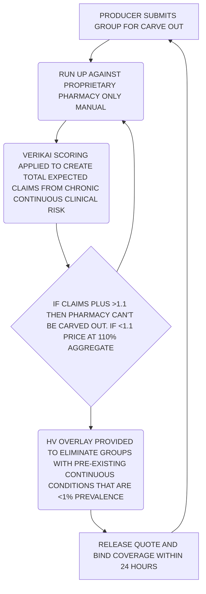

> **Original:** [View Original PDF](https://drive.google.com/file/d/1sPtnIxL1vyjaGhWECl5n-xRx9XT8DAAH/view)

## Slide 1: WriteWise Rx Guarantee Program
# WriteWise
# Rx Guarantee Program

## Slide 2: Specialty Drug Value
# Specialty Drug Value

### SEVERITY
Specialty drugs are prescribed for chronic conditions that are continuous and require high adherence.

### LONGEVITY
More specialty drugs are being both developed and approved than brand or generic drugs due to the symptom reduction they provide.

### COSTS
Specialty drugs mitigate medical cost by 50%

SPECIALTY DRUGS OFFER LIFE ALTERING VALUE TO PATIENTS
WriteWise

## Slide 3: Specialty Drug Cost
# Specialty Drug Cost

### 75x
The cost of specialty drugs are 75X higher than brand and generic medications

### 50%
Specialty drugs make up 2% of total claims but 50% of pharmacy spend

### +30%
Specialty drugs also have an additional 30% ADDED cost due to drug manufacturer rebates that are never redeemed by the employer

### ↑
The cost of drugs to the employer is rising faster than the decrease in medical costs those drugs are supposed to provide which is eating into the employer's total liability

SOLUTION NEEDED TO PROVIDE THESE LIFE ALTERING DRUGS WITHOUT BANKRUPTING THE MEDICAL PLAN
WriteWise

## Slide 4: Price Pharmacy Separately
# Price Pharmacy Separately

### PHARMACY FOCUS
Pharmacy claims are adjudicated through a separate system from medical claims allowing cost containment and diversion programs that are pharmacy focused only.

### REBATES
Rebates are managed through the same admin platform where they are aggregated and returned to the premium holder.

### 10-20% SAVINGS
This provides anywhere from 10-20% savings in total medical cost if pharmacy is carved out from the medical plan.

### PROFIT VS. MEDICAL RISK
But today, the FI carrier uses that 10-20% profit for margin purposes and not the medical risk.
WriteWise

## Slide 5: Competitive Differentiation
# Competitive Differentiation

### PHARMACY IS NOT PRICED SEPARATELY
From medical in market as FI sells products together for greater administrative return

### FULLY INSURED CARRIERS RETAIN REBATES
and coupons – largest part of administrative margin

### COMPETITORS WOULD HAVE TO ELIMINATE THIS BENEFICIAL FRAUD
– they get meaningful margin by retaining rebates in particular from specialty drugs

### THIS ALSO LIMITS THEIR INCENTIVE
to reduce inappropriate specialty drug utilization

THEY MAKE MONEY DOING THE WRONG THING!
WriteWise

## Slide 6: Competitive Differentiation
# Competitive Differentiation

### PHARMACY CLAIMS COST DOES NOT HAVE A SEPARATE MANUAL
– the experience is tied to the medical manual and assigned proportionally (70/30 medical/pharmacy against total cost).

### Generic and brand drugs are colinear to medical spend but SPECIALTY DRUGS ARE THE INVERSE IN COST TO MEDICAL COST due to the chronic nature of the diseases they mitigate.

### The inverse cost is not proportional – THE DRUG COSTS 20X THE REDUCTION IN MEDICAL COST.

### If specialty drug claims volume is greater than 2% of total claims and/or greater than 50% of the cost of all drugs THE LOSS RATIO FOR THE MEDICAL PLAN WILL BE >100%.

YOU NEED EXPERIENCE ISOLATED TO PHARMACY, AN ESTIMATION OF FUTURE TREND INDEPENDENT OF MEDICAL RISK, AND AN UNDERSTANDING OF DRUG COST NET OF REBATES TO UNDERWRITE A PHARMACY CARVE OUT.
WriteWise

## Slide 7: Pharmacy Only Stop Loss
# Pharmacy Only Stop Loss

### CARVE OUT PHARMACY FROM MEDICAL PLAN
with separate premium pricing (net premium costs lower)

### WILL WRITE ANY BUSINESS
(PEO, GOV ENTITIES.....)

### CAN BE BUNDLED WITH BOTH SUPPLEMENTAL AND INDEMNITY COVERAGE
for disease specific drug costs (autoimmune, rare disease, etc.)

### LEVEL FUNDED COVERAGE
– returns surplus to the group or offers protection on cost escalation long term

### COVER ALL DRUGS EXCEPT INPATIENT J CODES
(which fall under medical plan)

### FOCUSED ON >100 GROUPS
to minimize single drug specialty risk
WriteWise

## Slide 8: Underwriting Process
# Underwriting Process

*Note: The content is represented as a flowchart visually, so I've tried to capture the sequence and nodes.*

WriteWise

## Slide 9: What Customers Get
# What Customers Get

*   Lower total premium cost
*   Mitigation of risk against specialty medication price escalation
*   Equivalent formulary to current fully insured options
*   Rebates and coupons returned to group as part of loss ratio reduction
*   Rate stability on pharmacy uncoupled from medical cost inflation

## Slide 10: Program Platform
# Program Platform
"RX GUARANTEE" PROGRAM

### Level or traditional funding
*   Pay a set PEPM all in or pay admin PEPM and claims as you go
*   Level funding provides predictability

### Intercept Rx
*   Risk mitigation and cost containment
*   Seamless integration with PBM

### Aggregate stop loss
*   Caps total drug spend, guaranteed!

### PBM services (powered by Ventegra)
*   Transparent, cost-plus pricing
WriteWise

## Slide 11: PBM powered by Ventegra
# PBM powered by Ventegra
GAIN FLEXIBILITY AND CONTROL WITH CUSTOMIZED SOLUTIONS

| Category                | Value                                  |
| :---------------------- | :------------------------------------- |
| People on platform      | Over 10 million                        |
| Contracted pharmacies   | Over 67,000                            |
| Pricing                 | Acquisition Cost + Pricing including Specialty |
| Rebate to employer      | 100% (monthly)                         |
| Staff                   | Pharmacists on staff                   |

*   CUSTOMIZABLE FORMULARY TO MAXIMIZE COST SAVINGS TO MEET CLIENT NEEDS
*   INTERCEPT RX PROGRAM BUILT-IN TO ACCESS DRUGS AT THE LOWEST COSTS AVAILABLE
*   UTILIZE ALL SOURCING OPTIONS FOR LOWEST COST AVAILABLE
WriteWise

## Slide 12: Intercept Rx – Who are we?
# Intercept Rx – Who are we?

### ADVOCACY & ALTERNATIVE SOURCING
Navigate members to a lower cost option
*   Direct Contract Pharmacies
*   Incentivized Mail Order
*   Patient Assistance Programs
*   Utilize 340B pricing

Arm your employees with the ability to leverage a direct relationship with a Member Advocate to decrease their cost for care.

## Slide 13: Intercept Rx – How our program works
# Intercept Rx – How our program works

### THE INTERCEPT
Claim is identified using our technology or member establishes contact when given a prescription

### MEMBER ADVOCATES
Reach out to employee via phone, email, and/or text to communicate voluntary savings opportunities

### EMPLOYEE
**Accepts:** We facilitate enrollment, and the member advocate aids in prescription fulfillment
**Declines:** Remove from our list
WriteWise

## Slide 14: Intercept Rx – Why Choose Us?
# Intercept Rx – Why Choose Us?

### Our innovative programs minimize disruption while driving lower costs and improving population health

### Our programs result in 20 to 40 percent savings on a typical engagement

### Our objective is to find the lowest net (clinically adherent) drug pricing for our members

### Most importantly, we facilitate a consumer driven experience through education, advocacy and care navigation
WriteWise

## Slide 15: Products In Mind
# Products In Mind

### FULLY BAKED LEVEL FUNDED PRODUCT:
a full level funded product that incorporates direct contracting, specialized PPO networks and actual unit cost data from PBM partners to create the true aggregate cost of risk

### CONSUMER FACING GENERICS OPTION:
offering the flat PMPM generics product to consumers (or consumer facing business) at a higher price point to account for adverse selection.

### LEVEL FUNDED PHARMACY PRODUCT:
a level funded product that carves out and prices PHARMACY only so that the customer can save money with self funding but isn't exposed to variability of claims in their budgeting process.

### GENERICS ONLY DRUG OPTION:
a flat PMPM rate offered to small employers or aggregators of small employers to allow them to offer 0$ or 1% generics to their gig or part time employees, providing them some certainty of coverage even though they cannot afford full insured benefits.

### PERFORMANCE GUARANTEE:
an annual PMPM guarantee of all in pharmacy benefit spend that provides a back up to guaranteed savings contracts that are preferred by larger clients.
WriteWise

## Slide 16: Products In Mind
# Products In Mind

|                      | Product 1  | Product 2    | Product 3    | Product 4    |
| :------------------- | :--------- | :----------- | :----------- | :----------- |
| **PBM**              | Current    | Intercept Rx | Intercept Rx | MedImpact    |
| **Formulary**        | Current    | Intercept Rx | Intercept Rx | Generic Only |
| **Intercept Rx Alternative Sourcing** | Voluntary  | Voluntary    | Included     | Cash Only    |
| **Stop Loss Policy** | Aggregate Only | Aggregate Only | Aggregate Only | Aggregate Only |
| **Funding Arrangement** | Traditonal | Level        | Level        | Level        |
WriteWise

## Slide 17: Initial Market Value Proposition
# Initial Market Value Proposition

### GOVERNMENT CONTRACTORS:
Fixed Benefit dollars

### UNIONS:
Pre-negotiated contracts

### SCHOOLS AND MUNICIPALITIES:
Uncapped pension liability

### SMALL TO MID GROUP:
With no claims experience

### INDIAN TRIBES:
Federal Subsidization of medical only

### LARGE GROUP:
Replacement of current PBM
WriteWise

## Slide 18: What makes us UNIQUE
# What makes us UNIQUE

### FIRST PEOPLE to separate medical and pharmacy in A&H underwriting

### WE UNDERSTAND that the risk medical 70% and pharmacy 30% is not correct for every group – IT DEPENDS ON COMPLIANCE AND ADHERENCE

### We use Verikai to CORRECT TREND incorporating medical risk and compliance/adherence behavior

### We know unit cost from PBM partner which creates both an UNDERSTANDING OF AGGREGATE RISK AND THE CONTRIBUTION OF EXPERIENCE

### We want the REAL BENEFIT OF CUSTOMERS by reducing the price of goods to a minimum profit for us (change the market)
WriteWise

## Slide 19: The Future
# The Future
IN THE FUTURE WE SEE THE MARKET TURN INTO MORE OF A LEVEL FUNDED MARKET

### We would like to create a product
"500 OF THE MOST USED GENERIC DRUGS"
based on a (pmpm) $7-$10 that do not provide full coverage.

### We want to make our level funded pharmacy product a
GUARANTEED COST PRODUCT
that will help us retain the book/customers.

### We learned from our experience that to win business we need to be
10%-15% UNDER THE COMPETITORS

### Our pharmacy product will be written at
110%-125% AGGREGATE
WriteWise

## Slide 20: Averages Year 2022
# Averages Year 2022
IN THE LAST YEAR, THE AVERAGE COST FOR BRAND AND SPECIALTY WENT UP 20% FROM THE PREVIOUS YEAR (GENERIC WENT 20% DOWN).

AVERAGING COST/CLAIM= $89.40

### Chart 1: % of Number of Claims
| Category | Percentage |
| :------- | :--------- |
| Specialty | 0.8%       |
| Brand    | 13.3%      |
| Generic  | 85.90%     |

### Chart 2: Average Cost (per claim type)
| Category | Value      |
| :------- | :--------- |
| Specialty | $4,569.67  |
| Brand    | $313.77    |
| Generic  | $8.36      |

### Chart 3: % of Each Drug to Claims Cost History
| Category | Percentage |
| :------- | :--------- |
| Specialty | 47.3%      |
| Brand    | 40.2%      |
| Generic  | 12.4%      |

Legend:
*   Srecialty [sic] (should be Specialty)
*   Brand
*   Generic
WriteWise

## Slide 21: Example
# Example

| Category                | Value             |
| :---------------------- | :---------------- |
| Incumbent PBM Cost      | $ 27,536,823.48   |
| Estimated Rebates       | $ (4,039,094.04)  |
| Clinical Savings        | $ (6,164,264.00)  |
| Intercept Rx Savings    | $ (3,822,037.26)  |
| Ventegra Admin Fees     | $ 1,811,166.15    |
| **Total New Cost**      | **$ 15,322,594.33** |
WriteWise

## Slide 22: WriteWise
# WriteWise